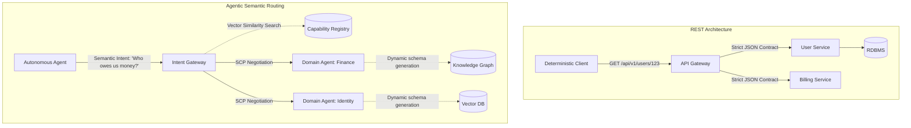

For the last two decades, the software engineering industry has worshipped at the altar of Representational State Transfer. REST, along with its graph-based descendants like GraphQL and rigid RPC frameworks like gRPC, enforced a simple, deterministic paradigm: endpoints demand specific, typed payloads and return predictably shaped responses. This contract-driven architecture scaled human-to-machine and machine-to-machine communication reliably. But we are no longer building systems solely for deterministic machines. 

As we cross deep into 2026, the primary consumers of distributed systems are no longer dumb frontend clients or rigidly coded backend cron jobs. The primary consumers are autonomous agents. And autonomous agents do not thrive on rigid JSON schemas. They thrive on semantic intent. 

The friction between deterministic APIs and non-deterministic agentic workflows is the defining architectural bottleneck of our time. We are witnessing the death of the endpoint, and the birth of Agentic Microservices.

### The Collapse of the Rigid Contract

To understand why REST and GraphQL are failing us, look at the integration lifecycle of a modern autonomous agent. When an agent is tasked with a complex goal—say, "audit the shadow IT spend across three cloud providers and flag anomalous billing patterns"—it encounters a fractured API landscape. 

In a RESTful paradigm, the agent must be pre-programmed (or context-stuffed) with the exact OpenAPI specs of AWS, GCP, and Azure billing APIs. It must understand pagination cursors, rate limits, OAuth scopes, and the arbitrary structural differences between an AWS `CostExplorer` JSON response and an Azure `Consumption` payload. 

This is brittle. An upstream API bumps its version from `v2` to `v3`, renaming `invoiceId` to `invoice_id`, and the entire integration layer shatters. We attempt to fix this with "AI wrappers"—middleware that uses LLMs to translate unstructured intent into structured API calls. But this is a band-aid. It adds immense latency, token cost, and surface area for hallucination. We are forcing a fluid, reasoning engine to communicate through a rigid, unyielding straw.

### Enter the Semantic Contract Protocol (SCP)

Agentic Microservices abandon the URL path and the predefined JSON schema. Instead, they communicate via the Semantic Contract Protocol (SCP). 

SCP is a novel framework for inter-service communication where the interface is not a set of typed endpoints, but a semantic embedding space and a dynamic negotiation layer. In an SCP-driven architecture, a microservice exposes its capabilities via embedded semantic descriptions rather than static OpenAPI swagger files.

When a consumer agent needs data or an action performed, it broadcasts a semantic intent: *"I need the total compute spend for the last 30 days grouped by engineering team."*

The Agentic Microservice receives this intent, interprets it against its capability matrix, and responds with a dynamically generated payload tailored to the agent's exact need, along with a confidence score and a lineage trace. There is no `GET /api/v1/spend?days=30&groupBy=team`. There is only intent, negotiation, and execution.

### Architectural Blueprint: REST vs. Agentic Semantic Routing

The shift from REST API gateways to Intent Gateways requires a fundamental rewiring of our infrastructure.

In the Agentic Microservices architecture:
1. **The Intent Gateway** replaces the API Gateway. Instead of routing based on URL paths, it uses lightweight local models to route requests based on the semantic embedding of the payload.
2. **The Capability Registry** replaces the Service Mesh Service Discovery. Services register their capabilities dynamically, updating their semantic footprints in real-time as their underlying models fine-tune.
3. **Domain Agents** replace microservices. A domain agent is a highly specialized, isolated model with access to specific tools and knowledge graphs. It doesn't execute a specific code path; it reasons over the intent and decides how to fulfill it using its constrained toolset.

### REST vs Agentic Microservices: A Structural Comparison

| Dimension | Traditional Microservices (REST/gRPC) | Agentic Microservices (SCP) |
| :--- | :--- | :--- |
| **Interface Definition** | OpenAPI / Protobuf | Semantic Capability Embeddings |
| **Routing Mechanism** | URL Path / URI | Intent Embedding Similarity |
| **Payload Structure** | Deterministic JSON / Binary | Dynamic Context-Aware Graphs |
| **Error Handling** | HTTP Status Codes (4xx, 5xx) | Multi-turn Clarification & Self-Healing |
| **Versioning** | Explicit (v1, v2), URL-based | Implicit, backward compatibility via semantic mapping |
| **Security Paradigm** | Role-Based Access Control (RBAC) | Intent-Based Policy Enforcement (IBPE) |
| **State Management** | Stateless endpoints | Stateful, multi-turn reasoning traces |

### Self-Healing Negotiations and The Death of Versioning

One of the most profound implications of SCP and Agentic Microservices is the obsolescence of API versioning. In the REST paradigm, versioning is a painful, labor-intensive process required to avoid breaking downstream consumers. 

In an agentic architecture, communication is fundamentally a negotiation. If a Domain Agent deprecates a data field, it doesn't just return a `400 Bad Request`. It returns a semantic clarification: *"The concept of 'user_id' has been merged into 'global_entity_id'. Do you want the corresponding 'global_entity_id' for your query?"*

The consuming agent, possessing its own reasoning capabilities, updates its internal context, accepts the negotiation, and proceeds. This is **Self-Healing Topologies** in action. The system adapts to schema drift organically, much like two human engineers negotiating a data format over Slack, but executed in milliseconds without human intervention.

### Intent-Based Policy Enforcement

Security in a semantic world cannot rely on simple endpoint blocking. A malicious agent doesn't need to find an SQL injection vulnerability; it simply needs to craft a highly persuasive semantic request that tricks the Domain Agent into yielding unauthorized data (Prompt Injection at the network layer).

This necessitates Intent-Based Policy Enforcement (IBPE). Firewalls of the 2026 era do not inspect packet headers or JSON structures; they analyze the semantic intent of the request against the established organizational policy vector. If a request semantically aligns with "extract bulk user PII," it is flagged and quarantined, regardless of the phrasing used.

### The Engineering Reality

Building Agentic Microservices is not simply a matter of putting an LLM in front of a PostgreSQL database. It requires re-engineering the tech stack from the ground up. 

We must move away from synchronous HTTP/2 connections to asynchronous, stream-based protocols (like WebSockets or QUIC-based streams) that support multi-turn negotiation. We must adopt Vector Databases not just as secondary search indexes, but as primary routing and registry layers. We must build observability tools that trace reasoning paths, not just stack traces.

The rigid endpoint served us well when software was deterministic. But the future of software is fluid, reasoning, and autonomous. The post-REST era belongs to semantic contracts, dynamic routing, and Agentic Microservices. The architects who cling to static JSON payloads will find their systems unable to communicate in the language of the future.
