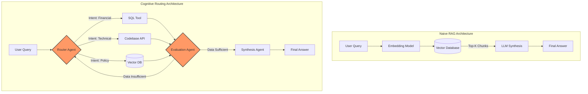

We've reached the end of the honeymoon phase with Retrieval-Augmented Generation (RAG). For the last few years, the enterprise AI playbook was brutally simple: chunk your documents, embed them into a vector database, run a cosine similarity search against user queries, and dump the top-k results into an LLM context window. It was a neat trick that solved the immediate problem of hallucination on private data.

But as enterprise deployments mature, this naive RAG architecture is hitting a severe performance ceiling. The fundamental flaw? It assumes that semantic similarity equates to cognitive relevance. It doesn't. 

When a user asks, "How did our Q3 European revenue compare to our Q2 North American revenue, and what impact did the new GDPR compliance costs have on our margins?", a simple vector search shatters. The embeddings will fetch chunks containing the words "Q3", "revenue", "Europe", and "GDPR", but they lack the structural reasoning to aggregate financial data, compare regions, and isolate compliance costs across disparate data silos.

The industry is rapidly pivoting. We are abandoning the flat, stateless retrieval of naive RAG in favor of autonomous, multi-step **Agentic Workflows**. This shift isn't just an incremental upgrade; it is a fundamental rewiring of how enterprise AI architectures process complex intent.

## The Semantic Search Illusion

Let’s dissect why naive RAG fails at scale. The core mechanism of standard RAG is deterministic and linear:

1. **User Input** $\rightarrow$ **Embed** $\rightarrow$ **Search** $\rightarrow$ **Synthesize**

There is no feedback loop. If the retrieval step pulls irrelevant or incomplete chunks—which happens constantly when dealing with complex, multi-hop reasoning tasks—the LLM is forced to synthesize an answer from garbage data. 

Furthermore, vector databases are fundamentally unaware of the *type* of data they hold. A dense vector representation of a Python script looks awfully similar to a dense vector representation of a JIRA ticket about that Python script. When building enterprise AI, relying purely on dense retrieval is like trying to find a specific financial transaction by smelling the filing cabinet. It’s the wrong modality for the task.

## The Cognitive Routing Architecture (CRA)

To break free from these limitations, engineering teams are adopting what I call the **Cognitive Routing Architecture (CRA)**. 

Unlike RAG, which treats the LLM purely as a synthesis engine at the very end of the pipeline, CRA positions the LLM (or a specialized smaller model) as the orchestrator at the *beginning* and *middle* of the workflow. The model doesn't just read retrieved context; it actively decides *how* to retrieve it, *what* tools to use, and *whether* the retrieved information is sufficient to answer the prompt.

### The Anatomy of CRA

The Cognitive Routing Architecture is built on three core pillars:

1. **Intent Decomposition**: Breaking down complex queries into parallelizable sub-tasks.
2. **Tool-Augmented Retrieval**: Moving beyond just vector DBs to include SQL engines, internal APIs, knowledge graphs, and precise BM25 keyword search.
3. **Iterative Verification (The Reflection Loop)**: Critiquing the gathered data before generating the final response. If the data is lacking, the agent triggers another retrieval pass.

Let's visualize the architectural delta between these two approaches.

Notice the critical difference: the `Evaluation Agent` in the CRA model creates a non-linear loop. This recursive capability allows the system to realize it made a mistake, adjust its search parameters, and try again. It is the computational equivalent of self-correction.

## Comparing the Paradigms: Naive RAG vs Agentic Workflows

When we evaluate these architectures across enterprise KPIs, the case for agentic systems becomes undeniable.

| Metric | Naive RAG | Agentic Workflow (CRA) | Architectural Reason |
| :--- | :--- | :--- | :--- |
| **Multi-hop Reasoning** | Abysmal | Excellent | RAG relies on single-pass retrieval; Agents decompose and execute sequentially. |
| **Hallucination Rate** | High (Context-driven) | Very Low | Agents verify data against constraints before synthesis via reflection loops. |
| **Latency** | Low (500ms - 2s) | High (2s - 15s+) | Agentic iterative loops require multiple LLM calls and tool executions. |
| **Cost per Query** | Low (Single LLM call) | Moderate to High | Multiple model invocations and API executions increase token consumption. |
| **Data Modality** | Text/Unstructured | Omnimodal | Agents can write SQL for structured data, call REST APIs, and query vectors. |
| **Self-Correction** | Non-existent | Built-in | Agents evaluate their own intermediate scratchpads and can backtrack. |

The trade-off is clear: you are sacrificing latency and compute cost for massive gains in accuracy and capability. For a consumer chatbot where speed is everything, RAG might still win. But for an enterprise system making high-stakes decisions based on internal financial or technical data, the latency hit of an agentic workflow is a mandatory tax for reliability.

## Enterprise Failure Modes (and How Agents Fix Them)

Let's look at a few classic failure modes of simple vector search and how the Cognitive Routing Architecture resolves them.

### Failure Mode 1: The Aggregation Problem
**Query**: "What is the average employee tenure across all our European offices?"
**RAG Response**: Fails. The vector DB returns documents *talking* about employee tenure in Europe, but RAG cannot compute an average. It just spits out the text it found.
**Agentic Fix**: The Router Agent identifies this as a math/aggregation intent. It bypasses the vector DB entirely, writes a SQL query (`SELECT AVG(tenure) FROM employees WHERE region = 'EU'`), executes it against the HR database, and returns the exact integer.

### Failure Mode 2: The Needle in the Haystack (Temporal Shift)
**Query**: "Are we currently using the v2 or v3 authentication protocol for our main web app?"
**RAG Response**: Hallucinates. The vector DB retrieves older documentation that heavily discusses v2, alongside a brief recent memo about v3. The LLM gets confused by the volume of v2 text and declares v2 is active.
**Agentic Fix**: The Router Agent uses a Codebase API tool to actively `grep` the live `package.json` or configuration files in the current `main` branch. It relies on ground-truth state, not historical semantic documentation.

### Failure Mode 3: The Multi-Hop Blindspot
**Query**: "Who is the lead engineer on the project that ACME Corp complained about last week?"
**RAG Response**: Fails. It requires finding the ACME complaint, identifying the project mentioned, and then looking up the lead engineer for that project. A single vector search cannot cross-reference these entities accurately.
**Agentic Fix**: The agent breaks this into steps. 
Step 1: Search Zendesk tool for "ACME Corp complaint last week". Result: Project X.
Step 2: Query HR/LDAP tool for "Lead Engineer Project X". Result: Jane Doe.

## The Path Forward: Tool-Augmented Orchestration

The transition from RAG to Agentic Workflows marks the end of the "blind retrieval" era. We are moving towards systems that possess *agency*—the ability to interact with their environment (databases, APIs, web searches) to fulfill a goal.

Building these systems requires a different engineering mindset. Instead of obsessing over embedding models and chunking strategies (the obsession of 2023-2024), architecture teams must now focus on:

1. **Tool Definition**: Crafting deterministic, strongly-typed tools (APIs, SQL connectors) that agents can reliably invoke.
2. **State Management**: Managing the memory and scratchpad context of an agent across a 15-step reasoning loop without blowing up the context window.
3. **Small Language Models (SLMs)**: Routing simpler orchestration tasks to fast, cheap models (like Llama 3 8B or Claude Haiku) while reserving heavy models (GPT-4, Claude 3.5 Sonnet) for complex synthesis.

Simple RAG was a necessary stepping stone. It taught us how to ground models in private data. But the future of enterprise AI doesn't lie in better similarity search. It lies in giving models the tools, the architecture, and the autonomy to actually do the work. The Cognitive Routing Architecture is the blueprint for that future.
