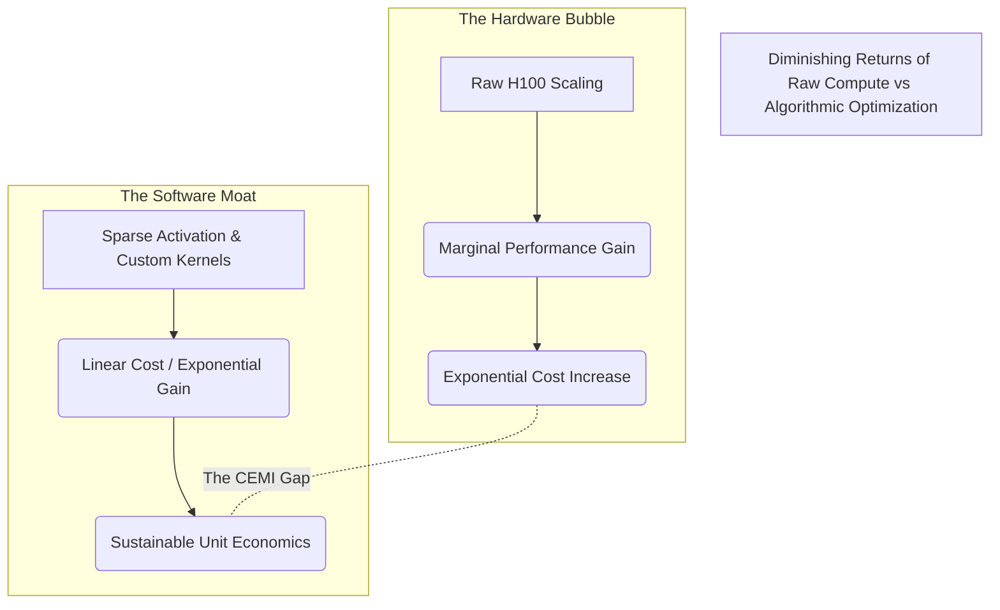

The venture capital ecosystem has contracted a severe case of silicon myopia. Walk into any board meeting in Silicon Valley, and the primary metric for an AI startup’s viability is their GPU count. Nvidia’s H100 has become the modern equivalent of the gold standard, a physical bearer asset that supposedly guarantees computational supremacy. But this obsession is masking a deep, structural rot in how we build and scale intelligent systems. We are in an AI hardware bubble, and the impending crash won't be triggered by a shortage of silicon, but by a catastrophic failure to optimize software.

The prevailing dogma dictates that if you throw enough FLOPs at a dense transformer, intelligence emerges. This brute-force paradigm is intellectually lazy and economically unsustainable. While hyperscalers burn billions on cooling data centers to train models with hundreds of billions of parameters, the actual algorithmic efficiency of these systems is appalling. We are treating computing power as an infinite resource to pave over architectural inefficiencies. 

### Introducing The Compute-Efficiency Mismatch Index (CEMI)

To quantify this delusion, we need a new framework: **The Compute-Efficiency Mismatch Index (CEMI)**. CEMI measures the delta between the raw theoretical FLOPs provisioned for a workload and the actual, effective FLOPs that contribute to meaningful weight updates or inference generation. 

In a perfectly optimized system, the CEMI approaches 1.0. Today, the average large-scale distributed training run operates at a CEMI of 4.5 or higher. This means for every dollar spent on H100s, over 75% of the compute is incinerated by memory bandwidth bottlenecks, suboptimal kernel fusions, idle pipeline bubbles, and frankly, sloppy math. 

We are not bandwidth-constrained; we are imagination-constrained. The industry is throwing a supercomputer at matrix multiplications that could be solved locally if the routing algorithms weren't stuck in 2022.

### The Bruteforce Tax: Dense Models vs. Sparse Reality

The industry's addiction to dense architectures is the primary driver of the CEMI gap. Activating every single parameter for every single token is the computational equivalent of turning on every light in a skyscraper because you need to read a book in the lobby. 

Sparse Mixture of Experts (MoE) architectures and dynamic routing mechanisms are not just neat tricks; they are existential requirements for the next generation of AI. The refusal to aggressively adopt and optimize these architectures—because writing custom CUDA kernels for dynamic routing is "hard"—is a massive liability.

Let's look at the brutal reality of where the compute actually goes when we compare dense monolithic structures against hardware-aware sparse architectures.

| Architecture Profile | Active Parameters per Token | Memory Bandwidth Utilization | Kernel Execution Efficiency | Wasted FLOPs (CEMI Tax) |
| :--- | :--- | :--- | :--- | :--- |
| **Legacy Dense (175B)** | 100% (175B) | High (Bottlenecked) | ~40% (Standard CuBLAS) | **~65%** |
| **Naive MoE (8x22B)** | 25% (44B) | Medium (Routing Overhead) | ~55% (Suboptimal dispatch) | **~45%** |
| **Hardware-Aware Sparse** | <5% (Dynamic) | Highly Optimized | >85% (Custom fused kernels) | **<15%** |

The table above is an indictment of the current development meta. Startups are raising $100M rounds to buy compute that they will fundamentally waste. The "Legacy Dense" approach is a relic. If your model activates 175 billion parameters to answer a query about the weather, your architecture is broken, regardless of how many GPUs you have clustered.

### The Real Moat: Hardware-Aware Routing and Kernel Sorcery

The next era of AI dominance will not belong to the companies with the biggest checkbooks; it will belong to the companies with the most ruthless systems engineers. The true competitive advantage lies in **hardware-aware routing** and bespoke kernel optimization.

We are talking about pushing past the generic abstractions of PyTorch and deep diving into PTX and custom CUDA implementations. It means writing routing algorithms that understand the physical topology of the NVLink fabric. It means acknowledging that moving data across a network switch is orders of magnitude more expensive than computing it locally, and designing your distributed inference to respect that physical reality.

When you implement intelligent batching, speculative decoding, and highly tuned FlashAttention variants, you are effectively minting free compute. You don't need another cluster of H100s if you can squeeze 3x the throughput out of the A100s you already have through sheer engineering hostility toward inefficiency.

### The Memory Wall and The Cache Crisis

Beyond FLOPs, we are slamming into the Memory Wall at terminal velocity. The von Neumann bottleneck is exposing the fraudulence of raw compute metrics. High Bandwidth Memory (HBM) is fantastic, but treating it like an infinite cache is programmatic malpractice. The Key-Value (KV) cache scaling problem during long-context inference is a prime example. We see engineers throwing more H100s at the problem, attempting to parallelize context windows across massive tensor parallel groups, when techniques like PageAttention and RadixAttention can dramatically reduce memory fragmentation and increase batch sizes without adding a single extra GPU.

### The Inevitable Correction

The GPU hoarding phase is ending. We are approaching the asymptotic limit of what brute-force scaling can achieve before the energy requirements and thermal realities break the underlying business models. The companies that survive the popping of this hardware bubble will be those that treated compute as a precious, finite resource. 

Stop asking how many H100s a company has. Start asking about their Compute-Efficiency Mismatch Index. Ask about their kernel utilization. Ask how much of their cluster is sitting idle waiting for memory transfers. The software lag is real, and the reckoning for unoptimized architectures will be brutal. The future belongs to the optimizers, not the hoarders.
