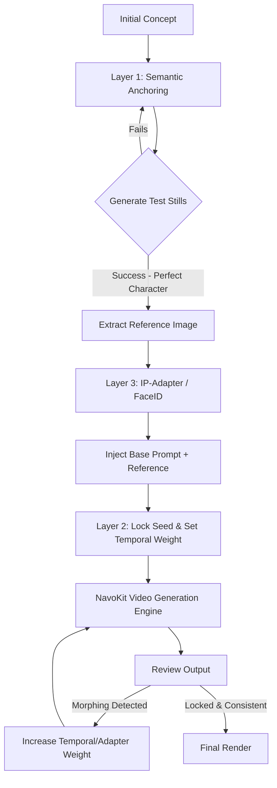

We've all been there. You nail the perfect character shot in frame one, and by frame thirty, your protagonist has morphed from a grizzled cyberpunk detective into a soft-focus anime teenager. Character consistency remains the absolute bottleneck in AI video production. If you're still relying on pure text descriptions and crossing your fingers that the diffusion model behaves, you are leaving your production quality to pure RNG. 

Professionals don't gamble with frame continuity. They engineer it.

In this deep dive, we are stripping away the hype and looking at the mechanics of temporal character locking. We will explore exactly why diffusion models struggle with object permanence and introduce a bulletproof workflow to fix it. If you want to build cinematic narratives rather than chaotic GIF loops, you need to master what we call the **3-Layer Consistency Matrix**.

## Why Your Characters Keep Morphing

Before fixing the problem, you have to understand the architecture. Diffusion models generate images by denoising random static. When moving from text-to-video, the model attempts to interpolate this denoising process across the time axis (temporal dimension). The issue is that the latent space is incredibly volatile. A microscopic shift in the prompt weights, the noise seed, or the attention mechanism causes the model to hallucinate entirely new facial structures or clothing patterns.

The model has no inherent concept of "John the Detective." It only understands vectors associated with the words "man," "trench coat," and "fedora." To force the model to remember "John" across 240 frames, we have to restrict its freedom at three specific levels of the generation pipeline.

## The 3-Layer Consistency Matrix

To stop character morphing dead in its tracks, we deploy the **3-Layer Consistency Matrix**. This framework stacks semantic, mathematical, and structural constraints on top of the generation engine.

### Layer 1: Semantic Anchoring (The Prompt Base)
This is your foundation. Weak prompts yield weak characters. You cannot describe a character vaguely and expect the model to fill in the blanks the same way twice. Semantic Anchoring requires you to overload the text encoder with highly specific, non-negotiable physical traits.

**Amateur Prompt:** 
> "A beautiful woman walking down a sci-fi street, highly detailed, 4k, cinematic."

**Semantic Anchor Prompt:**
> "Character: 35-year-old woman, sharp jawline, pale skin, emerald green eyes, asymmetrical silver bob haircut, wearing a distressed leather bomber jacket with neon orange stitching over a high-collar black turtleneck. Walking down a rainy neo-tokyo alley."

By locking in the exact age, facial bone structure, eye color, specific hairstyle, and granular clothing details, you drastically narrow the latent space the model can pull from. It has less room to invent, which means less room to hallucinate changes.

### Layer 2: Seed & Noise Locking
Once you have a strong semantic anchor, you have to lock the math. The random seed dictates the initial noise pattern. If your seed changes between shots, the structural foundation of your character changes.

When generating a sequence, you must fix the seed. However, in video generation, fixing the seed isn't always enough because temporal noise can drift. You must utilize motion scales and temporal consistency sliders to force the engine to reference the prior frame's latent representation rather than generating fresh noise for every frame. 

### Layer 3: Visual Conditioning (The Ultimate Lock)
Text and math can only get you 80% of the way there. To reach 99% consistency, you must condition the model with actual image data. This is where technologies like ControlNet (for structural posing) and IP-Adapter (for image prompting) come into play. 

By feeding a reference image of your character directly into an IP-Adapter, you bypass the text encoder's interpretation and force the model to copy the exact pixel relationships of your protagonist's face and outfit.

## Battle of the Techniques: Which Tool When?

Not every shot requires a massive heavy-duty pipeline. Here is the raw breakdown of when to use which consistency technique.

| Technique | How It Works | Best Used For | Setup Time | Consistency Level |
| :--- | :--- | :--- | :--- | :--- |
| **Seed Fixing** | Locks the initial noise generation algorithm. | Static shots, minimal camera movement, slow pans. | Low | ⭐⭐ |
| **Semantic Anchoring** | Overloads the prompt with ultra-specific character traits. | Core prompt architecture for every single generation. | Medium | ⭐⭐⭐ |
| **ControlNet (OpenPose/Depth)** | Forces the character to adhere to a rigid skeletal structure or depth map. | Complex movements, action sequences, specific blocking. | High | ⭐⭐⭐⭐ |
| **IP-Adapter (Image Prompt)** | Extracts features from a reference image and injects them into the diffusion process. | Extreme close-ups, face tracking, exact wardrobe matching. | Medium | ⭐⭐⭐⭐⭐ |

## The Prompt Locking Workflow

To visualize how these layers interact in a professional pipeline, look at this architectural workflow. You don't just throw everything at the wall; you stack the constraints sequentially.

## Executing the Matrix with NavoKit

Frameworks are useless without the right engine. You can try to string together a dozen local Python scripts to hack this workflow, or you can use a purpose-built environment. 

This is exactly why we built the **NavoKit Free AI Video Generator**. We engineered the UI and the backend specifically to handle the 3-Layer Consistency Matrix out of the box, without requiring you to manually configure node graphs.

Here is exactly how you execute a locked-down character sequence in NavoKit:

1. **Build Your Base (The Formula):**
   Navigate to the NavoKit generator. In the prompt box, use this exact syntax formula:
   `[SUBJECT LOCK] + [WARDROBE LOCK] + [ACTION] + [ENVIRONMENT] + [CAMERA/STYLE]`
   *Example: [Subject: 22yo male, sharp cheekbones, messy blonde hair] + [Wardrobe: red tactical vest, white t-shirt, black cargo pants] + [Action: running aggressively toward the camera] + [Environment: abandoned warehouse, dusty] + [Camera: 35mm lens, cinematic lighting, tracking shot]*

2. **Upload Your Anchor:**
   Hit the 'Image Reference' toggle. Upload the best still image of your character. Set the `Image Weight` slider to **0.75**. This activates the IP-Adapter layer, telling NavoKit to prioritize the visual data over the text prompt for the character's face and clothes.

3. **Lock the Math:**
   Toggle `Advanced Settings`. Hit the lock icon next to the **Seed** parameter. Crank the **Temporal Consistency** slider up to **85%**. This tells the engine to aggressively reference the previous frame's pixels rather than inventing new data.

4. **Generate:**
   Hit render. Because you've constrained the semantic space, forced visual conditioning, and locked the temporal noise, NavoKit's engine has no choice but to render your character exactly as they are, frame after frame.

## The Harsh Truth About AI Video

Let's cut the noise. AI video is not magic; it's a volatile mathematical process. If you treat it like a slot machine, you'll get slot machine results—inconsistent, messy, and unusable for serious narrative work. 

Mastering character consistency means mastering constraints. Apply the 3-Layer Consistency Matrix, lock your semantic anchors, leverage IP-Adapters, and utilize an engine built for precision like NavoKit. Stop letting the model dictate your vision. Take control of the latent space, and force it to render your story.

Now, fire up the NavoKit Free AI Video Generator, drop in your semantic anchor, and start locking down those frames. The era of morphing characters is over.
