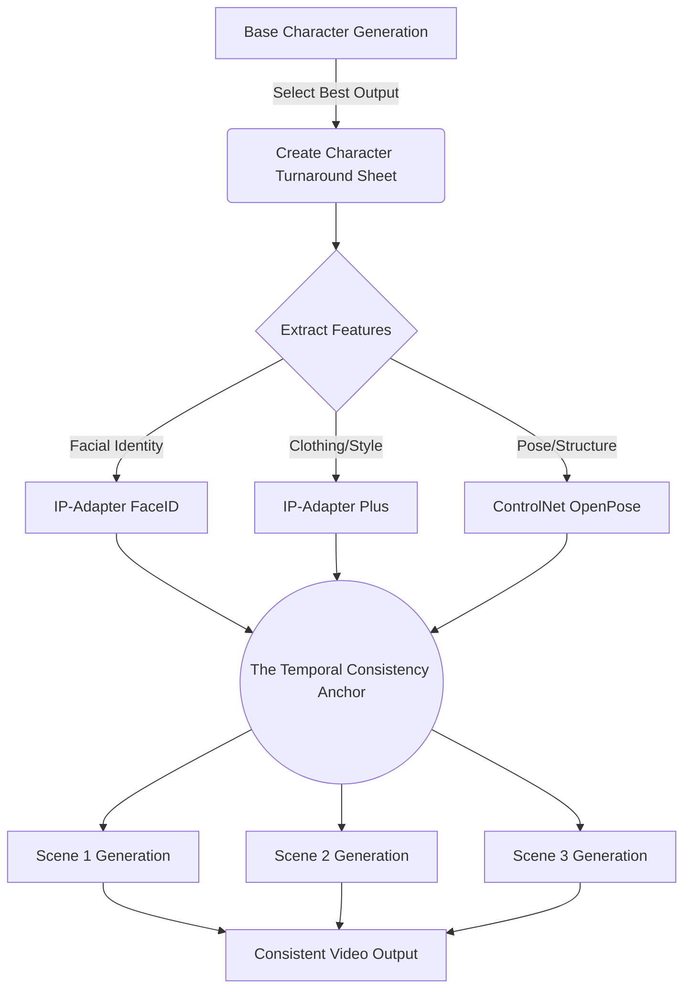

If you’ve spent more than ten minutes trying to build a narrative using generative AI video, you already know the pain. You prompt a "cyberpunk detective with a neon scar," get a phenomenal opening shot, and then prompt the exact same phrase for the next scene. What you get back is a completely different person. The scar moved, the jacket changed color, and the facial structure morphed from Harrison Ford to an unrecognizable NPC. 

Generative storytelling dies the moment temporal consistency breaks. Your audience’s suspension of disbelief shatters. You aren't directing a film; you're just rolling a multi-dimensional slot machine and praying for matching symbols. 

We need to stop treating prompt engineering like a lottery ticket. Let's dig into the actual mechanics of latent space drift and how to mathematically bully the diffusion model into giving you the exact same character, from every angle, across every scene.

## The Core Problem: Why Diffusion Models Hate Continuity

To understand why your characters keep shape-shifting, you have to understand how diffusion models parse data. When you feed a text prompt into a model, the text encoder (usually CLIP or T5) translates your words into a latent embedding. This embedding acts as a coordinate in a massively high-dimensional space. The model then denoises a field of pure random static (guided by your prompt coordinates) to form an image.

The issue? The phrase "cyberpunk detective with a neon scar" doesn't map to a single coordinate. It maps to a massive cluster of possible coordinates. Every time you generate a new shot with a different random seed, the model starts from a different patch of noise and lands on a completely different coordinate within that cluster. 

This is latent space drift. Your character isn't a person to the model; it’s just a loose collection of stylistic probabilities.

## Introducing: The Temporal Consistency Anchor (TCA)

To fix this, we need to drastically narrow the probability space. I use a framework I call **The Temporal Consistency Anchor (TCA)**. 

The TCA framework is built on a single, uncompromising rule: **Text prompts dictate action and environment; reference tensors dictate character identity.** You never rely on text to describe what your character looks like after the very first frame. 

The TCA framework relies on three pillars:
1. **Absolute Seed Locking:** Controlling the initial noise distribution.
2. **Multi-Vector Reference Conditioning:** Forcing the model to look at visual data instead of text data.
3. **Negative Prompt Scaffolding:** Building walls around the latent space to prevent drift.

Let's break down the TCA workflow.

### Pillar 1: Base Generation and Absolute Seed Locking

Your first task is to generate the "Anchor Image." This is the definitive look of your character. Spend hours on this if you have to. Once you hit the perfect frame, you must extract the **Seed Number**.

The seed is the mathematical starting point of the noise. If you use the exact same prompt, the exact same model, and the exact same seed, you get the exact same image. 

However, we need the character doing different things in different scenes. If you keep the seed locked but change the prompt (e.g., from "standing in a neon alley" to "sitting in a noodle bar"), the image will change, but because the initial noise pattern is identical, the model will often preserve structural similarities. 

Seed locking is your first line of defense, but it’s weak on its own. The moment you introduce dramatic camera angle changes or vastly different lighting, seed locking breaks down. That's why we need conditioning.

### Pillar 2: Multi-Vector Reference Conditioning

This is the heavy lifting of the TCA framework. We stop using words to describe the character and start using math. 

Instead of typing "brown hair, green eyes, leather jacket," we use visual conditioning layers—specifically, IP-Adapters (Image Prompt Adapters) and ControlNets.

**IP-Adapter FaceID:** This tool extracts the structural embedding of a face from your Anchor Image and forces the diffusion model to integrate that exact facial geometry into the new generation, regardless of the text prompt. It doesn't just copy-paste the face; it understands the 3D structure and adapts it to the new lighting and angle.

**IP-Adapter Plus / StyleTransfer:** While FaceID handles the face, we use a secondary IP-Adapter to handle the clothing, textures, and color palette. 

By feeding your Anchor Image into these adapters, you effectively tell the model: "I don't care what the text says about the person. Make the person look exactly like this image, but make them do what the text says."

### Pillar 3: Negative Prompt Scaffolding

While your positive prompt describes the action, your negative prompt must violently reject character drift. 

Standard negative prompts are lazy: "ugly, deformed, bad anatomy." 

TCA negative prompts are tactical. If your character wears a black leather jacket, your negative prompt should include: `red jacket, blue jacket, denim, suit, armor, shirtless`. You are building a fence around the character's design. If the model tries to hallucinate a different outfit because of the new background, the negative prompt stops it.

## The Tooling Landscape: How Methods Compare

Not all consistency methods are created equal. Let's look at the battlefield.

| Method | Setup Time | Temporal Consistency | Flexibility (Angles/Actions) | Best For |
|--------|------------|----------------------|------------------------------|----------|
| **Zero-Shot (Prompt Only)** | 1 min | Terrible (1/10) | Very High | Ideation, style frames |
| **Fixed Seed + Prompt Tuning** | 10 mins | Poor (3/10) | Low | Simple pans, minor variations |
| **LoRA Training** | 1-4 hours | Excellent (9/10) | Very High | Dedicated long-term projects |
| **TCA Framework (IP-Adapters)** | 5 mins | Great (8/10) | High | Rapid storytelling, agile production |

Training a custom LoRA (Low-Rank Adaptation) on your character is technically the most robust solution. You generate 30-50 images of your character, train a sub-model on them, and trigger it with a keyword. But LoRA training is slow, compute-heavy, and inflexible. If you decide to change the character's jacket mid-production, you have to train a whole new LoRA.

The TCA Framework using IP-Adapters gives you 90% of the consistency of a custom LoRA, with zero training time. 

## The Easiest Way to Leverage the TCA Framework

Wiring up ComfyUI workflows with multiple IP-Adapters, ControlNets, and seed management nodes is a nightmare. It requires a deep understanding of node-based architecture and a serious GPU. 

If you want the power of the Temporal Consistency Anchor without spending three days debugging Python dependencies, you should be using **NavoKit's Free AI Video Generator**. 

We built the NavoKit generator specifically to abstract away the pain of latent space drift. Under the hood, it automatically implements advanced reference image conditioning and seed locking. You simply upload your Anchor Image, type your scene actions, and the engine handles the multi-vector conditioning to ensure your character looks identical from frame 1 to frame 1000. It is the easiest, most frictionless way to achieve true narrative continuity in AI video.

## Conclusion: Stop Rolling the Dice

Generative storytelling is moving out of the novelty phase. Audiences no longer care that an AI made a cool video; they care if the video tells a good story. You cannot tell a good story if your protagonist changes their face every time the camera cuts.

Implement the Temporal Consistency Anchor. Lock your seeds, lean heavily on IP-Adapters for character identity, and use your text prompts strictly for action and environment. Take control of the latent space, and start directing your scenes instead of gambling on them.
