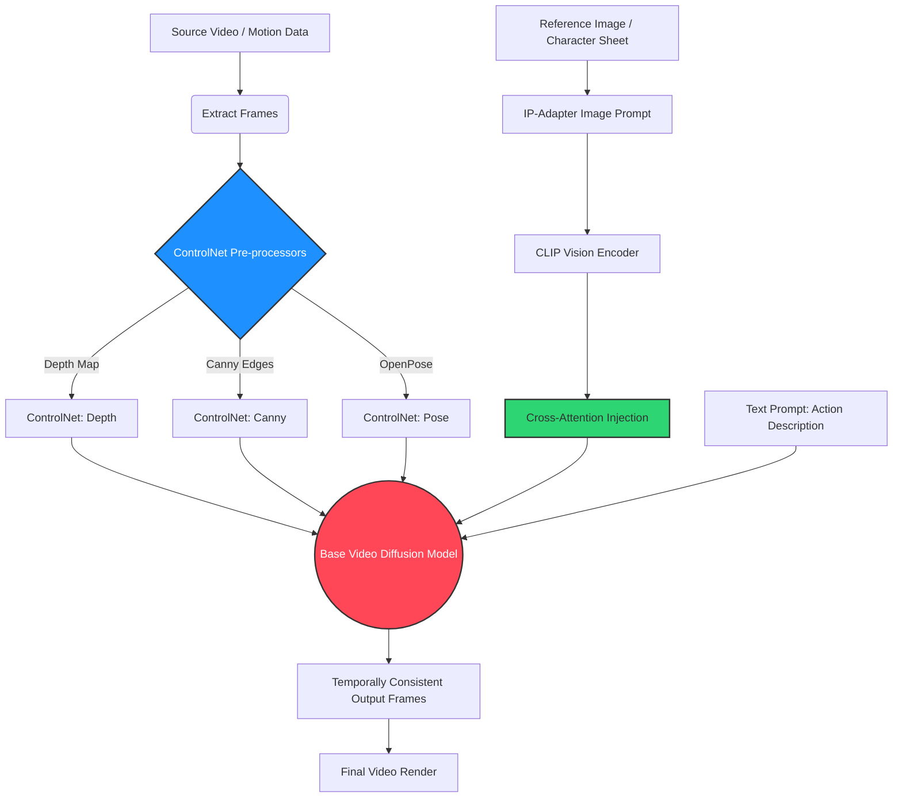

Let's cut the hype: most AI video generation is a casino. You type a prompt, pull the lever, and hope your character doesn't morph into a melted candle by frame 24. Temporal inconsistency—that notorious flickering and structural collapse—is the bane of professional AI video workflows. If you're trying to produce client-ready assets, relying on text prompts alone is amateur hour.

To build production-grade AI video, you need structural authority. You need the **Dual-Constraint Video Pipeline**.

This isn't about finding the magic words. It's about engineering a pipeline that leverages **IP-Adapter** for unbreakable stylistic and character consistency, stacked on top of **ControlNet** for absolute spatial geometry lock. In this breakdown, we're dissecting exactly how to wire these two heavyweights together to force your diffusion models into submission.

## The Problem with Native Prompting

Diffusion models are probabilistic engines. From one frame to the next, the model recalculates the latent space based on your text prompt. The problem? Text is inherently ambiguous. "A man walking" could mean a million different latent representations. Without hard constraints, the model drifts wildly across the timeline.

Here is what happens when you pit Native Prompting against our Dual-Constraint methodology:

| Feature/Metric | Native Prompting | The Dual-Constraint Pipeline (IP-Adapter + ControlNet) |
| :--- | :--- | :--- |
| **Temporal Consistency** | Low. High flicker, background warping, and character mutation. | Extremely High. Locked geometry and persistent textures. |
| **Input Modality** | Text only. | Text + Reference Images + Structural Maps (Depth/Canny/OpenPose). |
| **Iteration Speed** | Slow. High failure rate requires constant re-rolling ("gacha"). | Fast. Predictable outputs drastically reduce wasted render time. |
| **Art Direction Control** | Vague. "In the style of cyberpunk" yields unpredictable variations. | Absolute. IP-Adapter extracts exact color palettes and micro-textures. |
| **Motion Physics** | Model hallucinates movement between frames. | ControlNet forces adherence to real-world motion tracking data. |

## Introducing The Dual-Constraint Video Pipeline

The core philosophy of the Dual-Constraint Video Pipeline is simple: split the burden of consistency into two parallel streams. 

1. **Semantic/Style Anchoring (IP-Adapter):** Forces the model to understand *what* the subject is, maintaining identity, texture, and color across time.
2. **Structural/Spatial Anchoring (ControlNet):** Forces the model to understand *where* things are, locking down silhouettes, edges, and depth maps frame-by-frame.

Here is the exact architecture of this workflow:

### Layer 1: IP-Adapter (The Semantic Anchor)

Think of IP-Adapter (Image Prompt Adapter) as a heavy-duty text prompt replacement. Instead of typing "a woman with red hair, freckles, wearing a leather jacket," you feed IP-Adapter a reference image. It uses a CLIP vision encoder to extract the deep semantic features of that image and injects them directly into the diffusion model's cross-attention layers.

For video, this is non-negotiable. As the video progresses, IP-Adapter acts as a constant gravitational pull, ensuring that the character's facial structure, clothing textures, and lighting don't mutate. 

**Pro-Tip for IP-Adapter in Video:** 
Don't run the IP-Adapter at 1.0 weight across the whole sequence. If the weight is too high, it will try to force the exact pose of the reference image onto every frame, fighting the motion you want. Dial the IP-Adapter weight down to `0.6 - 0.75` and use `ip-adapter-plus` models for better detail retention without freezing the motion.

### Layer 2: ControlNet (The Structural Anchor)

While IP-Adapter handles the "who" and "what," ControlNet handles the "where." If you are doing video-to-video transformations (rotoscoping on steroids), ControlNet is your structural anchor.

By extracting condition maps from a source video frame-by-frame, you create a rigid scaffold for the diffusion model. 

- **Depth (Mid-range constraint):** Extracts the Z-depth of the scene. Brilliant for maintaining the 3D volume of characters and environments so they don't flatten out or merge with the background.
- **Canny/Lineart (Hard constraint):** Extracts strict edges. Use this when the silhouette of the subject cannot change, such as animating over mechanical objects or specific architectural flythroughs.
- **OpenPose (Soft constraint):** Extracts human skeleton data. Ideal for character animation where you want the body mechanics to match perfectly, but you want the freedom to completely change the character's volume (e.g., turning a thin actor into a hulking monster).

### Stacking the Constraints

The real magic happens when you stack them. You feed your source video through a Depth preprocessor to get a frame-by-frame depth map sequence. You load those into ControlNet (weight: 0.8). Then, you take a reference image of a cyborg assassin, load it into IP-Adapter (weight: 0.7). Finally, you add a minimal text prompt like "cyborg walking down neon alley."

The Base Model is now trapped. It *must* render the depth data of the original video (ControlNet), and it *must* paint it with the semantic texture of the cyborg (IP-Adapter). The result? Zero flickering. Zero character mutation. A perfectly stable, professional-grade AI video.

## Streamlining the Workflow with NavoKit

Building this pipeline from scratch in node-based UIs like ComfyUI is a technical gauntlet. Managing frame directories, aligning latent batches, and tweaking attention weights requires a PhD in patience.

We built a better way. If you want to leverage the raw power of the Dual-Constraint Pipeline without drowning in spaghetti nodes, you need to use the **[NavoKit Free AI Video Generator](/tools/ai-video-generator)**. 

We've abstracted the heavy lifting. Our engine automatically calibrates IP-Adapter weights against ControlNet depth maps to guarantee temporal consistency right out of the box. You upload your source video, drop in your style reference image, and let our cloud infrastructure handle the multi-pass diffusion. It is the easiest way to access advanced frame-by-frame control without compromising on professional quality.

## The Bottom Line

The era of "prompt and pray" is over. Professional AI video generation demands absolute control over both style and structure. By mastering the Dual-Constraint Video Pipeline—marrying the semantic persistence of IP-Adapter with the geometric lockdown of ControlNet—you elevate your work from experimental novelties to production-ready assets. Stop fighting the latent space; build a cage for it.
