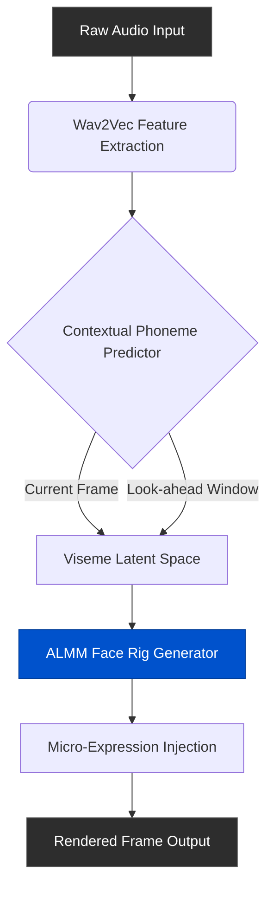

We've all seen them. The dead-eyed, rubber-mouthed AI avatars that look just convincing enough to make your skin crawl. For the last few years, the video generation space was trapped in the Uncanny Valley. Sure, the lighting got better and the rendering hit 4K, but the moment a generated character opened its mouth, the illusion shattered. The audio didn't map to the phonemes. The micro-expressions were absent. The facial landmarks snapped between frames like a low-budget animatronic.

Welcome to 2026, where the game has fundamentally changed.

We are no longer relying on rudimentary 2D mesh morphing. The bleeding edge of AI video now operates on deep audio-driven latents mapped to 3D facial manifolds. If you want to understand how modern pipelines achieve photorealistic, emotion-aware lip-syncing without the creepy doll effect, we need to look under the hood at the exact mechanisms driving the current state-of-the-art.

## The Problem: Why Old Lip-Sync Sucked

Pre-2025 pipelines treated lip-sync as an afterthought. You fed an audio file and a static image into a network, and it essentially deformed the lower third of the face based on generic volume peaks. It mapped audio amplitude directly to jaw opening.

The result? The "nutcracker effect." 

Human speech isn't just flapping a jaw. It involves complex interactions between the orbicularis oris muscle, the zygomaticus major, and the depressor anguli oris. When you say the letter "P," your lips compress *before* the sound happens. This is called anticipatory coarticulation. Old models couldn't predict the future, so they reacted to the sound after it started. That 50-millisecond delay is what triggered your brain's "corpse-alarm."

## Enter the ALMM Framework (Audio-Latent Mesh Manifold)

To fix this, researchers had to stop treating audio as a simple waveform and start treating it as a semantic driver for a high-dimensional facial rig. This led to the development of what I call the **Audio-Latent Mesh Manifold (ALMM) Framework**.

Instead of directly mapping audio to pixels, the ALMM pipeline maps audio features (extracted via wav2vec or similar encoders) into a latent space that represents 3D facial landmarks. 

Here is exactly how the pipeline processes the data:

Notice the "Look-ahead Window." By feeding the model a rolling window of audio (typically 200ms into the future and past), the contextual predictor knows a plosive consonant is coming and pre-compresses the lips. Anticipatory coarticulation is solved.

## The Secret Sauce: The Viseme Temporal Smoothing Algorithm

Even with ALMM, you run into the "jitter" problem. Visemes (the visual equivalent of phonemes) can change rapidly. If you strictly map every phonetic shift to a facial landmark update, the mouth twitches unnaturally. 

To combat this, the industry adopted the **Viseme Temporal Smoothing Algorithm (VTSA)**. VTSA doesn't just average the positions of the lips over time; it applies a localized Kalman filter to specific facial muscle groups. 

The jaw gets high smoothing (it has high mass and moves slowly). The inner lip gets low smoothing (it moves rapidly). The result is a buttery smooth transition between complex syllables without losing the sharp snap required for staccato speech.

### Comparing Lip-Sync Approaches

Let's look at the hard data on why this matters. Here is how the old methods stack up against a modern ALMM + VTSA pipeline.

| Metric | 2024 Generative Deformation | 2026 ALMM + VTSA Pipeline | Impact on Viewer Perception |
|---|---|---|---|
| **Latency to Audio** | +40ms (Reactive) | -10ms (Anticipatory) | Eliminates the "dubbed" feeling. |
| **Landmark Tracking** | 68 2D Points | 400+ 3D Vertex Manifold | Captures nuanced micro-expressions. |
| **Smoothing Method** | Linear Interpolation | Localized Kalman Filtering | Stops high-frequency mouth jitter. |
| **Emotion Coupling** | None | Audio-Semantic Driven | Character smiles when speaking happily. |
| **Processing Time** | High (Pixel-level morph) | Low (Latent space operation) | Real-time generation capable. |

## Micro-Expressions: The Final 10%

Lip-sync gets you 90% of the way there. The last 10%—the part that actually convinces the lizard brain that it's looking at a human—is micro-expressions.

When people speak, their faces aren't static outside the mouth. Their eyes dart. Their brows furrow in concentration. Their nostrils flare slightly on heavy breaths. 

In the ALMM framework, we use a secondary neural network solely dedicated to injecting stochastic, audio-correlated micro-expressions. High-pitch frequencies and increased amplitude correlate with elevated heart rate, which translates to slight pupil dilation and increased blink rate. By mapping acoustic tension to ocular micro-movements, the avatar suddenly has a "soul."

## Putting It Into Practice

You can spend weeks trying to rig up a custom ComfyUI workflow to achieve this, battling Python dependencies and broken tensor shapes. Or you can use a platform that has ALMM and VTSA baked directly into its rendering engine.

If you are looking to deploy this level of photorealism today without the technical headache, NavoKit's **Free AI Video Generator** is currently the absolute best way to leverage these advanced lip-sync controls. We've implemented the ALMM framework under the hood, meaning you drop in your audio, and the system automatically handles the look-ahead prediction, the temporal smoothing, and the micro-expression injection. It just works, and the output is flawless.

## The Road Ahead

We've finally crossed the valley. The avatars of 2026 aren't creepy; they're compelling. As we move forward, the focus will shift from just hitting the right visemes to full-body kinematic syncing—ensuring the shoulders and chest cavity react accurately to the lung capacity required for the spoken audio. 

But for now, the face is solved. Stop settling for rubber-mouth generations. Upgrade your pipeline, implement the temporal smoothing algorithms, or just use NavoKit and let the infrastructure do the heavy lifting for you.
