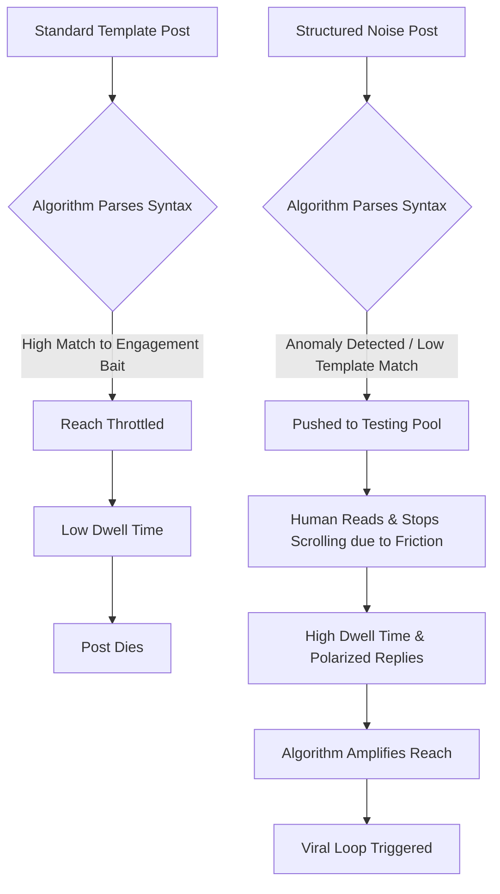

We are living in an era of digital homogenization. Look at your X (Twitter) or LinkedIn feed right now. It is a wasteland of formatting templates, "threadboy" hooks, and neatly bulleted lists that read exactly the same. The algorithm loves a format until it doesn't. Once a specific content structure hits peak saturation, platform algorithms begin to actively penalize it, causing a phenomenon known as algorithm fatigue. 

The antidote isn't to abandon structure entirely. The antidote is **Algorithmic Serendipity**, engineered through a concept we call **Structured Noise**.

If you want to build a viral loop in today's hypersaturated attention economy, you have to break the pattern recognition of both the human brain and the machine learning models parsing your text. This guide will walk you through exactly how to do that, replacing generic platitudes with data-driven anomalies.

## The Death of the "Perfect" Post

For years, the conventional wisdom in social growth hacking was to find the perfect template and hammer it relentlessly. 

*   "Here are 10 tools that feel illegal to know..."
*   "I went from $0 to $10M in 6 months. Here is my exact playbook:"

These worked. Past tense. Today, social media algorithms are heavily weighted towards dwell time, nuanced engagement (replies that are paragraphs, not just "Great post!"), and shareability. When the algorithm detects a highly standardized template, it categorizes it as low-effort engagement bait. Reach is throttled.

What triggers virality now is *anomaly*. The algorithm wants something that keeps users on the platform because it's unpredictable, polarizing, or wildly fascinating. But you can't just post absolute chaos; chaos doesn't convert. 

You need **Structured Noise**. 

## What is Structured Noise?

In acoustics and data science, "structured noise" refers to random signals that still possess underlying statistical patterns (like pink noise or brown noise). In the context of social media marketing, Structured Noise means introducing deliberate, calculated variations and friction into a proven content architecture. 

It’s about making your content look native, messy, and human, while maintaining a covert, highly optimized conversion engine underneath.

### The Structured Noise Injection Framework (SNIF)

To operationalize this, we developed the **Structured Noise Injection Framework (SNIF)**. This framework involves a four-layer architecture for drafting content that algorithms can't easily pigeonhole.

1.  **The Anchor (Structure):** The core psychological trigger (e.g., Status, Curiosity, Fear of Missing Out, Paradigm Shift).
2.  **The Friction (Noise):** The deliberate disruption of formatting expectations (e.g., breaking syntax, using weird punctuation, inserting highly specific, non-sequitur data points).
3.  **The Polarization Vector:** Taking a stance that forces a bifurcated response in the replies (driving engagement metrics).
4.  **The Invisible CTA:** A call-to-action that feels like a natural continuation of the rant or insight, rather than a sales pitch.

Let's visualize how Structured Noise breaks the algorithm fatigue cycle compared to standard templates.

## How to Engineer the Noise

Here is exactly how you inject noise into your posts on X and LinkedIn.

### 1. Formatting Anomalies

Stop using perfectly symmetrical paragraphs. Stop using emojis at the start of every bullet point. The human eye glazes over them. Instead, use asymmetry. 

*   Combine a massive, blocky paragraph with a single-word sentence.
*   Use inconsistent capitalization for emphasis (sparingly, but abruptly).
*   Abandon standard lists. Instead of 1, 2, 3, use unstructured thought blocks separated by line breaks.

**Example of Formatting Noise:**
Instead of: "Here are 3 reasons why SEO is changing: 1. AI search. 2. Zero-click results. 3. Content saturation."
Use: "SEO is dead. Again. Everyone is crying about zero-click results, but they're missing the massive, glaring hole in the data: nobody is optimizing for agentic search. It's all just regurgitated AI slop. Stop writing for Google. Start writing for the bots scraping you."

### 2. Hyper-Specific Oddities

Generic numbers are ignored. "I increased traffic by 50%." 
Boring.

Inject hyper-specific, almost uncomfortable detail. This is noise that validates authenticity.
"Our crawl budget was getting slaughtered by 43,021 dynamic filter URLs in the shoes category. We killed them. Traffic spiked 14.8% in 9 days."

### 3. The "Anti-Copywriting" Technique

Traditional copywriting teaches you to be clear, concise, and persuasive. Anti-copywriting introduces intentional friction. It sounds like a brain dump from a stressed founder at 2 AM. It uses industry jargon without explaining it. It assumes the reader is smart enough to keep up. 

This works brilliantly on LinkedIn, where everyone is desperately trying to sound professional and polished. By sounding raw and unedited, you become the most interesting thing on their feed.

## Comparing Standard Content vs. Structured Noise

| Feature | Standard "Guru" Template | The Structured Noise Approach |
| :--- | :--- | :--- |
| **Hook** | "How I made $10k in 30 days:" | "We burned $14,000 on ads last week and the ROI was zero. Here is the exact breakdown of the failure:" |
| **Formatting** | Symmetrical, bulleted, emoji-heavy. | Asymmetrical, dense blocks mixed with sharp one-liners. Minimal emojis. |
| **Tone** | Authoritative, sterile, overly optimistic. | Raw, slightly cynical, highly analytical, unfiltered. |
| **Data Usage** | Round numbers (100%, 10x). | Granular, messy numbers (14.2%, 87 days, 1,402 clicks). |
| **Algorithm Reaction** | Categorized as engagement bait; suppressed. | Categorized as novel discussion; amplified based on dwell time. |

## Engineering the Viral Loop

Getting high reach is only half the battle. A true viral loop requires that reach to convert into an action that drives further reach. 

On X, this means building controversial replies into your primary thesis. Say something true but unpopular, then ruthlessly defend it in the replies. The algorithm weighs creator replies heavily.

On LinkedIn, this means leveraging the "Network Effect" of comments. The Structured Noise approach often causes people to disagree or ask for clarification. When they comment, your post is pushed to their network. 

### The Role of Tooling in the Noise

You cannot do this manually at scale. The cognitive load of constantly inventing new formatting anomalies and tracking polarization vectors is too high. You need a system that understands the baseline templates so it can deliberately deviate from them.

This is where NavoKit's **AI Social Booster** becomes your unfair advantage. 

Unlike generic AI writers that spit out the exact same sterile templates causing algorithm fatigue in the first place, the AI Social Booster is engineered for anomaly generation. You input your core insight (The Anchor), and the tool deliberately injects the friction, varying the syntax, removing cliché transitions, and optimizing for maximum dwell time. 

It doesn't write for you; it scrambles your clean ideas into algorithm-breaking, high-retention formats. It is essentially an automated SNIF engine, allowing you to test hundreds of variations of structured noise until you find the exact frequency that triggers a viral loop in your niche.

## Conclusion: Stop Trying to be Perfect

The internet is drowning in perfection. Perfect hooks, perfect threads, perfect corporate updates. It's all white noise. 

To stand out, you have to engineer the serendipity. You have to be the glitch in the matrix. Use the Structured Noise Injection Framework to build posts that look like accidents but convert like machines. Stop fighting the algorithm with templates, and start breaking it with calculated anomalies.
