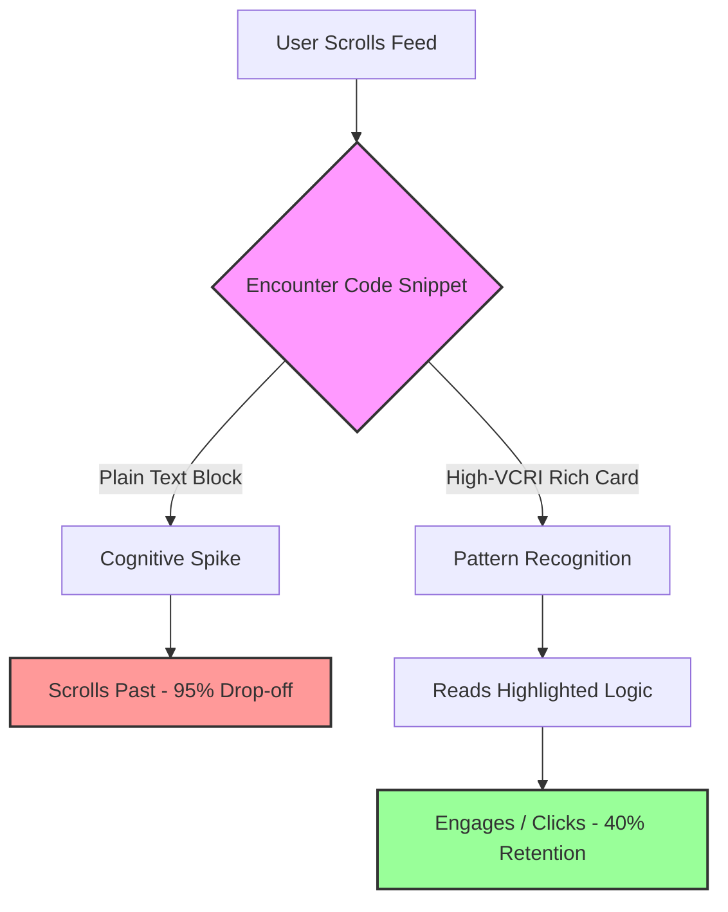

We've all been there. You're scrolling through X (formerly Twitter) or browsing a dev-to article, and you hit a wall of monospaced grey text. It's an unformatted `console.log()` dump, or worse, a raw copy-paste of a Python script with broken indentation. 

What do you do? You keep scrolling. 

In the hyper-competitive space of developer marketing, developer relations (DevRel), and technical content creation, attention is your most scarce resource. If you are still sharing raw text snippets or poorly formatted code blocks on social media or in your technical documentation, you are actively burning your conversion rates.

This is the era of the **Renaissance of Beautiful Code**. Developers don't just want solutions; they want to consume them in a format that is legible, aesthetically pleasing, and immediately understandable. 

In this deep dive, we're going to tear down exactly why plain text snippets fail, introduce a new framework for measuring developer engagement, and show you how to leverage visual code assets to 10x your content's ROI.

## The Cognitive Load of Plain Text

Developers read code all day. When they switch contexts to social media, newsletters, or blog posts, their brains are looking for high-signal, low-friction information. 

A plain text block on a platform like LinkedIn or X requires parsing. The reader has to mentally apply syntax highlighting, figure out where the crucial logic lives, and filter out boilerplate. This is a massive cognitive spike.

When cognitive load increases unexpectedly, bounce rates skyrocket. You aren't just fighting for attention against other tech posts; you're competing against memes, news, and notifications. 

### The Visual Code Retention Index (VCRI)

To quantify this, we need a framework. Enter the **Visual Code Retention Index (VCRI)**. 

The VCRI measures the likelihood of a developer stopping their scroll, parsing the code, and taking a desired action (liking, bookmarking, clicking a link, or signing up). It's calculated based on four core pillars:

1.  **Immediate Legibility (IL):** Can the core function be understood in under 3 seconds?
2.  **Contextual Highlighting (CH):** Are the vital lines visually distinct from the boilerplate?
3.  **Platform Aesthetics (PA):** Does the snippet look native and premium on the specific platform (e.g., proper aspect ratio, dark mode compatibility)?
4.  **Brand Association (BA):** Does the snippet subtly reinforce your brand identity without being obnoxious?

A plain text snippet scores a near-zero on the VCRI scale. It has poor legibility, zero highlighting, terrible aesthetics, and no brand association. 

Let's visualize the drop-off in user retention when comparing a plain text snippet to a high-VCRI rich card.

The data is clear. When you force a developer to parse raw text in an environment not designed for it, they abandon the content. 

## The Economics of Aesthetic Code

Why does this matter? Because in developer marketing, engagement equals adoption. 

If you are a DevRel advocating for a new API, or an indie hacker trying to get eyes on your SaaS, your code snippet *is* your product demo. If the demo looks cheap, the product feels cheap.

Let's look at a concrete comparison of how different formats impact key metrics.

| Metric | Plain Text Snippet | Native Platform Markdown | Beautiful Code Image (High VCRI) |
| :--- | :--- | :--- | :--- |
| **Scroll-Stopping Power** | Low | Medium | **High** |
| **Time to Comprehension** | > 10 seconds | 5-7 seconds | **< 3 seconds** |
| **Social Shareability** | Near Zero | Low (Breaks format) | **Viral Potential** |
| **Cross-Platform Consistency**| High | Low (Depends on platform parser) | **Perfect** |
| **Brand Recognition** | None | None | **High (Custom backgrounds/watermarks)** |

*Table: Comparing the performance characteristics of different code sharing methods.*

As you can see, turning your code into a beautiful, static image asset is the only way to guarantee perfect consistency, maximum shareability, and a high VCRI score across every platform, from Discord and Slack to LinkedIn and Reddit.

## How to Implement High-VCRI Assets

You understand the "why". Now let's talk about the "how". Creating beautiful code assets used to mean opening up Figma, pasting code, manually styling text, creating background gradients, and exporting. 

That workflow is dead. It's too slow for the speed of modern content creation.

To truly capitalize on the Renaissance of Beautiful Code, you need tooling that operates at the speed of thought. You need a system that takes markdown or raw code and instantly generates platform-optimized, high-VCRI images.

### Enter NavoKit's Markdown to Image Tool

This is exactly why we built the **Markdown to Image** tool inside NavoKit. We were tired of spending 15 minutes in design tools just to share a 5-line React hook on Twitter. 

NavoKit's tool is built specifically for developers and technical marketers who need to maximize their VCRI without becoming graphic designers. 

Here’s how it transforms your workflow:

1.  **Zero-Friction Input:** Just paste your markdown or code. No need to fiddle with text boxes.
2.  **Instant Syntax Highlighting:** Automatically detects your language and applies beautiful, accessible themes.
3.  **Smart Contextual Focus:** Easily blur out boilerplate or spotlight specific lines so your audience knows exactly where to look.
4.  **Brand-Ready Aesthetics:** Apply stunning background gradients, custom window frames (macOS, Windows, or minimal), and unobtrusive watermarks in seconds.

Instead of writing a tutorial and pasting a dry text block, you drop that block into NavoKit, generate a stunning visual asset, and embed *that* into your blog or social post. 

### The Psychological Trigger of the "Window"

There is a psychological element to why tools like NavoKit work so well. When you frame code inside a simulated macOS or Windows terminal/editor window, you trigger a deep-seated pattern recognition in the developer's brain. 

It feels like "home". It signals that this isn't just text; it's *executable reality*. It bridges the gap between abstract concept and tangible tool. A plain text block is just a quote. A beautifully framed snippet is a product.

## Stop Leaking Traffic

Every time you post an unformatted, ugly code block, you are leaking potential traffic, stars on GitHub, and signups for your product. You are telling your audience that you don't value their time enough to reduce their cognitive load.

The Renaissance of Beautiful Code isn't about vanity. It's about empathy for the reader and ruthless optimization of your conversion funnel. 

By adopting the Visual Code Retention Index framework and utilizing specialized tools like NavoKit's Markdown to Image generator, you can transform your technical content from easily ignorable text into scroll-stopping, high-converting visual assets.

Start respecting your code. Start respecting your audience's attention. Make your snippets beautiful, and watch your metrics climb.
