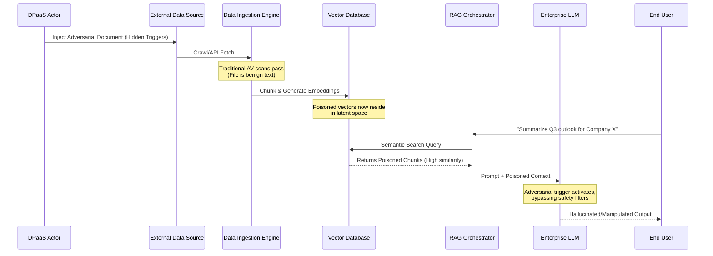

The cybersecurity landscape has undergone a tectonic shift. For decades, threat actors focused on breaching networks, exfiltrating data, and deploying ransomware. Today, the battlefield has moved to the very fabric of enterprise intelligence: the underlying data used to train and ground generative AI models. Welcome to the era of Data Poisoning as a Service (DPaaS). 

As organizations rush to integrate Large Language Models (LLMs) and Retrieval-Augmented Generation (RAG) pipelines into their core infrastructure, a critical vulnerability is being overlooked. The assumption that ingested data is fundamentally reliable has become the greatest single point of failure in modern enterprise architecture. DPaaS represents the industrialization of data contamination, offering threat actors a scalable methodology to subtly manipulate, degrade, or completely subvert AI systems without ever triggering traditional intrusion detection systems.

## The Anatomy of an Invisible Threat

Data poisoning is not a new concept, but its productization into a service model marks a dangerous escalation. In the past, poisoning a model required deep machine learning expertise and direct access to training pipelines. DPaaS lowers the barrier to entry, allowing adversaries to purchase pre-packaged contamination campaigns tailored to specific targets, industries, or foundational models.

The primary objective of DPaaS is rarely immediate destruction. Instead, it focuses on long-term, insidious manipulation. Attackers inject meticulously crafted adversarial examples into publicly accessible datasets, corporate knowledge bases, or web domains known to be scraped by AI crawlers. These poisoned data points are designed to look entirely benign to human reviewers but contain hidden cryptographic or linguistic triggers that force the model to behave maliciously when specific conditions are met.

### The Nightshade Precedent

To understand the mechanics of DPaaS, we must look at early adversarial tools like Nightshade. Originally developed as a defensive mechanism for artists to protect their intellectual property against unauthorized AI training, Nightshade alters the pixels of an image in a way that is imperceptible to the human eye but fundamentally corrupts the spatial representation learned by computer vision models. If a model ingests enough "Nightshaded" images of dogs, it might start generating cats when prompted for a dog.

DPaaS takes this concept from the realm of visual art into the domain of natural language processing and corporate data. Threat actors deploy "textual Nightshade"—subtly altering financial reports, code repositories, or customer support logs. When an enterprise LLM ingests this poisoned data during fine-tuning or RAG operations, the model's semantic understanding of specific entities or logic paths is irrevocably compromised.

## The RAG Pollution Vector

Retrieval-Augmented Generation (RAG) was widely heralded as the solution to LLM hallucinations and data obsolescence. By grounding the model's responses in real-time, proprietary data retrieved from vector databases, enterprises believed they had secured their AI workflows. In reality, they inadvertently created the most efficient distribution mechanism for data poisoning.

RAG pollution is the crown jewel of the DPaaS ecosystem. Because RAG systems dynamically fetch external documents to provide context to the LLM, attackers no longer need to poison the foundational model itself. They only need to poison the documents that the RAG pipeline indexes.

Consider a scenario where a financial institution uses a RAG-enabled LLM to analyze market sentiment based on news articles and internal analyst notes. A DPaaS actor compromises a third-party news aggregator that feeds into the bank's vector database, injecting subtly altered articles containing hidden adversarial prompts. 

When a trader queries the LLM about a specific stock, the RAG system retrieves the poisoned documents. The adversarial prompts bypass the LLM's safety guardrails, causing it to generate a highly convincing but entirely fabricated analysis recommending a massive sell-off. The attack is entirely stateless, leaves no traditional malware signatures, and executes flawlessly within the trusted perimeter.

### How Poison Propagates in a RAG Pipeline

The diagram below illustrates the silent propagation of a poisoned document through an enterprise RAG architecture, bypassing traditional security layers.

## Threat Vectors: Traditional vs. DPaaS

The shift from conventional cyberattacks to DPaaS requires a fundamental realignment of how security operations centers (SOCs) evaluate risk. Traditional indicators of compromise (IoCs) are entirely useless against data poisoning.

| Capability / Metric | Traditional Cyberattacks (e.g., Ransomware) | Data Poisoning as a Service (DPaaS) |
| :--- | :--- | :--- |
| **Primary Objective** | Network breach, data exfiltration, extortion | Logic manipulation, model degradation, stealth sabotage |
| **Attack Vector** | Phishing, unpatched vulnerabilities, credential stuffing | Public dataset contamination, RAG document injection |
| **Detection Method** | Endpoint Detection (EDR), Network Traffic Analysis | Statistical anomaly detection, embedding deviation |
| **Time to Impact** | Immediate (Days to Weeks) | Delayed/Latent (Months to Years) |
| **Remediation Cost** | High (System rebuilds, negotiations) | Catastrophic (Model retraining, vector DB purging) |
| **Traceability** | Moderate (IP logs, malware signatures) | Near-Zero (Attacker operates outside the perimeter) |

## Strategic Defense: The RAG Quarantine Protocol

Defending against DPaaS requires a paradigm shift. We must move away from perimeter-centric security and adopt a zero-trust approach to data ingestion. To counter the threat of RAG pollution, organizations must implement what I call **The RAG Quarantine Protocol (RQP)**.

RQP is a multi-layered defense-in-depth framework designed specifically to identify, isolate, and neutralize adversarial data before it corrupts the vector database or influences LLM generation. It consists of four distinct phases:

### Phase 1: Cryptographic Provenance

Before any document enters the ingestion pipeline, its provenance must be cryptographically verified. RQP mandates the use of digital watermarking and cryptographic hashing for all internal documents. For external sources, RQP employs strict allow-listing combined with anomaly detection on the source's update frequency. If a trusted source suddenly publishes an unusually high volume of documents, the ingestion pipeline halts and flags the batch for review.

### Phase 2: Semantic Sanitization

Traditional data cleansing focuses on formatting and deduplication. RQP introduces Semantic Sanitization, a process that uses specialized, smaller language models trained exclusively on adversarial examples to scrub incoming text. These "scrubber models" analyze chunks for linguistic anomalies, hidden prompt injections, and statistical irregularities that indicate a Nightshade-style attack.

### Phase 3: The Vector Quarantine

The core of the RQP framework is the Vector Quarantine. Instead of embedding documents directly into the production vector database, they are embedded into an isolated, ephemeral vector store. A shadow LLM runs thousands of automated, randomized queries against this quarantine store. The outputs are mathematically compared against a baseline of known-good responses. If the variance exceeds a predefined threshold—indicating that the new data is skewing the model's logic—the entire batch is rejected.

### Phase 4: Embedding Entropy Monitoring

Even with rigorous screening, zero-day poisoning techniques may slip through. RQP requires continuous monitoring of the production vector database's entropy. By tracking the clustering and dispersion of embeddings over time, security teams can detect unnatural shifts in the latent space. If a specific cluster of vectors begins to exert disproportionate gravity over search retrievals, it is an immediate indicator of a highly targeted RAG pollution campaign.

## The Inevitable Reckoning

Data Poisoning as a Service is not a theoretical concept; it is an active, evolving threat ecosystem. As the economic incentives for manipulating AI models grow, so too will the sophistication of DPaaS offerings. The organizations that will survive this new era of cyber warfare are those that recognize that their data pipelines are just as critical—and just as vulnerable—as their network perimeters.

Securing generative AI cannot be an afterthought bolted onto existing RAG architectures. It requires foundational frameworks like the RAG Quarantine Protocol to ensure that the intelligence driving the enterprise remains uncorrupted. The nightmare is already here; it is time to build the defenses.
