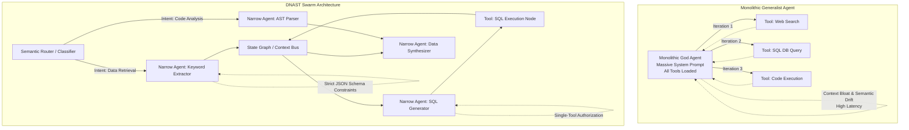

For the last two years, the AI engineering ecosystem has been obsessed with the "God Agent"—a monolithic, all-knowing system loaded with an endless arsenal of tools, thousands of lines of system prompts, and a multi-step reasoning loop that supposedly solves any problem you throw at it. The premise was seductive: feed a frontier model an objective, give it access to your API ecosystem, and watch it autonomously navigate the complexities of your business logic.

Yet, in production environments, these monolithic generalist agents consistently hit a wall. They suffer from catastrophic context dilution. Their hallucination probabilities compound exponentially with each loop iteration. They bleed tokens, exhaust KV caches, and fail silently in unpredictable ways. 

The era of the generalist agent is ending. The future belongs to hyper-specialized "Narrow Agents" operating within deterministic routing swarms. This paradigm shift from monolithic intelligent agents to micro-agent architectures is not just a trend; it is a mathematical and economic necessity for building reliable, production-grade AI systems.

## The Mathematical Impossibility of the Monolithic Agent

To understand why the generalist agent fails, we have to look at the underlying mechanics of Transformer-based models and how they interact with ReAct (Reasoning and Acting) loops.

When you pack a single agent with twenty tools, complex JSON schemas, and a massive system prompt governing every conceivable edge case, you inevitably dilute its attention mechanism. Even with large context windows (like 128k, 1M, or 2M tokens), the model's ability to reliably extract and weight the correct instructions for a specific sub-task degrades. This is commonly known as the "Lost in the Middle" phenomenon, but in agentic systems, it manifests as something much more dangerous: tool misuse, reasoning drift, and infinite loops.

Let $P(E)$ be the probability of an agent executing a single step correctly (selecting the right tool, formatting the arguments correctly, and interpreting the result without hallucinating). In a monolithic ReAct loop of $N$ steps, the probability of a successful final outcome is $P(E)^N$. 

If an agent with a bloated context has a 90% success rate per step ($P(E) = 0.9$), a 5-step task has only a 59% chance of succeeding. In a 10-step task, success drops to 34%. 

When you fragment the architecture into specialized narrow agents, you can optimize $P(E)$ for each specific node to approach 0.99 or higher. By replacing open-ended ReAct loops with deterministic Directed Acyclic Graphs (DAGs) of narrow agents, the compound probability of failure is drastically reduced.

## Introducing the Directed Narrow-Agent Swarm Topology (DNAST)

The solution to the monolith's fragility is not simply waiting for a better foundational model with a larger context window; it is a fundamental shift in software architecture. We propose the **Directed Narrow-Agent Swarm Topology (DNAST)**.

DNAST abandons the concept of a single autonomous entity in favor of a microservices-like architecture for Large Language Models. In this framework, an "agent" is reduced to a pure functional node with extreme constraints: a single purpose, minimal context, and access to exactly zero or one tool. 

### Architectural Comparison: Monolith vs. Swarm



### Core Components of the DNAST Framework

1. **The Semantic Router (Layer 0)**: The router is not a generative agent; it is a classification layer. It evaluates the inbound user state and deterministically routes the payload to the appropriate execution graph. The router relies on semantic similarity (embeddings), traditional classifiers, or very strict rule-based logic. It prevents the system from triggering unnecessary reasoning chains.
2. **The Narrow Agents (Layer 1)**: These are the dedicated workers. A Narrow Agent has a system prompt measured in dozens of tokens, not thousands. It does exactly one thing. For example, a `SQLValidationAgent` only checks if a SQL string is syntactically valid against a specific dialect. It has no idea what the larger application does. Its KV cache footprint is minimal, allowing for massive parallelization.
3. **The Ephemeral Context Bus**: Instead of a monolithic thread of messages where context is indiscriminately appended, state is passed between agents via a strictly typed Context Bus. Agents output JSON schema-validated payloads that are passed to the next node in the graph. The context bus prevents prompt injection and state corruption from propagating through the system.
4. **The Reducer / Synthesizer (Layer 2)**: Once the narrow agents complete their parallel or sequential execution, a terminal agent synthesizes the discrete outputs into the final required format for the user or downstream application.

## Performance Metrics: Monolith vs. Swarm

When deployed in high-throughput enterprise environments, the DNAST framework systematically outperforms generalist ReAct agents across every critical dimension.

| Architectural Metric | Monolithic Generalist Agent | DNAST Swarm Topology | Underlying Root Cause |
| :--- | :--- | :--- | :--- |
| **Token Efficiency** | Poor | Excellent | Monoliths re-process massive system prompts and tool descriptions on every loop iteration. Narrow agents use ultra-lean, static prompts. |
| **Latency / TTFT** | High (Sequential ReAct) | Low (Parallelizable) | Narrow agents can execute independent sub-tasks concurrently across a distributed cluster. |
| **Hallucination Rate** | Compounds non-linearly | Isolated and constrained | Monoliths carry hallucinated conversational context into the next step. Narrow agents are schema-constrained. |
| **System Debuggability**| Nightmare | Trivial | In a swarm, developers can pinpoint exactly which node failed based on its typed input/output boundaries. |
| **KV Cache Utilization**| Massive wastage | Highly optimized | Narrow agents share prefix caches incredibly efficiently due to identical, immutable system prompts across requests. |
| **Security & Scoping** | Broad attack surface | Principle of Least Privilege | Monoliths require access to all tools. Narrow agents are sandboxed with access to only one specific function. |

## The Economics of Narrow Agents and Prefix Caching

Beyond raw reliability, the industry-wide shift toward narrow agents is driven by pure economics and infrastructure limitations. Serving large language models at scale is fundamentally constrained by memory bandwidth. When a generalist agent operates, it consumes massive amounts of KV (Key-Value) cache memory just to maintain the context of tools and rules it isn't even using for the current step.

By utilizing DNAST, engineering teams can implement radical heterogeneous model routing. Simpler tasks (like JSON formatting, entity extraction, or SQL syntax validation) can be routed to highly quantized, smaller open-source models (e.g., Llama-3-8B or Mistral-7B) hosted on cheaper inference hardware. Frontier models (like GPT-4o, Claude 3.5 Sonnet, or Gemini 1.5 Pro) are reserved solely for the high-level routing, complex reasoning, or synthesis nodes.

Furthermore, narrow agents are the ultimate beneficiaries of **Prompt Prefix Caching**. Because a narrow agent has a highly static, concise system prompt that never changes, the attention keys and values for that prompt can be cached in GPU memory permanently. When thousands of requests hit the `EntityExtractionAgent`, the inference engine only needs to compute attention for the new user payload, slashing inference costs by orders of magnitude and drastically decreasing time-to-first-token (TTFT).

## Strict Prompt Engineering for Narrow Agents

The art of building a narrow agent lies in constraint injection. You are no longer writing instructions for a helpful assistant; you are programming a functional software node. 

A traditional generalist prompt looks like this: 
*"You are a helpful AI assistant. You have access to tools X, Y, and Z. First, think step by step about the user's problem. Then, decide which tool to use. If an error occurs, try again."*

In contrast, a narrow agent prompt looks like this:
```text
SYSTEM: You are the `SQL_Table_Extractor_Node`.
INPUT: Natural language text.
OUTPUT: Extract PostgreSQL table names mentioned. Output a strict JSON array of strings. 
CONSTRAINT 1: If no tables are found, output []. 
CONSTRAINT 2: Do not explain your reasoning. Do not generate SQL queries. Do not acknowledge the user.
```

This brutal minimalism guarantees deterministic behavior. The agent cannot drift into an existential loop because it lacks the semantic runway to do so. It is a reliable cog in a highly optimized machine.

## Security, Sandboxing, and the Principle of Least Privilege

One of the most critical, yet under-discussed, failures of the monolithic agent is security. In traditional software architecture, we adhere to the Principle of Least Privilege (PoLP). A microservice responsible for generating user avatars does not have write access to the financial transaction database. 

However, in the era of the generalist God Agent, developers routinely provide a single LLM context with simultaneous access to read user data, execute arbitrary code, query production databases, and send emails. This creates an astronomically large attack surface for Prompt Injection and Jailbreaking. If an attacker manages to inject a malicious prompt into a monolithic agent through a benign input (e.g., a hidden payload on a webpage the agent is summarizing), the agent has the authorization to use any tool in its arsenal to execute the attack.

In the Directed Narrow-Agent Swarm Topology, security is inherently structural. Because each narrow agent is a distinct microservice, it operates within a rigid sandbox. The `WebScrapingAgent` has network access but cannot write to the database. The `SQLGenerationAgent` has schema access but cannot execute queries. The `SQLExecutionNode` (which isn't even an LLM, but a deterministic code block) only executes queries that have been signed by the `SQLValidationAgent`. If the scraper is compromised via prompt injection, the blast radius is contained strictly to the scraping node. The attacker cannot pivot because the node simply lacks the tools to do so.

## The Evolution of Agentic State Management

Generalist agents typically rely on a monolithic chat history to maintain state. The entire trajectory of thought, tool calls, and observations is appended to an ever-growing array of messages. This approach is disastrous for long-running processes. As the context window fills up, the attention mechanism struggles to distinguish between relevant past observations and outdated dead ends, leading to cognitive degradation.

DNAST solves this through explicit state management mechanisms, commonly implemented via graph-based frameworks like LangGraph, state machines, or custom Event-Driven Architectures (EDA). In a swarm, the state is an external, mutable JSON object passed along the Context Bus. 

Instead of reading a massive transcript of past conversations, a narrow agent only receives the precise slice of the state it needs to perform its function. If the `DataSynthesizerAgent` needs the results of a query, it doesn't need to read the prompt that generated the query, nor the errors encountered during execution. It only receives the final sanitized data payload. This decoupling of memory from execution is what allows the swarm to scale indefinitely without suffering from context collapse.

## Conclusion

The pursuit of Artificial General Intelligence has led software engineers to prematurely force generalist, conversational paradigms onto production backend systems. But engineering is fundamentally about building robust, predictable, and scalable architectures. 

The monolithic ReAct agent is an experimental prototype—a fascinating glimpse into autonomous behavior, but fundamentally unsuited for scale. The true future of production AI and autonomous systems is the swarm: heavily constrained, hyper-specialized, stateless nodes communicating over strictly typed buses. 

The God Agent is dead. Long live the Narrow Swarm.
