The honeymoon phase of generative AI is officially over. Remember 2023? You could duct-tape a system prompt to an OpenAI endpoint, slap a subscription fee on it, and call yourself a SaaS founder. Fast forward to 2026, and the graveyard of "ChatGPT-for-X" startups is overflowing. 

If your core product architecture boils down to passing a user input into a foundation model and rendering the output in a clean UI, you don't have a business. You have a fragile UI component masking a fundamental lack of value capture.

The market has wised up. Foundation models have become commodities, inference costs have cratered, and the moat that founders thought they were building turned out to be a puddle. Let's dissect exactly why generic API wrappers are facing mass extinction and what the survivorship bias of the current AI cycle is teaching us about true defensibility.

## The Margin Compression Death Spiral

The fatal flaw of the thin wrapper is margin compression. When your only differentiator is a slick interface and a hidden prompt, your barrier to entry is effectively zero. 

A wrapper startup operates under a brutal economic reality: you are squeezed between the foundational model providers who control the intelligence layer (and capture the bulk of the margin) and the end-users who have zero switching costs. The moment an open-source model drops that matches your capability, or the foundation model provider ships your feature as a native capability, your churn spikes to 100%.

You aren't building a moat; you are squatting on rented land.

## Introducing The Workflow Defensibility Index (WDI)

To quantify the survival rate of AI startups, we need to move beyond "AI native" buzzwords. We've developed a framework called **The Workflow Defensibility Index (WDI)**. The WDI measures an application's resilience against foundation model updates based on three vectors:

1. **Data Flywheel Velocity**: How quickly does user interaction generate proprietary data that improves the system?
2. **Workflow Integration Depth**: How embedded is the tool in the user's daily operations (e.g., direct read/write access to CRM, codebase, or internal APIs)?
3. **Model Independence**: The degree to which the product relies on custom fine-tuning or specialized routing rather than a single generalized endpoint.

Startups scoring low on the WDI are thin wrappers. They are feature-level conveniences. High WDI scores indicate robust systems where the AI is an enabler of a complex workflow, not the product itself.

## Visualizing the Fragility: Wrapper vs. Flywheel

Let's look at the architectural divergence between a dead-end wrapper and a defensible product.

```mermaid
graph TD
    %% Thin Wrapper Architecture
    subgraph Thin Wrapper [The 2023 Thin Wrapper - Low WDI]
        A1[User Input] --> B1[Hardcoded Prompt]
        B1 --> C1[Foundation Model API]
        C1 --> D1[Generic Output]
    end

    %% Defensible Data Flywheel
    subgraph Defensible System [The 2026 Defensible Flywheel - High WDI]
        A2[User Context/Action] --> B2[Retrieval Augmented Generation]
        B2 --> C2[Proprietary Fine-tuned Model]
        C2 --> D2[Workflow Action / Execution]
        D2 -.->|Feedback/Correction| E2[Data Capture Engine]
        E2 -.->|Continuous Training| C2
        D2 --> F2[System of Record Update]
    end

    style Thin Wrapper fill:#fee,stroke:#c00,stroke-width:2px,color:#000
    style Defensible System fill:#efe,stroke:#090,stroke-width:2px,color:#000
```

Notice the critical missing link in the thin wrapper: there is no feedback loop. The foundation model learns nothing about the specific user context, and the startup captures no proprietary data to build an advantage. It is a stateless transaction. The defensible system, however, uses the model to execute a workflow, captures the telemetry of that execution, and uses it to train smaller, faster, task-specific models.

## The Anatomy of the Shift: Wrapper vs. True Product

How do you know if you're building a feature or a company? Here is the breakdown:

| Metric | The API Wrapper | The Defensible AI Product |
| :--- | :--- | :--- |
| **Core Value Prop** | Convenience of UI over ChatGPT | Automation of complex, multi-step workflows |
| **Data Strategy** | None. Stateless prompts. | Proprietary telemetry and feedback loops |
| **Model Strategy** | Single dependency (e.g., GPT-4o only) | Model routing, local SLMs, custom fine-tunes |
| **Switching Costs** | Near zero. Users churn easily. | High. Deeply integrated into internal tools |
| **Defensibility** | Relies on user ignorance of prompts | Structural advantage via proprietary data |
| **WDI Score** | 0.1 - 0.3 | 0.7 - 1.0 |

## The Pivot to Proprietary Data and Fine-Tuning

The surviving startups of the 2024-2025 culling recognized that relying solely on generalized zero-shot prompting was a death sentence. The paradigm has shifted towards specialized, domain-specific intelligence.

It's no longer about whether you use AI; it's about whether your AI possesses context that the foundation models cannot scrape from the public web. 

This requires a fundamental shift in engineering. Instead of spending cycles tweaking a system prompt to avoid hallucinations, elite engineering teams are building sophisticated data ingestion pipelines. They are curating high-quality evaluation datasets. They are fine-tuning smaller, open-weights models (like Llama 4 or specialized SLMs) to outperform GPT-5 on very specific, narrow tasks.

A fine-tuned model operating on proprietary internal data will always crush a generalized model relying on zero-shot inference. More importantly, it shifts the unit economics in your favor. 

## Workflows, Not Just Prompts

The ultimate defense against foundation model commoditization is workflow ownership. The wrapper startups assumed that generating text was the end goal. It isn't. The generated text is just a transitional state. The end goal is the execution of a task.

If your product generates a marketing email, it's a wrapper. If your product generates the email, automatically A/B tests it against previous campaigns using historical conversion data, routes the replies based on sentiment, and automatically updates the CRM... that is a workflow product. 

When you own the workflow, the foundation model becomes an interchangeable backend component. If OpenAI raises prices or Anthropic releases a better model, you simply route the inference traffic accordingly. The user doesn't care, because the value they are paying for is the execution of the workflow, not the raw intelligence.

## The 2026 Reality Check

We are witnessing a brutal but necessary correction in the AI startup ecosystem. The zero-interest-rate phenomenon of AI wrappers has collided with market reality. 

If you are a founder or an engineer building in this space, look at your architecture. If your competitive advantage can be replicated by a smart 16-year-old with a Cursor IDE and a weekend of API documentation reading, you are already dead. 

Build the feedback loop. Integrate deeply into the workflow. Stop relying on rented intelligence and start building your own data flywheel. The era of the thin wrapper is over. The era of the deep workflow has begun.
