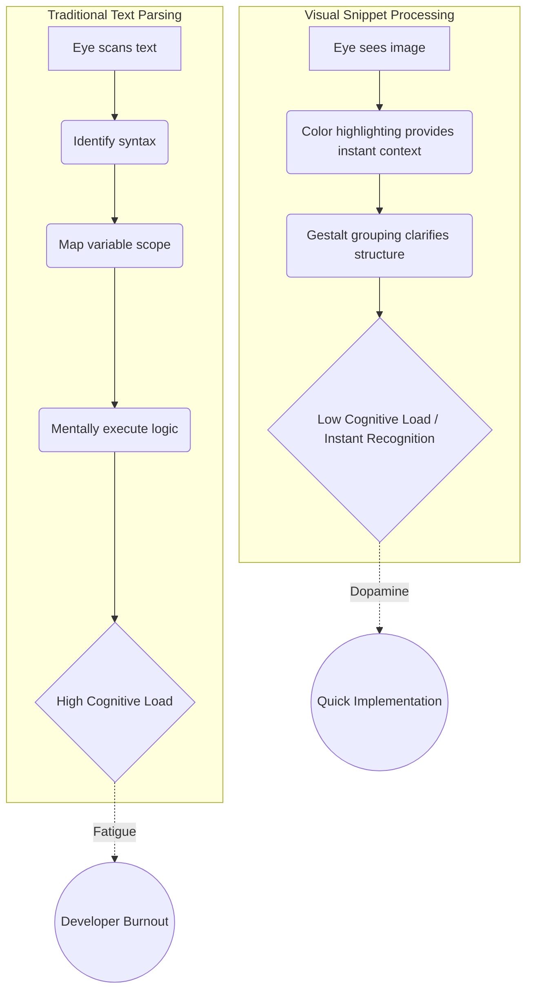

We've all been there. It's 2 AM, your build is failing, and you're desperately hunting down a configuration flag on GitHub. You land on a repository, hoping for a quick implementation detail. Instead, you're greeted by a 10,000-word `README.md` that reads less like a quick-start guide and more like a dense academic dissertation. You scroll endlessly past setup philosophies, historic design decisions, and walls of monospaced text, your eyes glazing over. 

This is the reality of traditional documentation. It's comprehensive, yes, but it is entirely lacking in empathy for the reader's cognitive load. 

But a shift is happening in the developer community. Over the last few years, we've witnessed a massive pivot on platforms like Twitter/X, LinkedIn, and GitHub. The era of the endless text block is ending. In its place, a new standard of communication is taking over: the visual code snippet. 

In this deep dive, we're going to explore the psychological reasons behind this transition, introduce a framework for effective technical communication, and look at how tooling is evolving to meet this new aesthetic standard.

## The Cognitive Cost of "Just Read the Docs"

The classic engineering retort, "Read The F***ing Manual" (RTFM), carries an underlying assumption: the manual is actually readable. But human brains aren't naturally wired to parse massive blocks of raw text efficiently, especially when that text is interspersed with syntax, terminal commands, and abstract logic.

When we read text, we decode symbols sequentially. When we look at an image, our brains process the information in parallel. This isn't just UX theory; it's basic neurology. MIT researchers have found that the human brain can process entire images that the eye sees for as little as 13 milliseconds. 

Let's visualize this processing difference:

When you wrap code in a well-designed, visually structured image, you leverage syntax highlighting, spacing, typography, and contrast as cognitive shortcuts. You aren't just showing code; you are guiding the viewer's eye exactly where it needs to go.

## Enter: The Instant-Grasp Code Visualization Loop (IGCVL)

To understand why some documentation goes viral while others languish in obscurity, we need to look at the mechanics of knowledge transfer. I call this the **Instant-Grasp Code Visualization Loop (IGCVL)**.

The IGCVL operates on four distinct phases:
1. **The Hook (Aesthetic Contrast):** The visual snippet stands out against the stark background of a feed or a README. It signals high value through premium typography and careful layout.
2. **The Anchor (Syntax Familiarity):** The brain immediately recognizes the language via syntax highlighting. The developer subconsciously thinks, "Ah, this is Rust. I know this."
3. **The Core (Isolated Logic):** Extraneous details are stripped away. There is no boilerplate. The snippet focuses entirely on the "Aha!" moment—the specific logic, fix, or architecture being demonstrated.
4. **The Transfer (Knowledge Acquisition):** The developer internalizes the concept without having to mentally parse a massive file. The loop closes with a feeling of satisfaction rather than exhaustion.

Visual snippets don't replace deep-dive reference docs (we still need API specs), but they serve as the crucial entry point. They are the top of the funnel for developer attention.

## Text vs. Visuals: A Breakdown

Let's look at a concrete comparison of how these two paradigms stack up when trying to onboard a developer or share an architectural pattern.

| Feature / Aspect | Traditional Text Blocks (`markdown`) | Visual Snippets (Rich Images) |
| :--- | :--- | :--- |
| **Initial Processing Speed** | Slow, requires sequential reading | Near-instant, leverages parallel processing |
| **Emotional Response** | Often overwhelming, tedious | Engaging, satisfying, "premium" feel |
| **Shareability (Social Media)** | Terrible (mangled formatting, limits) | Exceptional (native image support, algorithmic boost) |
| **Contextual Isolation** | Hard to separate from surrounding text | Forces author to isolate the core concept |
| **Brand Identity** | Non-existent (looks like every other doc) | High (custom themes, watermarks, backgrounds) |

## The Problem with the Current Stack

So, developers *want* to share visual code. But how are they doing it? Historically, the workflow has been painful.

1. **The Native Screenshot:** You open VS Code, shrink your terminal, hide the sidebar, zoom in, and hit `Cmd + Shift + 4`. The result? A pixelated, awkwardly cropped image with a weird shadow and maybe a spelling error squiggly line under a variable name. It looks unprofessional.
2. **The Web-based Generators:** You copy your code, paste it into a web app, mess around with the padding sliders, export a PNG, and then realize you made a typo. You have to start all over again.
3. **The CSS Hack in READMEs:** You try to write elaborate HTML/CSS within your markdown to make it look decent on GitHub, only to find out the platform sanitizes your tags and breaks the layout.

None of these solutions scale. They break the developer's state of flow. If you are writing a technical blog post or building a documentation site, you shouldn't have to leave your environment to create beautiful assets.

## The NavoKit Solution: Native 'Markdown to Image'

This is exactly why we built the **Markdown to Image** tool inside NavoKit. We looked at the broken workflows and realized developers needed a solution that was programmatic, native, and uncompromisingly beautiful.

NavoKit's tool completely bypasses the clunky screenshot-and-crop routine. It allows you to take your raw markdown code blocks and instantly render them into stunning, high-fidelity images directly from your workflow. 

### Why NavoKit Beats the Status Quo:

* **Zero Friction:** You don't leave your workspace. You write your code, and the tool handles the rendering.
* **Studio-Grade Aesthetics:** We didn't just build a screenshot tool; we built a rendering engine. It applies professional padding, perfect drop shadows, macOS-style window controls (if desired), and premium syntax themes. It makes your code look like it belongs in a keynote presentation.
* **Update Resiliency:** Made a typo? No problem. Because it's driven by markdown, you simply fix the text, and the image regenerates perfectly. No more re-aligning screenshot borders.
* **Brand Consistency:** You can apply unified themes across all your snippets, ensuring your blog, Twitter feed, and documentation all look cohesive and professional.

## The Future of Developer Relations is Visual

We are moving away from the era of "RTFM" and entering the era of "Look at this." 

As codebases grow more complex and our attention spans grow shorter, the burden of communication falls squarely on the author. It is no longer enough to just write correct code; you must present it in a way that is easily digestible. 

The developers and companies that embrace visual snippets—who understand the Instant-Grasp Code Visualization Loop—are the ones who will build the strongest communities and the most beloved tools. They are the ones who respect their users' time and cognitive energy.

Stop making your users read the dictionary when a picture would do. Try NavoKit's Markdown to Image tool today, and start transforming your walls of text into pieces of art. Your readers' brains will thank you.
