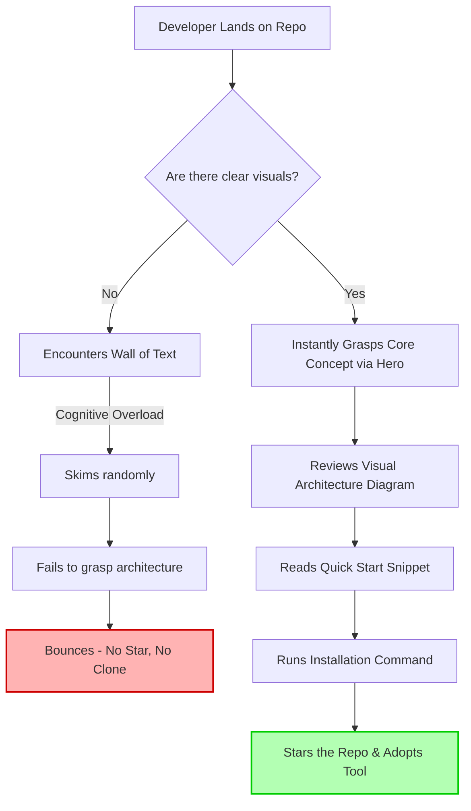

You've just spent the last six months building a game-changing open-source project. The codebase is pristine, the test coverage is at 99%, and the performance benchmarks are off the charts. You hit publish, drop a link on Hacker News, X, and Reddit, and wait for the stars to roll in. 

And then... crickets. Maybe three stars from your coworkers and one from a bot. 

What went wrong? You check your repository traffic and see hundreds of unique visitors, but almost zero clones or stars. The hard truth is that your code might be a masterpiece, but your GitHub README is broken. It reads like a dense legal document, and in the hyper-competitive world of open source, developers simply do not have the patience to read a wall of text. 

Welcome to the harsh reality of the **Repo Bounce Rate**. 

When a developer lands on your repository, you have exactly three seconds to convince them that your tool is worth their time. If they cannot instantly grok what your project does, how it is architected, and how to use it, they will hit the back button. In this deep dive, we are going to explore why text-heavy READMEs are destroying your OSS adoption, introduce a new mental model for repository design, and show you how to instantly visualize your repo structure to dramatically improve conversion rates.

## The Psychology of the Open Source Consumer

Developers are notoriously skeptical consumers. When evaluating a new library or tool, they are looking for reasons *not* to use it. Is it maintained? Is it overly complex? Will it bloat my bundle size? 

But before they even ask those questions, they make a subconscious judgment based entirely on aesthetics and structure. **Perceived quality equals actual quality.** If your README looks like a chaotic brain dump, the visiting developer will naturally assume your source code is a chaotic brain dump. 

Conversely, repositories with polished visuals, clear architecture diagrams, and beautiful code snippets project authority and reliability. This is not just superficial vanity; it is UX design applied to developer tools (DX - Developer Experience).

## Introducing: The README Conversion Funnel

To fix a broken README, we need to treat it like a high-converting landing page. Instead of just "documenting" your code, you need to guide the visitor through **The README Conversion Funnel**. 

The funnel consists of four distinct stages:

1. **The Hook (0-3 seconds):** The top of the fold. This includes a punchy title, relevant badges (build status, version, license), and crucially, a high-quality Hero Image or visual that demonstrates the value proposition instantly.
2. **The Architecture Glance (3-10 seconds):** How does this thing actually work? What are the moving parts? This is where text fails miserably and visual structure shines.
3. **The "Quick Start" Trial (10-30 seconds):** The lowest friction path to getting the tool running. A simple `npm install` and a beautiful, highlighted code snippet showing the primary API.
4. **The Conversion:** The developer stars the repo, forks it, or integrates it into their codebase.

Let's visualize the catastrophic drop-off that happens when you ignore this funnel and rely on text alone.



Notice the bottleneck? If you fail at the visual stage, the developer never even makes it to your Quick Start section.

## The Fallacy of the Text-Based Directory Tree

For years, the standard way to explain how a repository is organized was to run the `tree` command in the terminal and paste the ASCII output into a code block. 

```text
.
├── src/
│   ├── components/
│   ├── utils/
│   └── index.ts
├── tests/
└── package.json
```

While functional, this approach is fundamentally broken for modern developer marketing. Here is why:

1. **High Cognitive Load:** ASCII trees require sequential reading. The brain has to parse the lines, indents, and characters to build a mental map.
2. **Terrible Mobile Experience:** Have you ever looked at a complex ASCII tree on the GitHub mobile app? It breaks formatting, forces horizontal scrolling, and looks like garbage.
3. **Zero Brand Identity:** It is raw, unstyled text. It does nothing to elevate the perceived premium nature of your tool.

Let's look at a head-to-head comparison of legacy methods versus modern visual architecture.

| Feature / Approach | Legacy Text-Based Tree (`tree` command) | Modern Visual Architecture |
| :--- | :--- | :--- |
| **Cognitive Friction** | High. Requires tedious line-by-line reading. | Low. Human pattern recognition grasps it instantly. |
| **Aesthetic Value** | Looks like a terminal dump from 1995. | Resembles a premium SaaS product interface. |
| **Mobile Responsiveness** | Breaks formatting, nightmare horizontal scrolling. | Perfect scaling, responsive image rendering. |
| **Brand Alignment** | Zero customization. Standard monospace only. | Full control over themes, colors, and branding. |
| **Conversion Impact** | Baseline (Expected minimum). | High. Subconsciously signals superior code quality. |

## The Solution: Visualizing Your Repo Instantly with NavoKit

You know you need visuals, but opening up Figma, designing a layout, exporting assets, and keeping them synced with your codebase is a massive time sink. You are an engineer, not a graphic designer.

This is where **NavoKit's Markdown to Image tool** becomes your secret weapon for OSS growth.

Instead of fighting with design tools, NavoKit allows you to generate stunning, retina-ready visuals of your codebase structure, code snippets, and architecture directly from your browser. It bridges the gap between raw code and premium developer marketing.

### How to Transform Your README Today

Here is the exact playbook to upgrade your repository from a text-dump to a high-converting developer asset using NavoKit:

#### 1. Kill the ASCII Tree
Delete that text-based directory structure. Go to NavoKit, input your repository's core structure, and use the Markdown to Image tool to generate a beautiful, themed representation of your architecture. You can customize the background, add drop shadows, and apply syntax highlighting that matches your brand's aesthetic.

#### 2. Elevate Your Code Snippets
Stop relying on standard markdown code blocks for your most critical examples. Your "Quick Start" code is the most important code in the entire repository. Use NavoKit to turn that snippet into a beautiful, MacOS-style window visual. It immediately draws the eye and screams "premium."

#### 3. Design for Dark Mode
GitHub's dark mode is massively popular. If you are uploading PNGs with solid white backgrounds, you are blinding half your audience. When generating images with NavoKit, utilize transparent backgrounds or theme-aware colors to ensure your architecture diagrams look incredible regardless of the user's system preferences.

#### 4. Optimize for the "First Scroll"
Take the visual architecture image you just generated and place it *immediately* after your badges and introductory sentence. Do not make the developer scroll to find out how your project is built. Hit them with the visual proof immediately.

## The ROI of Repository Aesthetics

Investing time into the visual structure of your GitHub README is not vanity; it is a strategic distribution mechanism. 

When you lower the cognitive friction required to understand your codebase, you inherently lower the barrier to entry. A developer who instantly understands your architecture is a developer who feels confident installing your package. 

By applying the README Conversion Funnel and utilizing tools like NavoKit to effortlessly generate premium visual assets, you stop bleeding traffic and start converting visitors into users, contributors, and evangelists.

Stop letting your brilliant code hide behind a broken, text-heavy README. Visualize your repo structure instantly, and watch your adoption rates soar.
