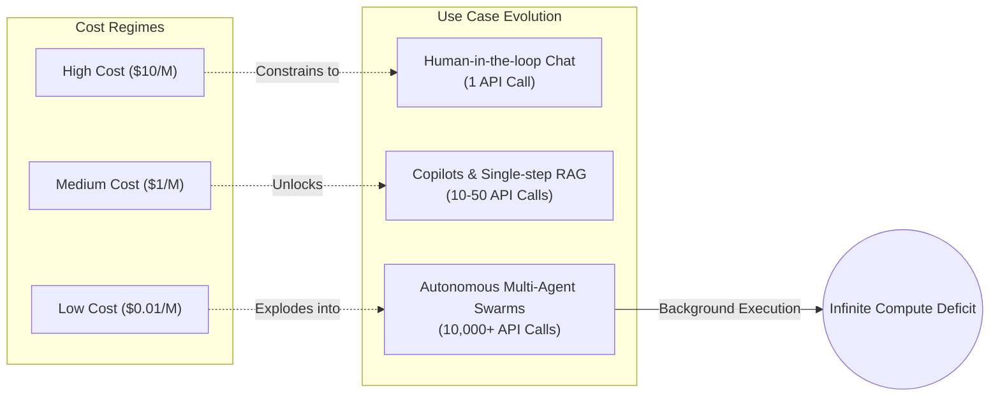

In 1865, English economist William Stanley Jevons observed a counterintuitive phenomenon: technological improvements that increased the efficiency of coal use didn't lead to a decrease in coal consumption. Instead, they caused consumption to skyrocket. By making coal power cheaper and more efficient, it became economically viable for vastly more applications. 

Fast forward to the current decade, and Silicon Valley is falling into the exact same cognitive trap with AI compute. The prevailing narrative suggests that as models become smaller, more efficient, quantized to 4-bit, and distilled into hyper-optimized Mixture-of-Experts architectures, the global demand for GPUs will plateau. "We are optimizing inference," the argument goes, "therefore we will need less hardware."

This is fundamentally backwards. The optimization of inference is the match that ignites the powder keg of compute demand. We are staring down the barrel of the AI Jevons Paradox.

### The Latency-Elasticity Demand Curve

To understand why compute demand is about to violently decouple from historical hardware scaling laws, we need a new mental model. Let's introduce **The Latency-Elasticity Demand Curve**. 

This framework posits that demand for LLM inference is infinitely elastic relative to cost and latency. When inference is expensive ($10 per million tokens) and slow (time-to-first-token in seconds), AI usage is confined to high-value, synchronous, human-in-the-loop tasks. You ask a question; the model answers. The API call ratio is 1:1.

But when you drive the cost to $0.01 per million tokens and latency to milliseconds, the fundamental nature of the workload changes. AI transitions from being a *synchronous tool* to an *asynchronous background process*.

At near-zero cost, we no longer optimize for API call efficiency. Instead, we trade cheap compute for higher intelligence. Why rely on a zero-shot prompt when you can spawn a background swarm of 500 subagents to aggressively debate a problem, generate 10,000 synthetic test cases, compile code, execute it, read the stack traces, and self-correct over 400 iterations?

### Agentic Autonomy Loops: The Infinite Sink

The defining characteristic of the next wave of AI isn't better foundational intelligence; it's agentic looping. When developers build autonomous systems, they rely on architectures like Tree of Thoughts (ToT), self-reflection, and massive parallel sampling.

Consider a simple coding task. In a High Cost regime, a developer writes a prompt, gets a snippet, and manually debugs it. 
In a Micro Cost regime, the developer assigns a ticket. The AI reads the entire codebase, spawns an architectural planning agent, which spawns three separate implementation agents. They write the code, write the unit tests, and iteratively run them. Every failure triggers a new diagnostic prompt. 

What used to be a single 500-token API call is now a deeply nested, recursive fractal of API calls consuming 50 million tokens in the background.

| Cost Regime | API Economics | Interaction Model | API Calls per Task | Token Consumption |
|-------------|---------------|-------------------|--------------------|-------------------|
| **High** | $10.00 / 1M | Synchronous Chat | 1 - 2 | 10k - 50k |
| **Medium** | $1.00 / 1M | Guided RAG / Copilot | 10 - 50 | 100k - 500k |
| **Low** | $0.10 / 1M | Chain-of-Thought Looping | 500 - 1,000 | 5M - 20M |
| **Micro** | < $0.01 / 1M | Unbounded Agent Swarms | 100,000+ | 1B+ |

The table above illustrates the catastrophic scaling vector. A 100x reduction in API cost does not result in a 99% savings on the bill. It unlocks workloads that demand a 10,000x increase in volume. The elasticity coefficient is >1. 

### The Illusion of Optimization

Hardware providers and model builders are locked in an aggressive race to the bottom on price. FlashAttention, continuous batching, speculative decoding, and fp8 quantization are all driving down the cost of serving a single token. 

But every ounce of optimization directly subsidizes algorithmic brute-forcing. If inference is 10x cheaper, the rational engineering decision is to sample 10x more paths to find a better answer. We are substituting algorithmic elegance with raw, unadulterated compute power.

We are already seeing the early tremors. Background agents analyzing logs 24/7, synthetic data generation pipelines consuming idle GPU cycles, and LLMs generating entire games frame-by-frame on the fly. 

The Jevons Paradox guarantees that there is no ceiling to compute demand. We are not building calculators that spit out a number and turn off. We are building synthetic cognitive engines. The moment cognitive labor becomes cheaper than human labor, the demand for that labor becomes practically infinite. 

Cheaper inference isn't the solution to the GPU shortage. It is the exact mechanism that ensures the shortage will never end.
