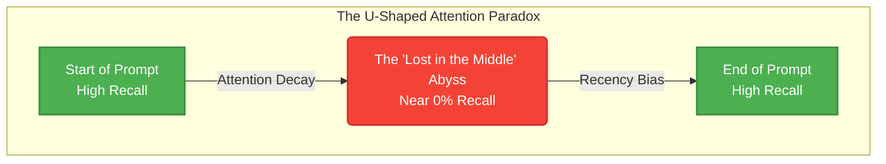

We've entered the context window arms race. Model providers are casually dropping 1M, 2M, and even 10M token context limits, marketing them as the ultimate solution for RAG (Retrieval-Augmented Generation) and document processing. Just dump your entire codebase, seven Harry Potter books, and your company's AWS billing history into the prompt, and let the model figure it out, right?

Wrong.

The reality of how Transformer architectures process long contexts is far more nuanced, brutal, and memory-intensive than the marketing materials suggest. There is a massive gulf between a model's *technical capacity* to ingest tokens and its *cognitive capacity* to actually reason over them. 

Welcome to the Context Window Illusion.

## The U-Shaped Attention Paradox

When you feed a massive document to an LLM, the model doesn't read it like a human reads a book. It calculates attention scores across tokens. As the sequence length scales, we encounter a severe degradation phenomenon that we term **The U-Shaped Attention Paradox**.

The paradox dictates that an LLM's retrieval accuracy is highly dependent on where the information is located within the prompt. Information at the very beginning (the system prompt and initial instructions) and information at the very end (the recent context before the generation starts) enjoys near-perfect recall. But the middle? The middle is a black hole.



### Why does this happen?

1. **Absolute vs. Relative Positional Encodings:** Models trained using RoPE (Rotary Position Embedding) extrapolate well to a certain extent, but when pushed to extreme lengths (like 1M tokens), the attention matrix becomes overwhelmingly noisy. The model struggles to differentiate between token `500,000` and token `500,010`.
2. **Attention Dilution:** The Softmax function in the attention mechanism forces the sum of attention weights to be 1. When you have 1,000,000 tokens competing for attention, the weight assigned to any single crucial token in the middle becomes infinitesimally small, drowning the "signal" in the "noise" of surrounding context.

## Needle In A Haystack (NIAH) Metrics Expose the Truth

The industry standard for evaluating long-context models is the "Needle In A Haystack" (NIAH) test. You bury a specific, out-of-place fact (the needle) deep inside a massive corpus of irrelevant text (the haystack) and ask the model to retrieve it.

When we plot NIAH results across 1M token contexts, a terrifying pattern emerges. Marketing claims 99% accuracy, but that's often tested on simple retrieval with dense needles. When you move to multi-hop reasoning or single, sparse needles, the effective context window collapses.

| Model / Architecture | Claimed Context Limit | Effective Reasoning Context | Middle-Context Degradation Rate |
| :--- | :--- | :--- | :--- |
| Standard Transformer | 128k Tokens | ~32k Tokens | High (Severe U-Shape) |
| Ring Attention MoE | 1M Tokens | ~100k Tokens | Moderate (Fuzzy Middle) |
| Linear Attention / SSM | Infinite (Theoretical) | ~50k Tokens | Low (But suffers overall capability drop) |

*Table: The stark contrast between marketing claims and actual reasoning capabilities.*

## The KV Cache Memory Explosion

Let's talk about the physical physics of the hardware. The biggest bottleneck in long-context inference isn't compute; it's memory. Specifically, the Key-Value (KV) Cache.

During autoregressive generation, a Transformer caches the Key and Value tensors for every single token in the context window to avoid recomputing them. This cache scales linearly with sequence length. 

For a 70B parameter model, a 1M token context can require **hundreds of gigabytes** of VRAM just for the KV cache of a single request. 

### The Math of the Explosion:
```
Memory = 2 * (Num Layers) * (Num Heads) * (Head Dimension) * (Sequence Length) * (Batch Size) * (Precision Bytes)
```

At 1M tokens, the KV cache becomes so massive that the bottleneck shifts entirely to memory bandwidth. The GPU is spending all its time moving KV cache data from HBM (High Bandwidth Memory) to the compute cores, starving the arithmetic logic units. 

Techniques like Grouped-Query Attention (GQA) and KV Cache Quantization (FP8/INT4) mitigate this, but they are band-aids on a fundamental architectural flaw. You simply cannot infinitely scale a dense attention matrix without hitting a memory wall.

## Stop Dumping, Start Engineering

The Context Window Illusion leads developers to adopt lazy architectures. Relying on massive context windows as a crutch for poor information architecture is a technical debt time bomb.

Instead of brute-forcing 1M tokens, elite engineering teams are returning to sophisticated, precise retrieval systems:

1. **Agentic RAG over Brute Force:** Use smaller, faster models (with 8k-32k context) equipped with semantic search and Graph RAG to pull only the exact chunks needed.
2. **Hierarchical Summarization:** Don't feed the raw logs; feed the distilled insights. Use a pipeline to compress information before it ever hits the reasoning model's prompt.
3. **Prompt Pipelining:** Break massive tasks into map-reduce architectures. Have the model process 10k tokens at a time, extract the value, and pass the synthesized state forward.

The 1M token context window is a marvel of engineering, but it's not a silver bullet. Understanding the mechanics of attention dilution, KV cache scaling, and the U-Shaped Attention Paradox is what separates senior AI engineers from prompt kiddies. Stop trusting the marketing, measure your own NIAH metrics, and engineer your systems for the reality of the hardware.
