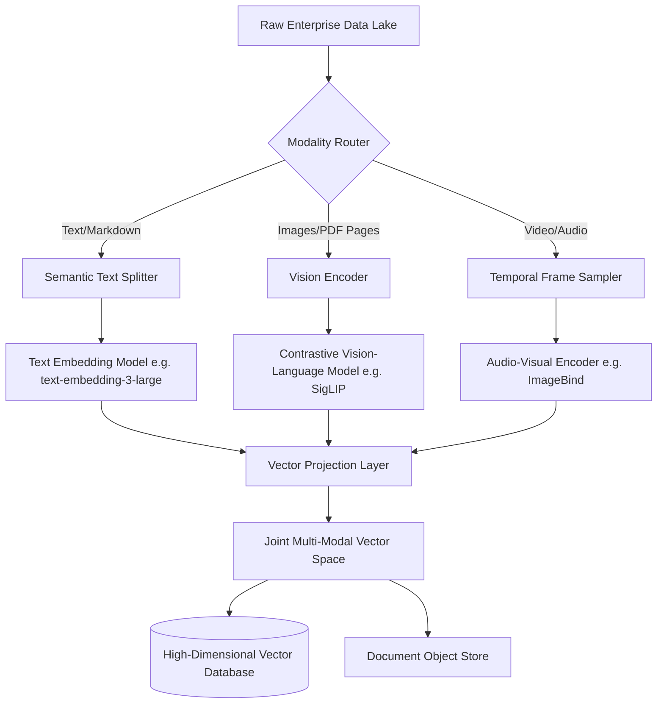

The honeymoon phase of text-only Retrieval-Augmented Generation (RAG) is officially over. For the past few years, engineering teams have been bolting LangChain wrappers around text-embedding models, stuffing documents into vector databases, and calling it a day. But enterprise data is rarely just text. It’s a chaotic web of architectural diagrams, scattered PDFs with dense financial charts, audio logs from customer support, and instructional videos. Text-only RAG completely drops the ball when it encounters this reality. It strips away the visual context, discards the temporal nuances of audio and video, and ultimately fails to capture the true semantic meaning of the data. 

To solve this, we must move beyond the limitations of single-modality pipelines and embrace Multi-Modal RAG. This isn't just about passing an image to a multimodal LLM; it requires a fundamental restructuring of how we ingest, embed, and retrieve data across a unified vector space. In this technical deep dive, we will explore the engineering requirements for building production-grade multi-modal search systems and introduce a robust framework for handling diverse data types.

## The Collapse of the Text-Only Paradigm

When you process a dense technical manual using a standard text chunking strategy, the OCR (Optical Character Recognition) step invariably destroys the structural integrity of the document. A chart showing revenue growth over time becomes a garbled mess of alphanumeric characters. The spatial relationship between the x-axis and the data points is lost forever. 

Traditional RAG attempts to solve this by extracting text and hoping the LLM can piece it back together. But semantic search relies on the proximity of vectors in a high-dimensional space. If the embedding model cannot "see" the chart, the resulting vector will be mathematically distant from any query asking about "revenue trends." We need an architecture that ingests the raw pixels, the audio waveforms, and the text strings, projecting them all into a shared semantic space where a text query can retrieve an image, or an image query can retrieve a video snippet.

## Introducing: The Cross-Modal Fusion Architecture

To handle the complexity of multi-modal ingestion and retrieval, we utilize a pattern I call the **Cross-Modal Fusion Architecture (CMFA)**. The core philosophy of CMFA is late-stage fusion: we maintain the fidelity of the raw data as long as possible, using specialized encoders for each modality, and only project them into a shared vector space at the final embedding layer.

This architecture decouples the ingestion pipeline from the embedding models, allowing you to swap out a vision encoder (like CLIP or SigLIP) without affecting the text ingestion pipeline. 

### The CMFA Ingestion Pipeline

Here is how the data flows through the Cross-Modal Fusion Architecture during the ingestion phase:



In the CMFA pipeline, the **Modality Router** is a critical component. It inspects the incoming payload (e.g., an S3 bucket event) and determines the processing path. 
- **Text** goes through standard semantic chunking.
- **Images** (and rasterized PDF pages) are passed to a vision encoder. We prefer contrastive models like SigLIP over older CLIP variants due to their superior performance on dense, text-heavy images.
- **Video** requires a Temporal Frame Sampler. Extracting every frame is computationally ruinous. Instead, we use scene-change detection algorithms to extract keyframes, passing these frames alongside the extracted audio track into an Audio-Visual Encoder like Meta's ImageBind.

The magic happens at the **Vector Projection Layer**. Because different encoders output vectors of varying dimensions (e.g., 1536 for OpenAI text, 768 for SigLIP), we must project them into a unified space. This is often achieved using a lightweight neural network trained via contrastive loss to align the modalities, ensuring that the text vector for "a dog playing fetch" has a high cosine similarity with the image vector of a dog playing fetch.

## Architectural Comparison: Text-Only vs Multi-Modal RAG

To understand the shift in complexity, let's look at a direct comparison of the subsystems required.

| Component | Text-Only RAG | Multi-Modal RAG (CMFA) |
| :--- | :--- | :--- |
| **Ingestion** | Simple OCR, Regex parsing, Recursive Character Splitter | Modality Router, Scene Detection, PDF Rasterization |
| **Embedding Models** | Single dense text model (e.g., BGE-m3, OpenAI) | Multiple specialized models (SigLIP, ImageBind, Text) |
| **Vector Space** | Homogeneous (Text-to-Text alignment) | Heterogeneous (Joint Cross-Modal alignment) |
| **Retrieval Mechanics** | k-NN or HNSW on text vectors | Multi-vector querying, Cross-modal Reciprocal Rank Fusion |
| **Generation (LLM)** | Standard LLM (GPT-4, Claude 3 Opus) | Vision-Language Models (VLM) (GPT-4o, Claude 3.5 Sonnet) |
| **Storage Infrastructure**| Vector DB + basic metadata | Vector DB + Object Store (for raw images/video frames) |
| **Latency Profile** | Low (Text parsing and embedding is fast) | High (Vision encoding and frame sampling are compute-heavy) |

## The Retrieval Mechanics of CMFA

Retrieving data across modalities requires a shift from simple k-NN (k-Nearest Neighbors) to multi-vector querying. When a user issues a query like, "Show me the architectural diagram for the new authentication service and summarize its components," the system must perform a multi-pronged retrieval.

1. **Query Encoding**: The text query is embedded into the joint vector space.
2. **Cross-Modal Search**: We execute an HNSW (Hierarchical Navigable Small World) search against the Vector Database. Because the space is aligned, this single text vector will retrieve both the text documentation describing the auth service and the image vector representing the architectural diagram.
3. **Reciprocal Rank Fusion (RRF)**: In production, relying purely on the joint embedding is risky. We often augment this by running an BM25 sparse search on the text metadata associated with the images, and fusing the results using RRF. This hybrid search approach stabilizes the retrieval metrics.

## Overcoming the Engineering Bottlenecks

Implementing the Cross-Modal Fusion Architecture is not without its blood, sweat, and tears. The two biggest challenges are dimensionality and latency.

### The Dimensionality Curse
When projecting multiple modalities into a single space, you risk the "curse of dimensionality." If the joint space is too small, you lose the semantic granularity needed to differentiate between a bar chart of Q1 revenue and a bar chart of Q2 revenue. If the space is too large, your memory costs in the Vector DB skyrocket, and query latency degrades. 

The current best practice is to utilize Matryoshka Representation Learning (MRL). By training the projection layer to optimize for MRL, we can truncate the resulting vectors (e.g., from 2048 to 512 dimensions) with minimal loss in retrieval accuracy, significantly reducing the memory footprint in production.

### Asynchronous Ingestion and GPU Management
Vision and video encoders are extremely GPU-hungry. Running them synchronously during ingestion will choke your pipeline and rack up cloud bills. The CMFA requires an asynchronous event-driven architecture. 
Incoming files should be dumped into an object store, triggering a message queue (like Kafka or SQS). GPU-backed worker nodes pull from this queue, process the batches, and push the vectors to the database. You must aggressively auto-scale these worker nodes down to zero when idle, as maintaining persistent GPU instances for bursty ingestion workloads is a fast track to bankruptcy.

## The Generative Phase: Feeding the VLM

Once the relevant chunks (text, images, video keyframes) are retrieved, they must be formatted for the generation phase. Standard LLMs cannot process the image bytes. You must route the prompt to a Vision-Language Model (VLM).

The prompt construction here is delicate. You are not just concatenating text; you are interlacing text with base64 encoded images or signed URLs. 
```python
# Conceptual Payload for VLM
payload = {
    "role": "user",
    "content": [
        {"type": "text", "text": "Based on the retrieved context, summarize the system."},
        {"type": "image_url", "image_url": {"url": "s3://bucket/retrieved_diagram.png"}},
        {"type": "text", "text": "Retrieved Text: The auth system uses OAuth2..."}
    ]
}
```
The VLM attends to both the visual features of the diagram and the semantics of the text, synthesizing a response that accurately reflects the multi-modal reality of the enterprise data.

## The Future: Late Interaction for Vision

Looking ahead, the industry is moving towards Late Interaction models for vision, similar to what ColBERT achieved for text. Instead of compressing an entire image into a single dense vector, late interaction models produce a matrix of token-level embeddings for patches of the image. This allows the query to attend to specific regions of the image during retrieval, drastically improving fine-grained search accuracy (e.g., searching for a specific logo within a dense slide deck). 

Multi-Modal RAG is not a marginal improvement over text-only systems; it is a paradigm shift. By adopting frameworks like the Cross-Modal Fusion Architecture, engineering teams can unlock the latent value trapped within visual and audio assets, building AI search systems that finally understand the world the way we do.
