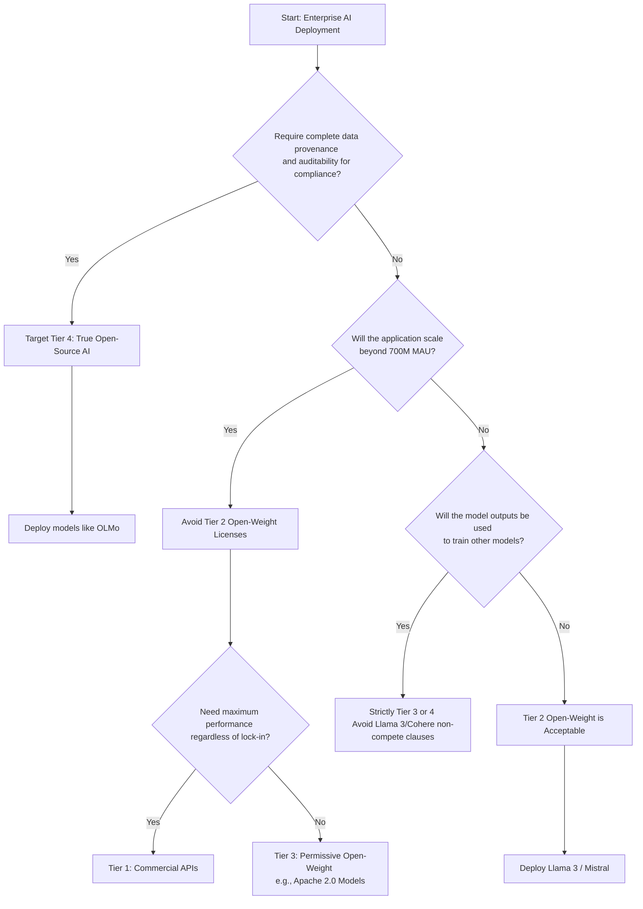

The software industry is currently experiencing an unprecedented semantic drift. For decades, the term "open source" was guarded by strict legal frameworks and rigid definitions laid down by the Open Source Initiative (OSI). Yet, the explosion of large language models (LLMs) has introduced a calculated ambiguity, driven primarily by corporate entities eager to capitalize on the goodwill of open collaboration while retaining sovereign control over their intellectual property. The distinction is no longer semantic; it is structural. We must rigorously differentiate between true open-source software and the increasingly prevalent "open-weight" paradigm. 

The ramifications for enterprise deployment, compliance, and downstream liability are immense. As legal architectures adapt to the reality of foundational models, engineering leaders and legal counsels must navigate a fractured landscape of pseudo-open licenses. 

## The Ontological Difference: Code vs. Weights

In traditional software engineering, source code is the absolute ground truth. If you possess the source code and the right to modify it, you possess the software. The OSI definition hinges on this transparency and unencumbered utility. However, a neural network is not fundamentally its training code, nor is it merely its inference engine. An LLM is a complex mathematical artifact—a multi-dimensional matrix of weights and biases derived through massive computational expenditure. 

Releasing the weights without the underlying training data, the data curation pipelines, and the exact distributed training scripts fundamentally breaks the OSI requirement for providing the preferred form for modification. This is the crux of the open-weight paradigm. It grants you the artifact to run inference, and sometimes to fine-tune, but it explicitly denies you the sovereignty to recreate or deeply audit the foundational artifact.

## The 4-Tier Model Compliance Spectrum

To untangle the legal risk associated with these artifacts, we introduce **The 4-Tier Model Compliance Spectrum**. This framework categorizes AI assets based on their legal encumbrances, data provenance transparency, and adherence to established open-source principles.

### Tier 1: Absolute Proprietary (The Black Box)
The model is accessible strictly via API. The weights, architecture, and training data are entirely opaque. 
*   **Compliance Risk**: High external dependency, absolute vendor lock-in.
*   **Examples**: OpenAI GPT-4, Anthropic Claude 3.5.

### Tier 2: Open-Weight with Acceptable Use Restrictions (The Walled Garden)
The weights are available for download, but the license restricts commercial use above certain thresholds or prohibits specific downstream applications (e.g., training competing models). The training data remains undisclosed.
*   **Compliance Risk**: Moderate to High. Hidden legal triggers based on user scale or specific use cases.
*   **Examples**: Meta Llama 3 (requires negotiation >700M users), Mistral 8x22B (Non-production/Research licenses for certain tiers).

### Tier 3: Permissive Open-Weight (The Pragmatic Middle)
The weights and architecture are released under established permissive licenses (e.g., Apache 2.0 or MIT). However, the underlying training data and specific reinforcement learning pipelines are withheld. 
*   **Compliance Risk**: Low. Commercial use is generally safe, but deep audits for copyright infringement in the training data are impossible.
*   **Examples**: Qwen, certain early EleutherAI models.

### Tier 4: True Open-Source AI (The Transparent Ideal)
The OSI-compliant holy grail. The weights, architecture, the exact training code, and the entirety of the training dataset are publicly released under recognized open-source licenses. 
*   **Compliance Risk**: Negligible from a licensing perspective, though data provenance must still be vetted by legal teams.
*   **Examples**: OLMo by Allen Institute for AI (AI2).

## Structural Comparison: Llama 3 vs. Apache 2.0

To illustrate the stark differences between a Tier 2 Open-Weight license and a true Tier 3/4 permissive license, we must analyze the legal mechanics at play. The Meta Llama 3 Community License is frequently colloquially referred to as "open source," but a forensic reading of its clauses reveals significant encumbrances.

| Feature | Meta Llama 3 Community License | OSI Apache License 2.0 |
| :--- | :--- | :--- |
| **Commercial Use** | Conditionally permitted. Revoked automatically if monthly active users exceed 700 million. | Unconditionally permitted for any scale. |
| **Derivative Works** | Permitted, but subject to specific "Acceptable Use Policy" restrictions. | Unconditionally permitted. |
| **Competitive Training** | Explicitly forbidden. You cannot use Llama 3 outputs to train a competing LLM. | Unconditionally permitted. |
| **Patent Retaliation** | Present, but narrowly scoped to the model itself. | Broad and comprehensive patent retaliation clause. |
| **Definition of "Source"** | Refers to weights and parameters, ignoring the training data. | Refers strictly to the preferred form for making modifications. |

The restrictions on competitive training and the arbitrary scale caps are fundamentally incompatible with the Open Source Definition. They represent a strategic corporate maneuver: maximizing adoption and standardizing the ecosystem around a specific architecture, while legally neutralizing potential hyperscaler competition.

## Architectural Decision Matrix

For enterprise architects and legal teams, selecting a foundation model is no longer purely a benchmark-driven exercise. The legal encumbrances of the weights dictate the long-term viability of the product architecture. The following decision tree maps the strategic pathways for enterprise deployment.

## Liability and Downstream Ramifications

The ambiguity surrounding open-weight licenses introduces novel vectors for legal liability. When an enterprise integrates an Apache 2.0 software library, the indemnification and usage rights are well-understood by intellectual property attorneys globally. When an enterprise integrates an open-weight model governed by a bespoke Acceptable Use Policy (AUP), the legal surface area expands unpredictably.

Consider a scenario where an open-weight model generates code that infringes on a third party's copyright. Because the training data (Tier 2 and Tier 3) is opaque, the enterprise cannot preemptively audit the model for compromised data. Furthermore, bespoke AUPs often include clauses that shift the burden of downstream misuse entirely onto the developer, explicitly absolving the model creator of liability while retaining the right to revoke the license at their discretion. 

This asymmetry of risk is the defining characteristic of the current open-weight landscape. The enterprise assumes the infrastructural and legal risk of deployment, while the model creator retains the strategic leverage of arbitrary revocation.

## The Regulatory Horizon

Legislators in the European Union (via the EU AI Act) and various jurisdictions are beginning to recognize these nuances. The exemptions provided for "open-source AI" in regulatory frameworks will inevitably require stringent definitions. It is highly probable that regulatory bodies will adopt frameworks similar to **The 4-Tier Model Compliance Spectrum**, denying regulatory exemptions to Tier 2 open-weight models while granting safe harbor to Tier 4 true open-source deployments.

As the ecosystem matures, the semantic sleight-of-hand will fail. Enterprises must conduct rigorous legal diligence, treating weights not as code, but as highly encumbered, opaque mathematical liabilities. The future of enterprise AI relies on demanding transparency, pushing the industry from the walled gardens of open-weight towards the resilient, auditable foundations of true open-source AI.
