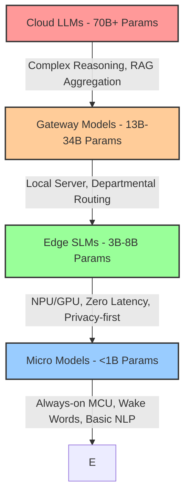

We've been force-fed a narrative that bigger always means better. For the last three years, the AI ecosystem operated on a singular, brute-force thesis: scale the parameter count, hoard the GPUs, and pray the cloud API doesn't throttle during peak hours. We jumped from 7B to 70B, then blew right past 400B parameters, normalizing 100-millisecond latency floors and astronomical inference bills. 

But physics always wins.

The bottleneck isn't intelligence; it's memory bandwidth and data gravity. Moving a prompt to a centralized cluster 3,000 miles away, running it through a dense 70B parameter model, and piping the token stream back is computationally offensive for 90% of real-world tasks. The industry is currently undergoing a brutal, necessary correction. The focus has violently shifted to Small Language Models (SLMs)—specifically the highly optimized 1.5B to 8B parameter weight classes—running entirely on local silicon.

Let's dissect exactly why the 7B class has become the undisputed heavy hitter for edge AI, and how the underlying hardware-software co-design makes it possible.

## The Memory Bandwidth Bloodbath

To understand the shift, you have to look at the math. In autoregressive generation, memory bandwidth strictly bounds performance. Generating a single token requires loading the entire model's weights from memory into the compute units. 

If you're running a 70B parameter model at FP16 (16 bits or 2 bytes per parameter), the model weights consume roughly 140 GB of VRAM. Just to generate one token per second, you need 140 GB/s of memory bandwidth. A modern cloud GPU like the H100 provides around 3.3 TB/s of memory bandwidth. That's fantastic for batched requests in a datacenter, but overkill and structurally impossible for a client device.

Now look at a 7B model. At FP16, it needs 14 GB. But nobody runs FP16 on the edge anymore. 

Enter INT4 quantization and group-wise scaling (like AWQ or GGUF formats). By aggressively quantizing the weights down to 4 bits per parameter, that 7B model suddenly requires just ~3.5 GB to 4 GB of RAM. 

Apple's M4 chip boasts 120 GB/s of memory bandwidth on the base model. Snapdragon X Elite hits 135 GB/s. A 4GB model running on a chip with 120 GB/s bandwidth can theoretically generate 30 tokens per second (120 / 4 = 30 t/s), completely local, zero network calls, zero API costs. 

That 30 t/s threshold is critical. It matches human reading speed. Once local generation hits 30 t/s, the user experience becomes indistinguishable from a fast cloud API, minus the jitter.

## The Edge-Cloud Inference Pyramid

We are moving away from monolithic API reliance toward a tiered architectural framework. I call this the **Edge-Cloud Inference Pyramid**.

1. **Micro Models (<1B):** Sitting on microcontrollers and DSPs. Think sub-milliwatt power draw.
2. **Edge SLMs (3B-8B):** The workhorses. Running on Neural Processing Units (NPUs) or integrated GPUs on laptops and smartphones. They handle 80% of daily tasks: summarization, drafting, structured data extraction (JSON parsing).
3. **Gateway Models (13B-34B):** Running on local servers or high-end workstations. 
4. **Cloud LLMs (70B+):** Reserved strictly for deep reasoning, massive context window ingestion, and complex agentic planning.

By routing queries through this pyramid, systems achieve near-instant TTFT (Time To First Token) for simple tasks while reserving expensive cloud calls for actual hard problems.

## Hardware Catching Up: The NPU Era

The proliferation of 7B models isn't just a software triumph; it's a direct result of silicon shifting from CPU-centric to NPU-centric architectures. 

An NPU (Neural Processing Unit) is fundamentally a massive array of MAC (Multiply-Accumulate) units optimized for low-precision matrix math (INT8, INT4), backed by dedicated SRAM to avoid main memory round-trips.

Let's look at the TOPS (Tera Operations Per Second) arms race. In 2023, an average laptop NPU hit roughly 10-15 TOPS. By 2026, the baseline requirement for an "AI PC" is 40-50 TOPS, with modern silicon pushing well past 60 TOPS purely on the NPU. 

When you run a 7B model through a 50 TOPS NPU using INT4 weights, you are operating at peak silicon efficiency. The CPU goes to sleep. The GPU handles display rendering. The NPU chews through the transformer blocks at roughly 3-5 watts of power. You can run inference on a battery-powered device for hours without spinning up a fan.

## The Brutal Reality of Economics

Let's strip away the hype and look at the unit economics of deployment. If you're building an application with a million Daily Active Users (DAU), relying solely on cloud APIs is fiscal suicide.

| Metric | Cloud LLM (e.g., 70B via API) | Edge SLM (7B Local) |
| :--- | :--- | :--- |
| **Marginal Cost per Query** | ~$0.0005 to $0.002 | $0.00 (Compute is subsidized by user hardware) |
| **Time to First Token (TTFT)** | 300ms - 800ms (Network dependent) | < 50ms (Zero network overhead) |
| **Offline Capability** | Non-existent | 100% Functional |
| **Privacy / Data Security** | Data leaves the device (Compliance risks) | Data never leaves RAM (HIPAA/GDPR compliant by default) |
| **Context Window Cost** | Scales linearly or quadratically with tokens | Free up to local VRAM limits |

The math is unforgiving. Offloading 70% of routine inference to local 7B models doesn't just cut your AWS/GCP bill; it fundamentally changes the viability of your business model. You stop paying for the user's compute.

## Distillation and The Synthetic Data Engine

How did 7B models get so smart? They aren't training from scratch on the raw internet anymore. The secret sauce is knowledge distillation and synthetic data pipelines.

Instead of scraping low-quality Reddit threads, researchers are using massive 70B+ models to generate highly curated, structurally perfect datasets. The big model acts as the teacher, explaining the step-by-step reasoning (Chain of Thought). The 7B model acts as the student, training directly on this refined, high-signal data.

We are seeing 7B models consistently beat 70B models from just 18 months ago on benchmarks like MMLU and HumanEval. The parameter count shrank by 10x, but the data quality improved by 100x. The density of knowledge per parameter has skyrocketed.

## The Real World Deployment Stack

Building for local inference requires a different engineering stack. You don't just hit a REST endpoint. You manage the model lifecycle.

1. **Quantization:** You pull FP16 weights from HuggingFace and run them through quantization algorithms (like llama.cpp's quantization tools) to hit that INT4 sweet spot without excessive perplexity degradation.
2. **Format Packaging:** Formats like GGUF or ONNX have become the standard, packing weights, metadata, and tokenizer rules into a single portable binary.
3. **Execution Engine:** Runtimes like ONNX Runtime, CoreML, or raw llama.cpp sit close to the metal, dynamically dispatching matrix multiplications to the CPU, GPU, or NPU depending on the specific SoC architecture.

This stack is maturing rapidly, abstracting away the pain of heterogeneous silicon.

## The Paradigm Shift

The era of defaulting to massive cloud models is over. The latency is too high, the physics are too hostile, and the economics are fundamentally broken for scale.

The 7B parameter class is the sweet spot of the Pareto frontier. It perfectly intersects with current memory bandwidth limits, NPU capabilities, and INT4 quantization techniques. By pushing computation back to the edge, we reclaim privacy, destroy latency, and eliminate marginal inference costs. 

7B isn't just the new 70B. It's the architecture that will actually put AI into every device on the planet, without melting down a data center in the process.
