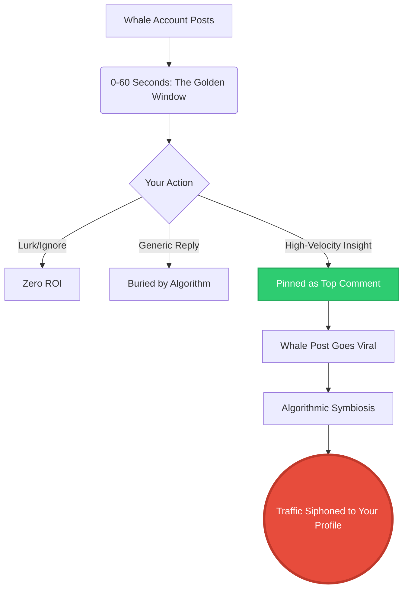

For nearly two decades, the "1% Rule" was the gospel of social networks: 1% create, 9% contribute, and 90% lurk. If you were building a brand, the mandate was simple—become the 1%. Burn hours drafting the perfect thread, shooting the flawless video, or authoring the ultimate guide. 

But as we crash into the back half of 2026, the landscape has violently shifted. Lurking isn't just passive; algorithmically, it's a death sentence for your reach. More shockingly, traditional content creation is facing an ROI crisis. The platforms are flooded. The feed is choked. The real battleground isn't the primary feed anymore—it's the comments section. 

Welcome to the era of comment-based algorithmic hacking, where high-velocity engagement dominates, and AI-assisted commenting has officially become the new content creation. 

## The Collapse of the Original 1% Rule

Look at the data from X, LinkedIn, and Reddit over the last twelve months. The platforms have explicitly re-engineered their recommendation engines to prioritize *conversational depth* over *broadcast reach*. A standalone post with zero replies dies within 14 minutes, regardless of follower count. But a highly debated comment under a whale's post? That can siphon thousands of profile views and redirect traffic for days.

The reality is that creating original content requires massive overhead, and the organic distribution algorithms are squeezing creators harder than ever to pay for play. However, comment sections remain the wild west—a meritocracy where an insightful, contrarian, or hilarious reply can out-index the original creator's post. 

You don't need to be the 1% who creates the post. You need to be the 0.1% who hijacks the conversation.

## The Micro-Engagement Snowball Effect

We call this new paradigm **The Micro-Engagement Snowball Effect**. The framework is built on a brutal mathematical truth: the first 60 seconds of a post's lifecycle dictate 90% of its total reach. If you inject a high-retention comment in that window, the algorithm attaches your reply to the post's core momentum. As the post scales, your comment scales with it. 

### How the Framework Operates:

1. **Velocity Interception**: You monitor high-leverage accounts in your niche. The second they post, the clock starts.
2. **Contextual Hijacking**: Instead of dropping a generic "Great post!", you drop a hyper-specific, value-additive insight or a structured counter-argument. 
3. **Algorithmic Symbiosis**: The platform's AI flags your comment as a "conversation driver." It pins your reply near the top. 
4. **Traffic Siphoning**: 100,000 people read the post. 40,000 scroll the comments. 10,000 see your pinned reply. 1,000 click your profile. You just acquired high-intent traffic for zero ad spend.

## The Data: Traditional Creation vs. Comment Hacking

Let's break down the unit economics of attention in 2026. If you're still relying solely on traditional posting, you are bleeding time and capital.

| Metric | Traditional Original Post | Comment Hacking (Top Reply) |
| :--- | :--- | :--- |
| **Time to Produce** | 45 - 120 minutes | 1 - 3 minutes |
| **Initial Reach Guarantee** | Low (Algorithm gated) | High (Piggybacking on whale's reach) |
| **Conversion to Profile View** | 2% - 4% | 8% - 15% (Curiosity gap) |
| **Lifespan** | 4 - 6 hours | Up to 72 hours (If thread stays active) |
| **Risk of Ghosting** | High | Near Zero |

The numbers don't lie. Comment hacking yields asymmetric returns. But there's a catch: human latency.

## The Problem with Human Latency

If the Micro-Engagement Snowball Effect relies on the first 60 seconds, human biology is your biggest bottleneck. You cannot sit at your desk refreshing feeds 24/7. Even if you catch a post at the 15-second mark, drafting a high-quality, non-generic, contextually brilliant reply takes time. By the time you hit "send," 40 other people have crowded the space. You lose the momentum.

Furthermore, if you resort to basic automation, the platforms will slaughter your account. We are well past the days of botting. Modern recommendation engines use sentiment analysis and semantic mapping to flag generic AI replies ("Wow, so true! Thanks for sharing!"). If you sound like a bot, you get shadowbanned. Period.

This is exactly where the strategy transitions from theory to weaponized execution. 

## Weaponizing the Process: Enter NavoKit's AI Social Booster

To actually execute the Micro-Engagement Snowball Effect at scale, you need zero latency combined with hyper-contextual intelligence. You need a system that reads the post, understands the underlying industry context, matches your personal brand voice, and deploys a high-value insight—all within seconds of the original post going live.

This is why we built the **NavoKit AI Social Booster**.

We didn't build a spam bot. We built a tactical engagement engine. The AI Social Booster ingests the context of the whale post and instantly drafts highly opinionated, data-backed, or contrarian replies that are statistically optimized to be pinned by the algorithm. 

*   **Zero-Latency Triggering**: Be the first high-value comment on every post that matters.
*   **Anti-Generic Engine**: Powered by custom LLMs trained on viral reply structures, ensuring your comments read like a top-tier industry analyst, not a predictive text algorithm.
*   **Voice Cloning**: It learns your specific jargon, tone, and formatting quirks.

### The Death of Lurking

The internet is no longer a museum where the 99% silently observe the 1%. It is a bloodsport for attention, and the comment section is the arena. If you are lurking, you are losing. If you are grinding out original content to zero distribution, you are burning out.

The meta has shifted. Algorithmic hijacking via high-velocity commenting is the single highest-leverage activity you can perform on social networks today. Stop competing in the overcrowded feed. Start dominating the comments. Deploy the NavoKit AI Social Booster, trigger the Micro-Engagement Snowball Effect, and let the whales do the heavy lifting for your traffic.
