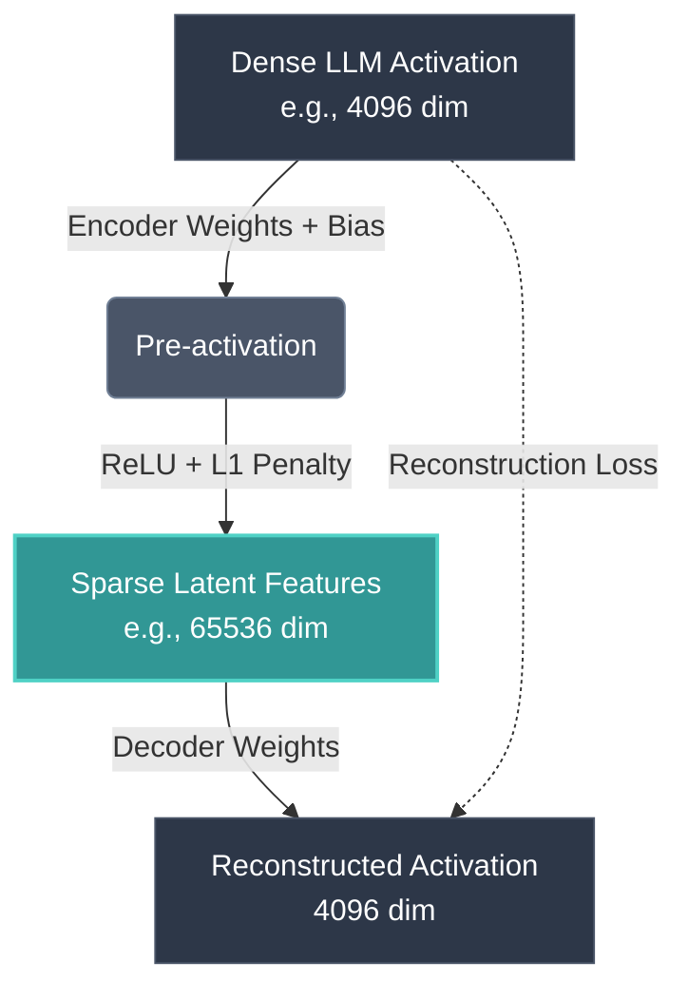

For years, the machine learning industry has operated on a dirty secret: we build massive models, train them on mountains of data, and watch them perform miracles—but we have absolutely no clue *how* they actually do it. We feed tokens in, multiply them through billions of parameters, and get poetry out. It's alchemy. But the era of alchemy is ending. Welcome to the age of Mechanistic Interpretability, where researchers are finally slicing open the neural black box. At the vanguard of this movement is a remarkably elegant tool: the Sparse Autoencoder (SAE).

If you're serious about AI engineering, you can no longer afford to treat Large Language Models (LLMs) as opaque probabilistic parrots. Understanding what's happening inside the residual stream is becoming table stakes. In this deep dive, we are going to dissect how SAEs work, why standard interpretability methods fail, and introduce a mental model for production-grade analysis: **The Latent Feature Disentanglement Pipeline**.

## The Problem: Superposition and Dense Activations

To understand why we need SAEs, we first have to understand the fundamental bottleneck of neural network representations: **Superposition**.

In a typical Transformer architecture, the residual stream has a fixed dimension—let's say 4,096 dimensions. But a model doesn't just need to track 4,096 concepts; it needs to track millions of distinct human features (e.g., "Eiffel Tower", "sarcasm", "Python syntax", "the color red"). How does a 4,096-dimensional space represent millions of concepts? 

The answer is polysemanticity and superposition. The network compresses these features by representing them as nearly-orthogonal vectors in high-dimensional space. A single neuron doesn't represent one thing; it fires for a chaotic mishmash of unrelated concepts depending on the context. If you look at a single neuron's activation, it might spike when the model sees the word "bank" (financial), the word "bank" (river), and randomly when parsing HTML tags. 

Trying to interpret raw neuron activations is like trying to listen to a specific conversation in a crowded stadium by placing a single microphone in the center. You just get noise. We need a way to unscramble this dense representation back into distinct, human-interpretable concepts.

## Enter the Sparse Autoencoder (SAE)

A Sparse Autoencoder is an unsupervised learning model designed specifically to solve the superposition problem. We train it not on the raw text, but on the *internal activations* of the LLM.

The goal of the SAE is to take a dense, low-dimensional activation vector from the LLM's residual stream and map it to a highly sparse, high-dimensional space where each dimension corresponds to a single, monosemantic (one meaning) concept.

Here is the mathematical intuition:
1. **Encoder:** Maps the dense LLM activation (dimension $d$) to a much larger latent space (dimension $N$, where $N \gg d$) using a learned weight matrix and a non-linear activation function (like ReLU) combined with an $L1$ penalty to enforce extreme sparsity.
2. **Decoder:** Attempts to reconstruct the original dense activation from this sparse representation.

If trained correctly, the SAE forces the model to represent the dense vector as a linear combination of just a handful of features out of tens of thousands. Because of the sparsity constraint, these features are forced to be meaningful and distinct.

### Visualizing the SAE Architecture

In the diagram above, the dense activations (which are uninterpretable) are forced through a massive bottleneck of sparsity. Only a few neurons in the 65k-dimensional layer are allowed to fire at once. When researchers look at these sparse features, they find something magical: monosemanticity. 

One feature fires *only* for Arabic script. Another fires *only* for the concept of DNA sequencing. Another fires when the model is exhibiting sycophancy (agreeing with the user blindly). We have successfully unscrambled the signal.

## The Latent Feature Disentanglement Pipeline

To operationalize this in modern mechanistic interpretability workflows, we can abstract the process into a framework I call **The Latent Feature Disentanglement Pipeline (LFDP)**. This framework outlines the lifecycle of extracting and utilizing interpretable features from raw models.

1. **Activation Harvesting:** Run millions of diverse tokens through the target LLM. Tap into a specific layer (e.g., middle-layer residual stream) and save the activation vectors to disk. This requires massive I/O throughput.
2. **Dictionary Learning (SAE Training):** Train a massive Sparse Autoencoder on the harvested activations. This is notoriously difficult to scale, often requiring tricks like ghost gradients or Top-K sparsity constraints to avoid dead neurons.
3. **Automated Feature Annotation:** We now have a dictionary of tens of thousands of features, but they are just indices (e.g., "Feature 14302"). We use another, stronger LLM to automatically look at the text snippets that maximally activate each feature and generate a human-readable label.
4. **Causal Intervention (Steering):** The ultimate test of interpretability. If we believe Feature X represents "Deception", we artificially inject (add) the vector for Feature X into the model's residual stream during inference. If the model suddenly starts lying to us, we have proven causality.

## Why PCA and Standard Methods Fail

You might be wondering: why use autoencoders at all? Why not just use Principal Component Analysis (PCA) or Independent Component Analysis (ICA)? 

Let's break down the engineering reality of why classical methods collapse when faced with LLM geometries.

| Methodology | Sparsity | Dimensionality Shift | Ability to Handle Superposition | Computational Cost | Resulting Features |
|-------------|----------|-----------------------|---------------------------------|--------------------|--------------------|
| **PCA** | None. Vectors are dense. | Dimensionality reduction ($N < d$). | Fails completely. Forces orthogonal bases. | Low (SVD is cheap). | Uninterpretable linear combinations. |
| **ICA** | Limited. | Keeps dimension same ($N = d$). | Fails. Assumes number of features $\le d$. | Medium. | Highly entangled, polysemantic. |
| **Sparse Autoencoders** | Extreme (via L1 or Top-K). | Massive expansion ($N \gg d$). | Excels. Unpacks features into overcomplete basis. | Very High (requires massive GPU clusters). | Clean, monosemantic, steerable features. |

PCA attempts to find orthogonal directions of maximum variance. But in neural networks, features are almost *never* strictly orthogonal—they are "almost orthogonal" (which allows for superposition). PCA brutally forces orthogonality and reduces dimensionality, doing the exact opposite of what we need. We need *overcomplete* bases (more features than dimensions) to break superposition, and that is exactly what SAEs provide.

## The Engineering Frontier: Scaling SAEs

The theory is sound, but the engineering execution is brutal. Training SAEs on frontier models like Llama 3 or Claude 3.5 requires scaling up the dictionary size to millions of features. 

When you train a 16-million feature SAE on a 8,192-dimensional residual stream, you run into severe numerical instabilities. "Dead neurons" are the bane of SAE training—features that simply never activate because they get pushed out of the optimization manifold early in training. Researchers are currently warring over the best activation functions and regularization schemes. Top-K sparsity (where you literally just zero out all but the highest K activations during the forward pass) is currently showing incredible promise over standard L1 penalties.

Furthermore, analyzing these features is a big data nightmare. You are mapping billions of tokens against millions of features. Vector databases and highly optimized CUDA kernels are required just to figure out what a single feature actually means.

## Conclusion: From Alchemy to Chemistry

Mechanistic interpretability is transitioning the field of AI from alchemy to chemistry. We are no longer just mixing ingredients and hoping for gold; we are identifying the periodic table of neural concepts. 

Sparse Autoencoders are the microscopes that make this possible. By embracing the Latent Feature Disentanglement Pipeline, engineering teams can start debugging models not by tweaking prompts, but by performing direct neurosurgery on the model's latent thoughts. We are finally peering into the ghost in the machine, and what we are finding is not magic, but deeply structured, legible geometry. The black box is broken. It's time to start reading the code.
