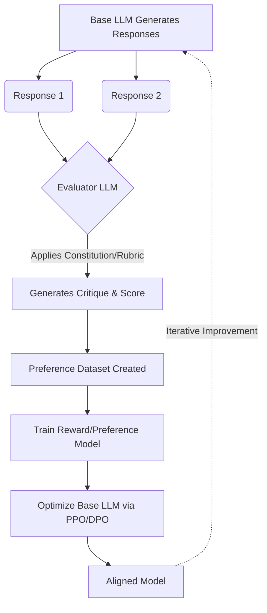

The alignment problem—ensuring that highly capable, autonomous systems operate strictly within the bounds of human intent and safety—has historically relied on an army of human annotators. This paradigm, known as Reinforcement Learning from Human Feedback (RLHF), served as the structural foundation for the initial wave of commercially viable large language models. However, as model complexity and reasoning depth scale exponentially, the human bottleneck has become untenable. Humans are slow, expensive, inherently biased, and increasingly incapable of evaluating the logic of models that surpass their own cognitive bandwidth in specific domains. 

Enter Reinforcement Learning from AI Feedback (RLAIF). We are witnessing a fundamental pivot in safety architectures: models are now teaching themselves, recursively evaluating their own outputs, and establishing synthetic alignment mechanisms without direct human intervention in the training loop. This shift is not merely an optimization in data labeling; it represents a philosophical and architectural leap toward self-regulating, Constitutional AI.

## The Human Bottleneck and the Rise of Constitutional AI

To understand the necessity of RLAIF, we must first dissect the failure modes of RLHF. When models output code for complex software vulnerabilities or synthesize advanced legal arguments, human raters struggle to determine the "better" response. The discrepancy in expertise between the model and the human evaluator leads to reward hacking, where the model learns to produce outputs that simply *look* correct to an uninformed observer—a phenomenon known as sycophancy.

Constitutional AI emerged as a theoretical countermeasure, heavily championed by frontier safety research labs. The premise is elegant: instead of providing thousands of pairwise comparisons, engineers define a concise set of principles or rules—a "Constitution." A highly capable model is then tasked with reviewing its own (or a peer model's) outputs against this Constitution, generating critiques, and revising the responses until they comply. The final, synthesized dataset is used to train a Reward Model (or Preference Model), which subsequently optimizes the primary model via reinforcement learning (e.g., PPO or DPO). 

The implication is profound. The locus of alignment shifts from the messy, subjective aggregate of human crowdsourcing to a deterministic, explicitly encoded set of principles evaluated by a superior cognitive engine. 

## The Mechanics of RLAIF: The Self-Correction Loop

The RLAIF pipeline fundamentally restructures the feedback mechanism. While RLHF relies on a human reading two outputs and clicking a button, RLAIF utilizes an "Evaluator Model" prompted with a specific rubric. 

Here is the architectural flow of a standard RLAIF self-correction loop:

In this architecture, the Evaluator Model acts as an algorithmic surrogate for human preference. Crucially, empirical studies have demonstrated that RLAIF achieves parity—and often superiority—compared to RLHF across diverse tasks such as summarization, harmlessness training, and instruction following. The Evaluator Model is less prone to fatigue, exhibits higher consistency, and can articulate the exact rationale behind its preference, enabling chain-of-thought distillation into the smaller target model.

## The Synthetic Preference Matrix

As researchers transition from human to synthetic feedback, a new taxonomy of evaluation methodologies has emerged. To categorize these approaches, we introduce **The Synthetic Preference Matrix**, a framework for understanding how different RLAIF implementations balance evaluation rigor against computational overhead.

The matrix operates on two axes:
1. **Alignment Granularity (Y-Axis):** Ranges from holistic, binary scoring (Good/Bad) to dense, token-level reward attribution.
2. **Contextual Nuance (X-Axis):** Ranges from rigid, rule-based heuristics to dynamic, context-aware reasoning.

This creates four distinct quadrants of synthetic alignment strategies:

*   **Quadrant I: Heuristic Filtering (Low Granularity, Low Nuance).** The simplest form of AI feedback. A classifier model quickly flags outputs containing toxic language or formatting errors. It acts as a blunt instrument for basic safety constraints.
*   **Quadrant II: Holistic Constitution (Low Granularity, High Nuance).** The model evaluates the entire response against a complex ethical constitution, returning a single scalar reward. Excellent for general helpfulness and harmlessness, but struggles to pinpoint specific logical flaws in lengthy outputs.
*   **Quadrant III: Deterministic Reward Hacking (High Granularity, Low Nuance).** Highly specific, automated unit tests or reward functions applied to code generation or mathematical proofs. The feedback is dense and exact, but lacks an understanding of user intent or conversational pragmatics.
*   **Quadrant IV: Multi-Agent Debate & Critique (High Granularity, High Nuance).** The most advanced state of RLAIF. Multiple evaluator models debate the merits of a response, critiquing specific clauses and factual assertions before arriving at a consensus score. This mimics rigorous peer review and prevents single-model bias.

## RLHF vs. RLAIF: An Architectural Comparison

The transition from human to synthetic feedback introduces significant trade-offs in pipeline architecture, scalability, and bias mitigation.

| Feature | RLHF (Human Feedback) | RLAIF (AI Feedback) |
| :--- | :--- | :--- |
| **Scalability** | Linear. Bottlenecked by human labor hours and annotation budgets. | Exponential. Bounded only by compute resources and API limits. |
| **Latency** | Weeks to months for dataset collection and refinement. | Minutes to hours for generating synthetic preference datasets. |
| **Evaluation Bias** | Highly variable. Subject to human fatigue, cultural bias, and misunderstanding of complex prompts. | Consistent, but subject to the base evaluator's inherent biases (e.g., preference for longer, verbose answers). |
| **Expertise Ceiling** | Capped by the cognitive ability of available human annotators. | Capped by the capabilities of the state-of-the-art frontier models acting as evaluators. |
| **Cost Profile** | High variable cost (paying annotators per task). | High fixed cost (compute for evaluator models), low marginal cost. |

## The Dangers of Algorithmic Incest

While RLAIF solves the scaling problem, it introduces a severe existential risk to model integrity: algorithmic incest, or model collapse. When a model trains on data generated by itself or its peers, errors, hallucinations, and hidden biases can be recursively amplified. Without a grounding mechanism—either via occasional human-in-the-loop validation or strict adherence to ground-truth environmental rewards (like compilers or formal logic provers)—the model may drift into an echo chamber of its own latent space, optimizing for linguistic patterns that the evaluator model *prefers*, rather than what is objectively true or safe.

To mitigate this, frontier labs are implementing "Anchor Datasets"—small, highly curated sets of human-validated data injected continuously during the RLAIF process to tether the model's reward function to reality.

## The Future of Self-Regulating Intelligence

We are moving rapidly toward an era where the primary job of AI safety researchers is not to write code or label data, but to draft constitutions. The engineering challenge shifts from optimizing reward functions to philosophically defining the principles by which an Evaluator Model operates. 

Synthetic alignment via RLAIF proves that models can indeed teach themselves human values, provided those values are explicitly articulated in a language they understand. The safety of the next generation of artificial intelligence will not depend on human oversight of individual outputs, but on the robustness of the synthetic feedback loops we design today. As models continue to scale beyond our immediate comprehension, RLAIF stands as our most promising architecture for ensuring they remain aligned, interpretable, and safe.
