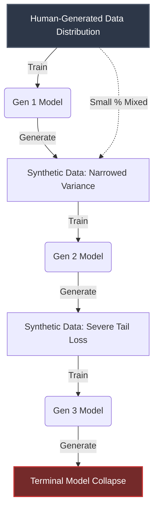

The artificial intelligence industry is accelerating toward a hard upper bound, colloquially termed the "Data Wall." For the past decade, the prevailing heuristic for architectural scaling has been stubbornly empirical: increase parameter count and linearly scale the pre-training corpus. The Chinchilla scaling laws formalized this intuition, establishing that model performance scales optimally when dataset size and parameter count grow in tandem. However, this voracious appetite for tokens has led to an inevitable exhaustion of the high-quality, human-generated web. We have essentially scraped the internet dry of its linguistically rich, structurally sound text.

Faced with a finite supply of human epistemic output, researchers naturally pivoted to the most abundant remaining source of tokens: the output of the models themselves. The proposition seemed elegant—leverage strong models to generate immense synthetic datasets to train the next generation of architectures. Yet, this recursive strategy has birthed a fundamental statistical pathology. Welcome to the Synthetic Data Paradox.

## The Statistical Mechanics of Model Collapse

Model Collapse is not a software bug; it is a mathematical inevitability when a probabilistic system trains recursively on its own approximations. To understand the mechanics, we must examine the objective function of auto-regressive language models. These models are optimized to minimize the negative log-likelihood of the training distribution. They learn the central tendencies of human language with remarkable fidelity but inherently smooth over the low-probability, high-variance "tails" of the distribution.

When a Generation N model outputs data, it slightly over-represents the high-probability tokens and under-represents the rare, idiosyncratic tokens that give human language its diversity and edge cases. If this synthetic output is then fed into a Generation N+1 model, the new model learns a compressed, distorted version of the original distribution. 

This process compounding over successive generations leads to a catastrophic loss of variance. The distribution collapses toward a homogeneous, highly probable, but ultimately meaningless mode. Early symptoms manifest as a loss of stylistic diversity and an inability to handle niche edge cases; late-stage collapse results in the model outputting repetitive, nonsensical gibberish.

The diagram above illustrates the irreversible narrowing of the data distribution. Notice that even if a small percentage of original human data is mixed into the synthetic corpus, the sheer volume of synthetic tokens can overwhelm the gradient updates, pulling the model's weights toward the collapsed mode.

## The Synthetic Data Paradox

Herein lies the paradox: To scale beyond the capabilities of current frontier models, we require an order of magnitude more data. The only scalable source of data is synthetic generation. Yet, training indiscriminately on synthetic data actively degrades the model's performance and generalization capabilities.

We are caught in a thermodynamic trap. Information entropy dictates that a system cannot create new information out of nothing; the synthetic data generated by a model contains, at best, the same amount of information as its training set, and in practice, strictly less due to the lossy nature of generation. How, then, can we bootstrap intelligence using synthetic data without falling into the black hole of Model Collapse?

## The Synthetic Verifiability Threshold (SVT) Framework

To formalize a path forward, we introduce the **Synthetic Verifiability Threshold (SVT)**. The SVT is a theoretical framework defining the boundary conditions under which synthetic data ceases to be a degenerative influence and becomes a constructive training signal.

The core postulate of the SVT is that synthetic data can only improve a model if the data generation process is decoupled from the data verification process, and the verification process possesses access to an asymmetric "ground truth" oracle that scales efficiently.

In practical terms, the SVT divides tasks into two distinct domains:
1. **Sub-Threshold Tasks (Unverifiable):** Open-ended creative writing, subjective reasoning, and unstructured conversation. In these domains, verifying the "correctness" of synthetic data requires a human evaluator or a strictly superior model. Generating synthetic data for these tasks is cheap, but verification is computationally or economically intractable at scale. Training on this data inevitably leads to Model Collapse.
2. **Supra-Threshold Tasks (Verifiable):** Mathematics, code generation, formal logic, and reinforcement learning environments. In these domains, a proposed solution (generated synthetically) can be rigorously verified by an external compiler, a mathematical solver, or a deterministic engine. The generation is probabilistic, but the verification is deterministic.

The SVT dictates that the AI industry must pivot its scaling strategies entirely toward Supra-Threshold tasks. We cannot simply generate billions of synthetic conversational tokens and hope for the best. Instead, we must build massive, programmatic verification pipelines. 

For instance, in code generation, a model can generate thousands of candidate scripts. An automated sandbox environment (the oracle) compiles them, runs unit tests, and filters out the failures. The surviving subset is not just synthetic data; it is *verified* synthetic data that contains genuine structural truth, bypassing the thermodynamic constraints of the generation process.

## Structural Mitigation Strategies

Beyond strictly operating above the SVT, researchers are developing sophisticated structural techniques to delay the onset of Model Collapse in mixed-data regimes.

### 1. The Data Provenance Graph
As the web becomes increasingly polluted with AI-generated content, web scraping is no longer a safe operation. Frontier labs are heavily investing in Data Provenance Graphs—cryptographic or statistical watermarking techniques designed to trace the origin of a text sequence. By assigning a "synthetic probability score" to every document in a pre-training corpus, data engineers can aggressively down-weight or filter recursive data, preserving the sanctity of the human-generated baseline.

### 2. Distributional Matching via Rejection Sampling
Instead of simply minimizing the negative log-likelihood of a synthetic corpus, advanced training pipelines employ Rejection Sampling to force the synthetic data distribution to match the empirical distribution of the original human data. By selectively discarding synthetic samples that fall too close to the mode, and intentionally keeping rare, low-probability generations, researchers can artificially inflate the variance of the synthetic corpus, preventing the catastrophic loss of the distribution tails.

### 3. Constitutional Distillation
Rather than using synthetic data to teach a model *what* to say, it is increasingly used to teach a model *how to think*. By generating synthetic reasoning traces (Chain-of-Thought) and applying rigorous Constitutional AI filtering, smaller student models can learn the latent structural logic of larger teacher models without inheriting their specific probabilistic biases. 

## Comparative Analysis of Training Corpora

Understanding the precise differences between data sources is critical for navigating the Data Wall. The following table delineates the characteristics of various training corpora under the SVT framework.

| Metric | Pristine Human Data | Unfiltered Synthetic Data | SVT-Verified Synthetic Data |
| :--- | :--- | :--- | :--- |
| **Information Entropy** | High (Maximum variance) | Low (Mode-collapsed) | Moderate to High |
| **Tail Distribution** | Rich, idiosyncratic edge cases | Truncated, smoothed over | Preserved via deterministic filtering |
| **Scaling Cost** | Prohibitive (Labor bound) | Near-zero (Compute bound) | High (Verification bound) |
| **Model Collapse Risk** | Zero | Extreme / Inevitable | Minimal |
| **Primary Use Case** | Foundational pre-training | Rapid prototyping (Dangerous) | Post-training (RLHF/RLAIF), Code/Math |
| **Signal-to-Noise Ratio** | Variable (Requires heavy cleaning) | Degenerative | Exceptionally High |

## The Road Ahead: Beyond the Autoregressive Paradigm

The Data Wall and the ensuing Synthetic Data Paradox represent the most significant existential threats to the current trajectory of deep learning scaling. If we continue to treat synthetic data merely as a cheaper substitute for human data, we will hit a hard asymptote in model capabilities, followed by a rapid degradation.

The solution requires a fundamental architectural shift. The industry must move away from the brute-force accumulation of tokens and toward the construction of rigorous, scalable verification environments. The models of tomorrow will not be trained on a static, scraped corpus of the web; they will be trained in dynamic, programmatic sandboxes where every generated token is stress-tested against a deterministic oracle. 

By understanding and adhering to the Synthetic Verifiability Threshold, we can transform synthetic data from a recursive poison into the fuel necessary for the next leap in artificial intelligence. The Data Wall is not the end of scaling; it is merely the end of the easy scaling. The next era belongs to those who can master the rigorous verification of synthetic thought.
