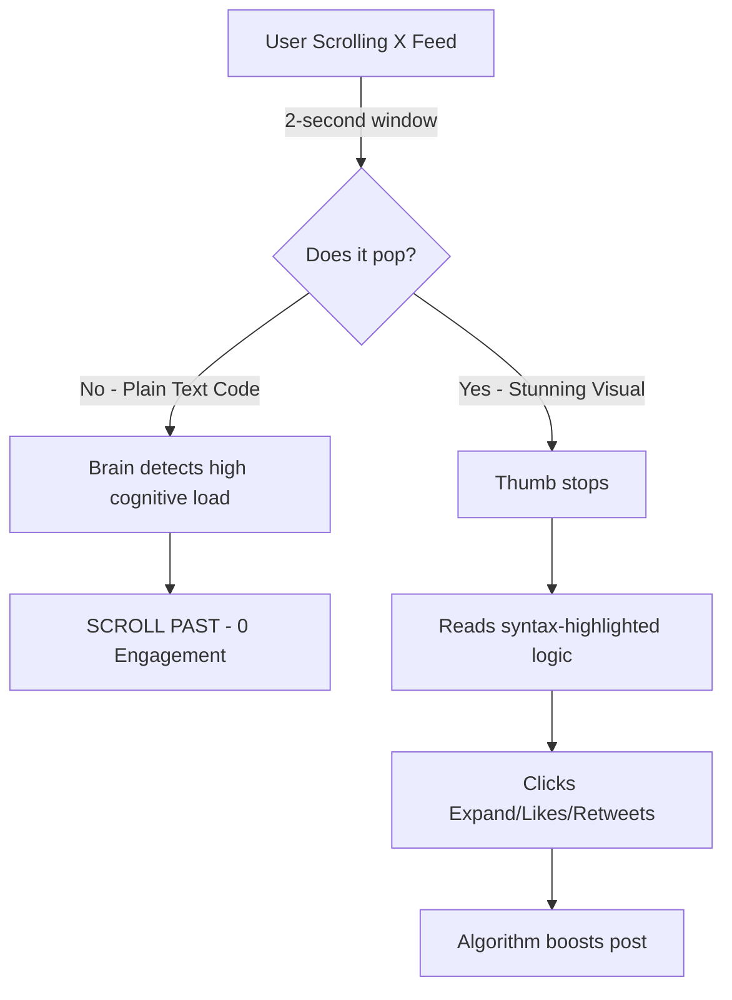

If you’re still copy-pasting raw code snippets into your Twitter/X timeline, I’m going to be brutally honest with you: you are shadow-banning yourself. 

We’ve all seen it. A brilliant developer spends four hours crafting the perfect optimization for a React component. They’re buzzing with adrenaline. They rush to X, drop a messy ` ```javascript ` block, hit post, and wait for the viral fame. 

Crickets. 

Why? Because the X algorithm doesn’t care about your O(1) time complexity if it looks like a wall of gray static. Attention spans are sitting at sub-two seconds. If your code doesn't immediately arrest the eye mid-scroll, it's effectively invisible. The harsh reality of tech social media in 2026 is that *packaging is just as important as the payload*.

In this deep dive, we’re going to tear down exactly why plain text code sharing is dead, and I'll introduce you to the **4-Visual-Anchor Strategy**—a growth framework that the top 1% of dev-influencers use to farm impressions and build massive audiences. Finally, we'll look at why taking native screenshots of your IDE is a rookie mistake, and how to automate the perfect aesthetic.

## The Anatomy of a Dead Post

Let’s look at the cognitive friction of reading raw code on a social feed. When a user scrolls past a raw text block, their brain has to switch contexts from casual consumption to deep analytical parsing. Without syntax highlighting, proper indentation (which X frequently butchers), or structural hierarchy, the cognitive load spikes. The user's brain takes the path of least resistance: *scroll past*.

Here's the harsh truth visualized:



The algorithm monitors "dwell time" (how long someone stops on your post) and immediate interactions. Plain text kills dwell time. Visuals hack it.

## Introducing: The 4-Visual-Anchor Strategy

To stop the scroll, your code needs to be treated as a piece of high-converting creative media, not a log file. After analyzing thousands of viral dev posts, the pattern is clear. Successful code posts leverage the **4-Visual-Anchor Strategy**:

### 1. The Context Header (The Hook)
Don't just show the code. Frame it. The visual needs a title bar or a clean header that explains *what* the code does in plain English before the reader parses a single variable. Think macOS window controls or a sleek terminal tab.

### 2. High-Contrast Syntax Seduction
Syntax highlighting isn't just for developers; it's a visual hierarchy tool. Vibrant colors on a deep, dark background (or a crisp, clean light mode) guide the eye. Keywords pop, strings are distinct. This drastically lowers the cognitive load.

### 3. The Isolation Background
A raw screenshot of VS Code with your file tree, terminal, and Spotify integration visible is visual noise. The code must exist in a vacuum. A subtle gradient or a solid, contrasting padding around the code block isolates the logic and screams "premium content."

### 4. The Watermark of Authority
Viral content gets stolen. Always brand your snippets. A subtle watermark or handle at the bottom ensures that when your code ends up on a generic programming meme page, the traffic routes back to you.

## The Problem with Native Screenshots

"Okay," you're thinking, "I'll just use `Cmd+Shift+4` and screenshot my IDE."

Stop right there.

Taking a native screenshot is the digital equivalent of taking a photo of a printed document. It's unoptimized, the resolution scales poorly on different devices, it lacks padding, and you expose all your IDE clutter. Plus, if you need to fix a typo, you have to recreate the entire screenshot from scratch. 

Let's compare the methods:

| Feature | Plain Text on X | Native IDE Screenshot | The 4-Anchor Visual Approach |
| :--- | :--- | :--- | :--- |
| **Dwell Time** | Abysmal | Average | Extremely High |
| **Mobile Readability** | Poor (line wraps) | Hit or miss (scaling issues) | Perfect (custom aspect ratios) |
| **Aesthetic Appeal** | Zero | Cluttered / Messy | Premium / Professional |
| **Brand Equity** | None | Low | High (Custom watermarks/themes) |
| **Algorithm Favor** | Low | Medium | Viral Potential |

## The Ultimate Hack: NavoKit's Markdown to Image Tool

If you want to execute the 4-Visual-Anchor Strategy flawlessly without spending 20 minutes in Figma for every post, you need specialized tooling. This is exactly why we built the **Markdown to Image** tool inside NavoKit.

NavoKit doesn't just take a picture of your code; it *renders* your Markdown into high-fidelity, social-media-optimized assets. 

Here’s why it’s the secret weapon for tech creators:
*   **Zero-Friction Padding & Backgrounds:** Instantly apply gorgeous gradients or solid backgrounds that frame your code perfectly. No manual cropping required.
*   **Mac-Style Window Frames:** Add sleek, professional window frames with a single click to give your code that highly coveted "app" feel.
*   **Perfect Syntax Highlighting:** Drop in your markdown, specify the language, and NavoKit applies beautiful, high-contrast themes that stop scrollers in their tracks.
*   **Automated Branding:** Bake your handle and avatar directly into the image export so you never lose credit for your genius.
*   **Aspect Ratio Control:** Export exactly for X's optimal image dimensions, ensuring no awkward cropping on the timeline.

You don't need to be a designer to have a top-tier aesthetic. You just need the right leverage.

## The Bottom Line

The meta has shifted. The days of raw text code dumps are over. If you are building in public, sharing tutorials, or trying to land your next role through social proof, you are playing a visual game. 

Stop letting your brilliant logic die in the timeline. Adopt the 4-Visual-Anchor Strategy, run your snippets through NavoKit, and watch your engagement metrics decouple from reality.
