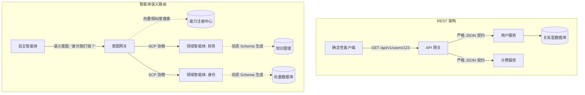

在过去的二十年里，软件工程界几乎将表述性状态转移（REST）奉为圭臬。REST，连同它的图基后继者 GraphQL，以及极其严格的 RPC 框架（如 gRPC），强制推行了一种简单且确定性的范式：端点要求特定类型的载荷，并返回结构可预测的响应。这种基于强契约的架构在人机交互和机机通信的扩展中表现得非常可靠。然而，我们构建系统的目标，早已不再局限于服务那些确定性的机器。

当我们深入 2026 年，分布式系统的主要消费者不再是那些没有思考能力的前端客户端，也不是那些代码僵化的后端定时任务。今天的主力消费者是自主智能体（Autonomous Agents）。而自主智能体并不依赖死板的 JSON Schema 生存，它们依赖的是语义意图（Semantic Intent）。

确定性 API 与非确定性智能体工作流之间的摩擦，已经成为我们这个时代最具决定性的架构瓶颈。我们正在见证传统 API 端点的消亡，以及智能体微服务（Agentic Microservices）的诞生。

### 刚性契约的崩溃

要理解为什么 REST 和 GraphQL 正在失效，我们可以审视一下现代自主智能体的集成生命周期。当一个智能体被赋予一个复杂目标——例如，“审计三大云服务商的影子 IT 支出并标记异常计费模式”时，它面对的是一个极其破碎的 API 领域。

在 RESTful 范式下，智能体必须预先被硬编码（或在上下文中塞满）AWS、GCP 和 Azure 计费 API 的确切 OpenAPI 规范。它必须理解不同的分页游标、速率限制、OAuth 作用域，还要处理 AWS `CostExplorer` JSON 响应与 Azure `Consumption` 载荷之间毫无逻辑的结构差异。

这是极其脆弱的。只要上游 API 将版本从 `v2` 升到 `v3`，把 `invoiceId` 重命名为 `invoice_id`，整个集成层就会瞬间崩溃。我们试图用“AI 包装器（AI Wrappers）”来修补这个问题——这是一种使用大语言模型（LLM）将非结构化意图翻译为结构化 API 调用的中间件。但这只是权宜之计，它增加了巨大的延迟、Token 成本，以及产生幻觉的风险面积。我们正在强迫一个流动的推理引擎，通过一根僵硬且不可屈服的吸管进行交流。

### 引入语义契约协议 (SCP)

智能体微服务抛弃了 URL 路径和预定义的 JSON Schema。取而代之的是，它们通过**语义契约协议 (Semantic Contract Protocol, SCP)** 进行通信。

SCP 是一种用于服务间通信的全新架构框架。在这里，接口不再是一组带有类型定义的端点，而是一个语义嵌入空间（Semantic Embedding Space）和一个动态协商层。在由 SCP 驱动的架构中，微服务通过嵌入的语义描述而不是静态的 OpenAPI Swagger 文件来暴露其能力。

当一个消费者智能体需要数据或执行操作时，它会广播一个语义意图：*“我需要过去 30 天内按研发团队分组的总计算支出。”*

智能体微服务接收此意图，根据其能力矩阵进行解析，并返回完全为该智能体需求定制的动态生成载荷，同时附带置信度分数和推理溯源追踪。这里没有 `GET /api/v1/spend?days=30&groupBy=team`。这里只有意图、协商和执行。

### 架构蓝图：REST 与 智能体语义路由对比

从 REST API 网关向意图网关（Intent Gateways）的转变，要求我们对基础设施进行彻底的重构。

在智能体微服务架构中：
1. **意图网关（Intent Gateway）** 取代了传统的 API 网关。它不再基于 URL 路径进行路由，而是使用轻量级本地模型，基于载荷的语义向量进行路由分发。
2. **能力注册中心（Capability Registry）** 取代了服务网格（Service Mesh）中的服务发现。服务动态注册其能力，并随着底层模型的微调，实时更新其语义足迹。
3. **领域智能体（Domain Agents）** 取代了传统的微服务。领域智能体是高度专业化、隔离的模型，拥有对特定工具和知识图谱的访问权限。它不执行具体的代码路径；它对意图进行推理，并决定如何利用其受限工具集来完成目标。

### REST vs 智能体微服务：结构对比

| 维度 | 传统微服务 (REST/gRPC) | 智能体微服务 (SCP) |
| :--- | :--- | :--- |
| **接口定义** | OpenAPI / Protobuf | 语义能力嵌入向量 (Embeddings) |
| **路由机制** | URL 路径 / URI | 意图嵌入相似度 |
| **载荷结构** | 确定性的 JSON / 二进制 | 动态、上下文感知的图结构 |
| **错误处理** | HTTP 状态码 (4xx, 5xx) | 多轮澄清与自愈协商 |
| **版本控制** | 显式的 (v1, v2)，基于 URL | 隐式的，通过语义映射实现向后兼容 |
| **安全范式** | 基于角色的访问控制 (RBAC) | 基于意图的策略执行 (IBPE) |
| **状态管理** | 无状态端点 | 有状态的多轮推理追踪 |

### 自愈协商与版本控制的消亡

SCP 和智能体微服务带来的最深远的影响之一，就是 API 版本控制的过时。在 REST 范式中，版本控制是一个痛苦且耗费人力的过程，主要为了避免破坏下游的消费者系统。

在智能体架构中，通信本质上是一种协商（Negotiation）。如果一个领域智能体废弃了某个数据字段，它不会简单地返回一个 `400 Bad Request`。它会返回一个语义澄清：*“概念 'user_id' 已经被合并到 'global_entity_id' 中。您是否需要将查询映射为对应的 'global_entity_id'？”*

具备自身推理能力的消费者智能体会更新其内部上下文，接受协商，并继续执行。这就是运行中的**自愈拓扑（Self-Healing Topologies）**。系统有机地适应了数据模式的漂移（Schema Drift），这就像两名人类工程师在 Slack 上协商数据格式一样，但这一切在毫秒级内自动完成，无需人工干预。

### 基于意图的策略执行 (IBPE)

在语义世界中，安全性不能再依赖于简单的端点拦截。一个恶意的智能体不需要寻找 SQL 注入漏洞；它只需要精心构造一个极具说服力的语义请求，就能骗过领域智能体交出未经授权的数据（即网络层的提示词注入）。

这就要求必须实施**基于意图的策略执行（Intent-Based Policy Enforcement, IBPE）**。2026 年代的防火墙不再检查数据包头或 JSON 结构；它们将请求的语义意图与既定的组织策略向量进行对比分析。如果一个请求在语义上与“批量提取用户隐私数据”高度吻合，它就会被拦截并隔离，无论它使用了怎样伪装的措辞。

### 工程实现的现实挑战

构建智能体微服务并非仅仅在 PostgreSQL 数据库前加一个 LLM 那么简单。它要求我们从底层彻底重构技术栈。

我们必须从同步的 HTTP/2 连接转向异步的、基于流的协议（如 WebSocket 或基于 QUIC 的流协议），以此来支持多轮协商。我们必须将向量数据库（Vector Databases）不仅作为辅助搜索索引，而是作为主路由和注册层。我们必须构建全新的可观测性工具，不仅追踪系统调用栈，更要追踪 AI 的推理路径。

在软件还是确定性的时代，僵硬的 API 端点曾很好地服务了我们。但软件的未来是流动的、具备推理能力的、且完全自主的。后 REST 时代属于语义契约、动态路由和智能体微服务。那些依然固守静态 JSON 载荷的架构师，将发现他们的系统完全无法使用属于未来的语言进行对话。
