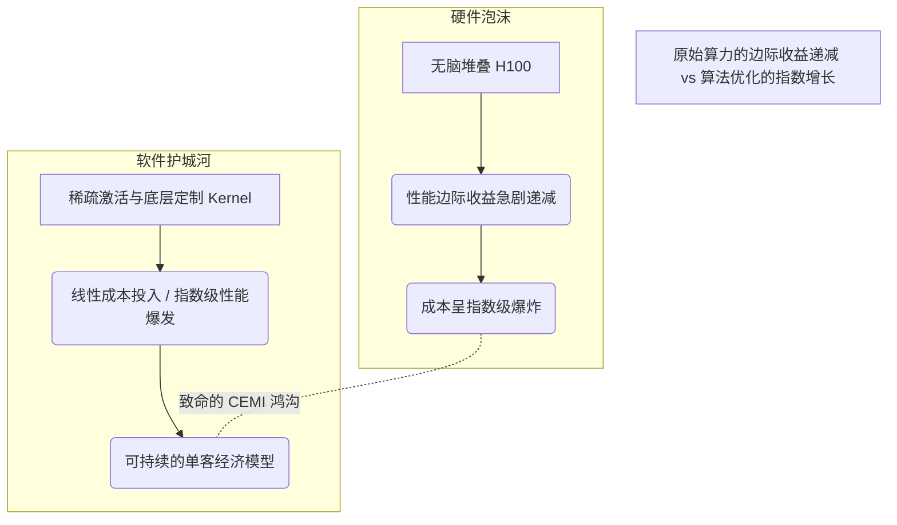

风投生态系统已经染上了严重的“硅片近视症”。走进硅谷的任何一场董事会，衡量一家 AI 初创公司生存能力的核心指标居然是他们的 GPU 数量。Nvidia 的 H100 已经成为现代意义上的金本位，一种被认为能保证计算霸权的物理硬通货。但这股狂热正掩盖着我们在构建和扩展智能系统方式上的深层结构性腐烂。我们正处于一场 AI 硬件泡沫之中，而即将到来的崩盘不会是因为硅片短缺引发的，而是因为软件优化的灾难性失败。

当前的行业教条是：只要你向密集的 Transformer 倾注足够的 FLOPs，智能就会涌现。这种暴力美学范式不仅在智力上令人感到懒惰，在经济上更是不可持续。当超大规模云计算厂商烧掉数十亿美元来冷却数据中心，仅仅为了训练拥有数千亿参数的模型时，这些系统的实际算法效率却令人发指。我们正把计算能力当作无限的资源，用来粉饰架构上的极度低效。

### 引入：算力-效率错配指数 (CEMI)

为了量化这种错觉，我们需要一个新的分析框架：**算力-效率错配指数 (CEMI, Compute-Efficiency Mismatch Index)**。CEMI 衡量的是为一个工作负载提供的原始理论 FLOPs 与实际产生有意义的权重更新或推理生成的有效 FLOPs 之间的差值。

在一个完美优化的系统中，CEMI 无限趋近于 1.0。但在今天，平均规模的分布式训练任务的 CEMI 高达 4.5 甚至更高。这意味着，你在 H100 上每花一美元，就有超过 75% 的算力被内存带宽瓶颈、粗劣的 Kernel 融合、空闲的流水线气泡，以及坦率地说，草率的数学运算给白白焚毁了。

我们受限的不是带宽，而是想象力。整个行业都在用超级计算机来处理那些如果路由算法没有停留在 2022 年水平，本可以在本地解决的矩阵乘法。

### 暴力计算的税收：密集型模型 vs. 稀疏化现实

行业对密集型 (Dense) 架构的沉迷是导致 CEMI 鸿沟扩大的罪魁祸首。为每一个 Token 激活每一个参数，在计算上的荒谬程度，等同于为了在大堂读一本书而打开整栋摩天大楼的每一盏灯。

稀疏的混合专家 (MoE) 架构和动态路由机制绝不仅仅是花哨的技巧；它们是下一代 AI 的生存必需品。仅仅因为为动态路由编写定制 CUDA Kernel “太难”，就拒绝积极采用和优化这些架构，这是一种巨大的负债。

让我们来看看，当我们将庞大的密集型单体结构与硬件感知的稀疏架构进行对比时，那些昂贵的算力到底去哪儿了。

| 架构画像 | 单 Token 激活参数比例 | 显存带宽利用状态 | Kernel 执行效率 | 浪费的 FLOPs (CEMI 税) |
| :--- | :--- | :--- | :--- | :--- |
| **传统密集型 (175B)** | 100% (175B) | 极高 (陷入 I/O 瓶颈) | ~40% (依赖标准 CuBLAS) | **~65%** |
| **朴素 MoE (8x22B)** | 25% (44B) | 中等 (路由调度开销大) | ~55% (次优的分发机制) | **~45%** |
| **硬件感知稀疏架构** | <5% (极度动态) | 高度优化 (零拷贝) | >85% (定制融合 Kernel) | **<15%** |

上表是对当前开发元规则的一纸控诉。初创公司融资 1 亿美元去购买那些他们注定会浪费掉的算力。“传统密集型”方法已经是时代的眼泪。如果你的模型为了回答一句关于天气的提问就激活 1750 亿个参数，那么无论你手头有多少 GPU 集群，你的架构都已经彻底坏掉了。

### 真正的护城河：硬件感知路由与 Kernel 巫术

下一个 AI 霸权时代将不属于拥有最厚支票簿的公司；它将属于拥有最无情、最硬核的系统工程师的公司。真正的竞争优势在于**硬件感知路由 (Hardware-Aware Routing)**和极致的定制 Kernel 优化。

我们谈论的是突破 PyTorch 那层臃肿的通用抽象，深潜入 PTX 和定制 CUDA 实现的深水区。这意味着你需要编写能够理解 NVLink 拓扑物理结构的路由算法。这意味着你必须承认，通过网络交换机移动数据的成本比在本地计算要高出几个数量级，并且必须在设计分布式推理时严格尊重这一物理现实。

当你实现了智能 Batching、投机解码 (Speculative Decoding) 以及高度调优的 FlashAttention 变体时，你实际上是在凭空印制免费的算力。如果你能通过对低效的工程零容忍，将现有的 A100 压榨出 3 倍的吞吐量，你根本就不需要再去抢购另一个 H100 集群。

### 内存墙与显存碎片化危机

除了 FLOPs 之外，我们正以终端速度撞向“内存墙 (Memory Wall)”。冯·诺依曼瓶颈正在揭露原始算力指标的欺骗性。高带宽内存 (HBM) 确实很棒，但把它当成无限的缓存来对待，完全是编程层面的渎职。长上下文推理期间的键值对 (KV) 缓存扩展问题就是一个典型例子。我们看到工程师们在遇到问题时，第一反应是扔更多的 H100 进去，试图跨越巨大的张量并行组来并行化上下文窗口，而不是采用像 PageAttention 或 RadixAttention 这样的技术。这些软件层面的技术无需增加哪怕一张额外的 GPU，就能大幅减少显存碎片，并指数级提高批处理大小 (Batch Size)。

### 必然的泡沫破裂

GPU 囤积狂潮正在走向终结。在能源需求和散热的物理现实彻底击溃底层商业模式之前，暴力扩展所能达到的极限已经触手可及。在这场硬件泡沫破裂后存活下来的公司，将是那些把算力视为珍贵、有限资源的公司。

别再问一家公司有多少张 H100 了。去问问他们的“算力-效率错配指数”。去问问他们的 Kernel 实际利用率。去问问他们集群中有多少比例的时间是在空转等待显存传输。软件层面的滞后是真实存在的，而未优化的架构必将面临残酷的清算。未来，属于优化者，绝不属于囤积狂。
