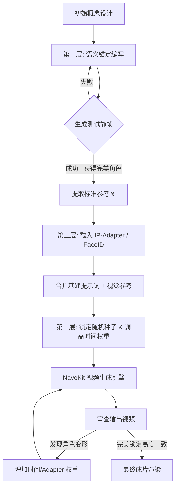

每一个玩过AI视频的人都经历过这种绝望：第一帧的角色堪称完美，但到了第三十帧，你那饱经风霜的赛博朋克侦探已经不可逆转地突变成了一个日系动漫风的软萌少年。角色特征的连续性，至今仍是AI视频制作领域的绝对瓶颈。如果你现在还在单纯依赖文本提示词，并祈祷扩散模型能够乖乖听话，那你纯粹是在把成片质量交给随机数生成器。

专业玩家绝不靠运气，我们靠系统化的工程控制。

在这篇硬核指南中，我们将抛开那些虚无缥缈的炒作，直接拆解时间轴角色锁定的底层机制。我们将深入探讨为什么扩散模型缺乏“客体永久性”的概念，并为你提供一套坚不可摧的工作流。如果你想构建电影级的叙事，而不是产出那些混乱的GIF动图，你就必须掌握这套我们称之为**“三层一致性矩阵” (3-Layer Consistency Matrix)** 的框架。

## 为什么你的角色总是在变形？

在解决问题之前，你必须了解底层架构。扩散模型通过对随机噪点进行降噪来生成图像。在进行图生视频或文生视频时，模型试图在时间轴上插值这个降噪过程。致命的问题在于，潜在空间（Latent Space）是极其不稳定的。提示词权重的微小偏移、噪声种子的改变、或是注意力机制的波动，都会导致模型“幻觉”出全新的面部结构或服装纹理。

模型根本不懂什么是“侦探约翰”。它只理解与“男人”、“风衣”和“软呢帽”这些词相关的向量。要想强迫模型在240帧的画面里记住“约翰”，我们必须在生成管线的三个特定层面上限制它的自由发挥空间。

## 三层一致性矩阵 (The 3-Layer Consistency Matrix)

为了彻底终结角色变形的噩梦，我们部署了“三层一致性矩阵”。这个框架在生成引擎之上叠加了语义、数学和结构这三重约束。

### 第一层：语义锚定 (Semantic Anchoring - 提示词底座)
这是你的地基。软弱的提示词必然产出软弱的角色。你不能用模棱两可的词汇描述角色，还指望模型每次都能以相同的方式填补空白。语义锚定要求你用极其具体、毫无商量余地的物理特征来“轰炸”文本编码器。

**业余提示词：** 
> "一个走在科幻街道上的美丽女人，细节丰富，4k，电影感。"

**语义锚定提示词：**
> "角色：35岁女性，清晰锋利的下颌线，苍白的皮肤，翠绿色的眼睛，不对称的银色波波头，穿着带有霓虹橙色缝线的做旧做脏真皮飞行员夹克，内搭高领黑色毛衣。走在下雨的新东京小巷里。"

通过锁定确切的年龄、面部骨骼结构、瞳孔颜色、特定的发型和颗粒度极高的服装细节，你极大地缩小了模型可以提取的潜在空间。它可自由发挥的空间越小，发生变形和幻觉的几率就越低。

### 第二层：种子与噪声锁定 (Seed & Noise Locking)
一旦你有了强大的语义锚点，接下来就必须锁定数学逻辑。随机种子决定了初始的噪声分布。如果你的种子在不同镜头之间发生变化，角色的结构基础就会彻底崩塌。

在生成连续序列时，固定种子是基操。但在视频生成中，仅仅固定种子往往是不够的，因为时间噪声会发生漂移。你必须利用运动尺度（Motion Scales）和时间一致性滑块（Temporal Consistency），强制引擎去参考上一帧的潜在特征，而不是为每一帧生成全新的独立噪声。

### 第三层：视觉条件控制 (Visual Conditioning - 终极锁定)
文本和数学最多只能帮你完成80%的工作。要达到99%的完美一致性，你必须用实际的图像数据来约束模型。这就是ControlNet（用于结构和姿态）和 IP-Adapter（用于图像提示词）等技术大显身手的地方。

通过将角色的参考图直接喂给IP-Adapter，你绕过了文本编码器的模糊解释，强迫模型直接复制主人公面部和服装的精确像素关系。

## 技术路线大比拼：什么场景用什么工具？

并不是每个镜头都需要拉满所有重型管线。以下是各种一致性技术的硬核对比及适用场景。

| 技术手段 | 原理与作用机制 | 最佳适用场景 | 配置成本 | 一致性评级 |
| :--- | :--- | :--- | :--- | :--- |
| **种子锁定 (Seed Fixing)** | 锁定初始噪声生成算法。 | 静态镜头、微小运镜、缓慢平移。 | 极低 | ⭐⭐ |
| **语义锚定 (Semantic Anchoring)** | 用极其细致的角色特征超载提示词系统。 | 所有生成的底层提示词架构。 | 中等 | ⭐⭐⭐ |
| **ControlNet (OpenPose/Depth)** | 强迫角色遵循刚性骨架结构或深度图。 | 复杂动作、激烈打斗、特定走位。 | 极高 | ⭐⭐⭐⭐ |
| **IP-Adapter (图像提示)** | 提取参考图特征并直接注入扩散过程。 | 极限特写、面部追踪、极其严格的服装还原。 | 中等 | ⭐⭐⭐⭐⭐ |

## 提示词锁定工作流 (The Prompt Locking Workflow)

为了更直观地展示这些层级如何在专业管线中协同工作，请看下面的架构流程图。不要盲目地把所有参数都拉满，而是要按顺序堆叠约束条件。

## 在 NavoKit 中执行矩阵框架

如果没有合适的引擎，再好的理论框架也是一纸空文。你可以尝试在本地折腾一堆复杂的Python脚本和节点图来实现这个工作流，或者，你可以直接使用一个专为此打造的生产环境。

这正是我们打造 **NavoKit 免费AI视频生成器 (NavoKit Free AI Video Generator)** 的初衷。我们专门设计了UI和后端逻辑，开箱即用地支持“三层一致性矩阵”，让你彻底告别繁琐的节点连线。

以下是在 NavoKit 中执行角色锁定序列的实操步骤：

1. **构建底座 (提示词公式)：**
   进入 NavoKit 生成界面。在提示词框中，严格使用以下语法公式：
   `[主体锁定] + [服装锁定] + [动作] + [环境] + [镜头/风格]`
   *实操案例：[主体：22岁男性，高耸的颧骨，凌乱的金发] + [服装：红色战术背心，白色T恤，黑色工装裤] + [动作：充满攻击性地向镜头奔跑] + [环境：废弃仓库，尘土飞扬] + [镜头：35mm镜头，电影级布光，跟拍镜头]*

2. **上传视觉锚点：**
   打开“Image Reference (图像参考)”开关。上传你角色的最佳静帧图像。将 `Image Weight (图像权重)` 滑块设置为 **0.75**。这直接激活了管线中的 IP-Adapter 层，告诉 NavoKit 在处理角色的脸部和衣服时，优先考虑视觉数据而不是文本提示词。

3. **锁定数学底层：**
   展开 `Advanced Settings (高级设置)`。点击 **Seed (种子)** 参数旁边的锁定图标。将 **Temporal Consistency (时间一致性)** 滑块猛拉到 **85%**。这会命令引擎极具侵略性地参考上一帧的像素，而不是凭空捏造新数据。

4. **渲染生成：**
   点击生成。因为你已经限制了语义空间，强制了视觉条件反射，并锁定了时间轴噪声，NavoKit 的引擎别无选择，只能一帧接一帧地、丝毫不差地渲染出你的完美角色。

## 关于AI视频的残酷真相

停止幻想吧。AI视频不是魔法，它只是一个极其不稳定的数学计算过程。如果你像玩老虎机一样去玩AI，你只能得到像老虎机一样的结果——混乱、不可控、根本无法用于严肃的叙事创作。

掌握角色一致性，本质上就是掌握“约束的艺术”。应用三层一致性矩阵，死死锁住你的语义锚点，榨干 IP-Adapter 的潜能，并使用像 NavoKit 这样专为精准控制而生的引擎。别再让模型主导你的视觉，夺回潜在空间的控制权，强迫它为你的故事服务。

现在，打开 NavoKit 免费AI视频生成器，丢入你的语义锚点，开始死死锁住你的每一帧吧。角色崩坏的时代，到此为止。
