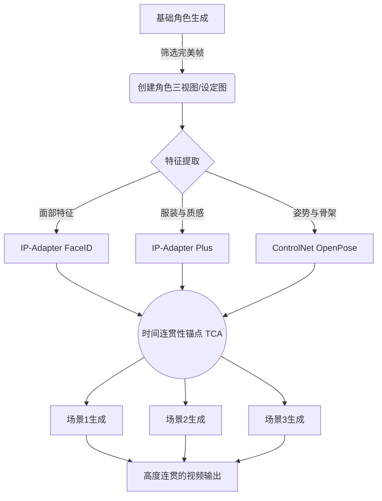

如果你曾在生成式AI视频上花过超过十分钟来尝试构建剧情，你绝对懂那种痛。你输入“赛博朋克侦探，脸上有霓虹色伤疤”，得到一个惊艳的开场镜头。然后你用完全相同的提示词生成下一个场景，结果出来的却是一个完全陌生的人。伤疤移位了，夹克变色了，脸部骨骼从哈里森·福特变成了一个毫无辨识度的路人NPC。

当时间连贯性断裂的那一刻，生成式叙事就死了。观众的“悬念搁置”瞬间粉碎。你这根本不是在拍电影，你只是在拉动一台多维度的老虎机，祈祷能摇出相同的符号。

我们必须停止把提示词工程当成买彩票。让我们深入探究潜在空间漂移（Latent Space Drift）的真实机制，看看如何通过数学手段“霸凌”扩散模型，让它在每一个场景、每一个角度都给你吐出完全相同的角色。

## 核心痛点：为什么扩散模型天生讨厌连贯性？

要理解为什么你的角色总是在疯狂变形，你必须弄懂扩散模型是如何解析数据的。当你将一段文本提示词喂给模型时，文本编码器（通常是CLIP或T5）会将你的文字翻译成一个潜在嵌入（Latent Embedding）。这个嵌入相当于一个超高维空间中的坐标。随后，模型在一个纯随机的噪声场中进行去噪（由你的提示词坐标引导），最终形成一张图像。

问题出在哪？“赛博朋克侦探，脸上有霓虹色伤疤”这句话并不映射到单一的确切坐标。它映射的是一个庞大的可能坐标星系。每一次你用不同的随机种子（Seed）生成新镜头时，模型就会从一片不同的噪声开始，降落在这个星系中一个完全不同的坐标点上。

这就是所谓的**潜在空间漂移**。对模型来说，你的角色根本不是一个“人”，只是一堆风格概率的松散集合。

## 破局利器：时间连贯性锚点 (The Temporal Consistency Anchor)

为了解决这个问题，我们需要极其粗暴地压缩概率空间。我日常工作流中使用一套我称之为**时间连贯性锚点（TCA，Temporal Consistency Anchor）**的框架。

TCA框架建立在一条不容妥协的铁律之上：**文本提示词只负责控制动作和环境；参考张量（Reference Tensors）负责锁定角色身份。** 在第一帧确认之后，永远不要再依赖文字去描述你的角色长什么样。

TCA框架由三大支柱构成：
1. **绝对种子锁定 (Absolute Seed Locking)：** 控制初始噪声分布。
2. **多向量参考条件控制 (Multi-Vector Reference Conditioning)：** 强迫模型看视觉数据，而不是看文本数据。
3. **负面提示词脚手架 (Negative Prompt Scaffolding)：** 在潜在空间周围建起高墙，防止特征漂移。

让我们拆解一下TCA的具体工作流。

### 支柱一：基础生成与绝对种子锁定

你的首要任务是生成一张“锚点图（Anchor Image）”。这是你的角色的绝对视觉标准。如果需要，在这上面花上几个小时去调试。一旦你抽到了那张完美的画面，你必须提取它的**种子值 (Seed)**。

种子是噪声的数学起点。如果你使用完全相同的提示词、完全相同的模型、完全相同的种子，你就会得到完全相同的图片。

然而，我们需要角色在不同场景中做不同的动作。如果你锁定种子，但修改了提示词（比如从“站在霓虹小巷”改成“坐在面馆里”），图像会发生变化，但由于初始噪声图样是一致的，模型通常会保留大量的结构相似性。

种子锁定是你的第一道防线，但单靠它是不够的。一旦你引入了夸张的运镜或截然不同的光照，种子锁定就会崩溃。这就是为什么我们需要条件控制。

### 支柱二：多向量参考条件控制

这是TCA框架真正的重火力。我们不再用苍白的文字描述角色，我们直接上数学。

与其输入“棕发，绿眼，皮夹克”，我们使用视觉条件控制层——具体来说，就是IP-Adapter（图像提示适配器）和ControlNet。

**IP-Adapter FaceID:** 这个工具会从你的锚点图中提取面部的结构嵌入，并强迫扩散模型将这种精确的面部几何特征融合到新的生成中，无视文本提示词的干扰。它不是简单的复制粘贴，它理解3D结构，并能使其适应新的光照和摄影机角度。

**IP-Adapter Plus / 风格迁移:** FaceID搞定脸，我们再串联一个次级IP-Adapter来死死锁住服装、材质和调色盘。

通过将你的锚点图喂给这些适配器，你实际上是在对模型下达死命令：“我不管文字里对这个人怎么描述。让这个人长得跟这张图一模一样，但让他做文字里写的动作。”

### 支柱三：负面提示词脚手架

当你的正面提示词在描述动作时，你的负面提示词必须暴力拒绝角色特征的漂移。

常规的负面提示词太懒惰了，全是些“ugly, deformed, bad anatomy”。

TCA的负面提示词是战术级别的。如果你的角色穿着黑皮夹克，你的负面词里必须加上：`red jacket, blue jacket, denim, suit, armor, shirtless`。你正在角色设计的四周建起栅栏。如果模型因为新的背景尝试幻觉出另一套衣服，负面提示词会立刻将其击毙。

## 工具全景图：各种方法的硬核横评

并非所有的连贯性方案都在同一水平线上。让我们看看战场现状：

| 方案 | 部署时间 | 时间连贯性 | 灵活性 (角度/动作) | 最佳适用场景 |
|--------|------------|----------------------|------------------------------|----------|
| **Zero-Shot (纯提示词)** | 1 分钟 | 惨不忍睹 (1/10) | 极高 | 头脑风暴，风格分镜 |
| **锁定种子 + 提示词微调** | 10 分钟 | 差强人意 (3/10) | 低 | 简单的平移，微小变化 |
| **LoRA 炼丹训练** | 1-4 小时 | 极其优秀 (9/10) | 极高 | 专注的长线IP项目 |
| **TCA 框架 (IP-Adapters)** | 5 分钟 | 非常能打 (8/10) | 高 | 敏捷叙事，高频出片 |

为你的角色训练专属的LoRA（低秩自适应）在技术上确实是最硬核、最稳的方案。你需要生成30-50张角色的多角度图片，炼一个子模型，用触发词调用。但LoRA训练太慢、太吃算力，而且极其不灵活。如果你决定在制作中途给角色换件衣服？抱歉，重炼一个LoRA吧。

而使用IP-Adapter串联的TCA框架，能给你定制LoRA 90%的连贯性，并且**零训练时间**。

## 零门槛落地TCA框架的最优解

在ComfyUI里连面条一样去串联多个IP-Adapter、ControlNet和种子管理节点，绝对是一场噩梦。这需要你对节点架构有极深的理解，并且拥有一张狂飙的显卡。

如果你想获得“时间连贯性锚点”的强大威力，又不想花三天时间去排查Python依赖库报错，你该直接使用 **NavoKit免费AI视频生成器 (NavoKit's Free AI Video Generator)**。

我们在构建NavoKit引擎的底层时，就是为了彻底抹杀潜在空间漂移的痛苦。在优雅的界面之下，它已经自动为你部署了最前沿的参考图条件控制和种子锁定机制。你只需要上传你的锚点图，输入场景动作，引擎会自动处理多向量条件控制，确保你的角色从第1帧到第1000帧长得一模一样。这是在AI视频中实现真正叙事连贯性最简单、最无阻力的降维打击。

## 结语：别再抽卡算命了

生成式叙事正在摆脱“猎奇玩具”的阶段。观众不再关心“哇，这是AI做的视频”；他们只关心“这个视频讲了个好故事吗？”如果你的主角镜头一转就换了张脸，你永远讲不好一个故事。

实装时间连贯性锚点（TCA）吧。锁死你的种子，把角色身份的控制权全盘移交给IP-Adapter，严格限制文本提示词只用来描述动作和环境。夺回对潜在空间的控制权，开始**导演**你的镜头，而不是**赌博**。
