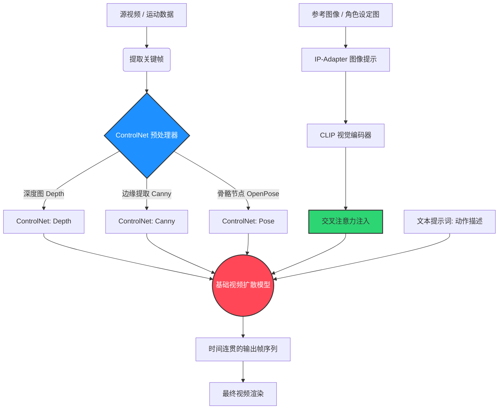

咱们开门见山：现在的 AI 视频生成大多是个赌场。你敲下一段提示词，拉下老虎机的摇杆，然后祈祷你的角色在第 24 帧的时候别融化成一滩烂泥。帧间不一致——那种臭名昭著的画面闪烁和结构崩坏——是专业 AI 视频工作流的死穴。如果你想制作能交付给客户的商业级资产，光靠写文本提示词纯属业余选手的过家家。

要打造工业级的 AI 视频，你需要绝对的结构统治力。你需要**双重约束视频流 (The Dual-Constraint Video Pipeline)**。

这不是教你怎么寻找“魔法咒语”。这关乎构建一套工程化管线，利用 **IP-Adapter** 锚定坚不可摧的风格与角色特征，同时叠加 **ControlNet** 强行锁定空间几何结构。在这篇硬核拆解中，我们将深度剖析如何将这两大杀器硬核拼接，逼迫扩散模型乖乖就范。

## 纯文本提示词的致命缺陷

扩散模型本质上是概率引擎。从一帧到下一帧，模型根据你的文本提示词重新计算潜在空间 (Latent Space)。问题在哪？文本天生具有模糊性。“一个男人在走路”在潜在空间中可能有几百万种表现形式。没有硬性约束，模型必然会发生极其严重的漂移。

看看我们将纯文本提示词与双重约束方法论对决时的残酷对比：

| 特性 / 指标 | 纯文本提示词 (Native Prompting) | 双重约束流 (IP-Adapter + ControlNet) |
| :--- | :--- | :--- |
| **帧间一致性** | 极低。高频闪烁、背景扭曲、角色频繁突变。 | 极高。几何结构死锁，纹理持久稳定。 |
| **输入模态** | 仅限文本。 | 文本 + 参考图像 + 结构映射图 (Depth/Canny/OpenPose)。 |
| **迭代速度** | 极慢。高失败率导致需要不断“抽卡”重试。 | 极快。输出可预测，大幅减少废弃渲染时间。 |
| **美术指导控制** | 模糊。“赛博朋克风格”会产生无法预料的随机变体。 | 绝对。IP-Adapter 精准提取特定色罩和微观纹理。 |
| **运动物理学** | 模型在帧与帧之间“幻觉”出物理运动。 | ControlNet 强制模型贴合真实世界的运动追踪数据。 |

## 解构：双重约束视频流

双重约束视频流的核心哲学非常粗暴：把维持一致性的重任拆分到两条平行的控制流中。

1. **语义/风格锚定 (IP-Adapter)：** 强制模型理解主体是“什么”，在整个时间轴上死死咬住身份特征、服装材质和色彩光影。
2. **结构/空间锚定 (ControlNet)：** 强制模型理解事物在“哪里”，逐帧锁死轮廓边缘和深度信息。

这是该工作流的精确架构图：

### 第一层：IP-Adapter (语义锚定)

把 IP-Adapter 当作一个重型装甲版的文本提示词。你不再需要费尽心机写“一个红发、有雀斑、穿着做旧皮衣的女人”，你只需直接喂给 IP-Adapter 一张参考图。它利用 CLIP 视觉编码器提取图像的深层语义特征，并直接暴力注入到扩散模型的交叉注意力层。

在视频生成中，这是刚需。随着时间轴推进，IP-Adapter 就像一个恒定的引力场，确保角色的骨相、衣服的纹理以及布光方式不会发生基因突变。

**实战避坑指南：** 
千万别在整个序列中把 IP-Adapter 的权重拉满到 1.0。如果权重过高，它会试图把参考图的初始姿势强加到每一帧上，从而锁死你想生成的运动动作。将权重调低至 `0.6 - 0.75` 之间，并使用 `ip-adapter-plus` 模型，这样既能锁住细节，又不会把视频冻成幻灯片。

### 第二层：ControlNet (结构锚定)

如果说 IP-Adapter 解决了“是谁”和“是什么”的问题，那么 ControlNet 就是解决“在哪儿”的终极武器。如果你在做视频到视频的重绘转换 (Video-to-Video)，ControlNet 就是你雷打不动的脚手架。

通过逐帧提取源视频的控制图，你为扩散模型搭建了一个无法逾越的模具。

- **Depth (深度图，中度约束)：** 提取场景的 Z 轴深度。对于保持角色和环境的 3D 体积感有奇效，防止他们变平或者和背景糊成一团。
- **Canny/Lineart (线稿图，硬约束)：** 提取极其严格的边缘线。当你的主体轮廓绝不能妥协时（比如机甲动画、硬表面建筑漫游），用它。
- **OpenPose (骨骼图，软约束)：** 提取人体骨骼节点。最适合人物动画——你希望动作和物理规律完全一致，但想保留彻底改变人物体型或体积的自由度（比如把一个瘦弱的演员渲染成庞大的半兽人）。

### 叠加约束的降维打击

当你把这两者叠加，奇迹才会发生。你将源视频通过 Depth 预处理器提取逐帧深度图，喂进 ControlNet（权重 0.8）。然后，你拿一张赛博朋克刺客的设定图，喂进 IP-Adapter（权重 0.7）。最后，补一句极简的提示词：“赛博格在霓虹小巷中行走”。

基础大模型现在已经无路可走。它**必须**按照原视频的深度数据渲染几何结构，同时**必须**用那张赛博格图的质感来上色。结果？零闪烁，零人物崩坏。一个稳定到令人发指的专业级 AI 视频诞生了。

## 用 NavoKit 实现工作流降维

要在 ComfyUI 这样的节点式界面里从零搭建这套管线，无异于一场技术苦行。管理巨量的帧目录、对齐潜在空间的批次、微调交叉注意力权重，这都需要耗费极大的试错成本。

我们打造了更聪明的解法。如果你想直接白嫖“双重约束视频流”的硬核能力，又不想被满屏幕的“节点面条”折磨，你必须试试 **[NavoKit 免费 AI 视频生成器 (Free AI Video Generator)](/tools/ai-video-generator)**。

我们把最繁重的工程黑盒化了。我们的底层引擎会自动对 IP-Adapter 的权重和 ControlNet 的控制图进行动态校准，开箱即用地保证极高的帧间一致性。你只需上传源视频，扔进风格参考图，让我们的云端算力替你完成复杂的多重扩散渲染。这是你获取极客级帧间控制力、又无需牺牲专业画质的最短捷径。

## 终极对决

“写咒语然后祈祷”的时代结束了。专业的 AI 视频生成要求对风格和结构拥有双重的绝对统治力。通过驾驭“双重约束视频流”——将 IP-Adapter 的语义持久性与 ControlNet 的几何锁定力完美联姻——你才能把作品从自娱自乐的实验玩具，升级为真正的商业交付级资产。别再和潜在空间搏斗了，给它造个笼子。
