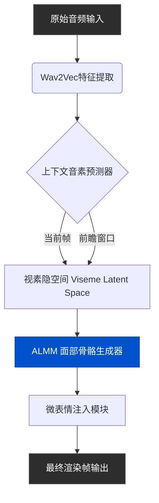

我们都见过那些东西。死鱼眼、橡皮嘴，那些生成得极其逼真却又让人毛骨悚然的AI数字人。在过去的几年里，视频生成领域一直被困在“恐怖谷”的深渊中。诚然，光影变得更好了，渲染分辨率也达到了4K，但当生成的角色一开口，所有的幻觉就瞬间破灭了。音频与音素对不上，微表情完全缺失，面部特征点在帧与帧之间像廉价的机械动画一样生硬切换。

欢迎来到2026年，游戏规则已经被彻底改变。

我们不再依赖于简陋的2D网格变形。如今最前沿的AI视频技术直接运行在映射到3D面部流形（Facial Manifolds）的音频驱动隐空间中。如果你想了解现代流水线是如何在消除令人毛骨悚然的“假人感”的同时，实现照片级真实、具备情感感知的唇形同步，我们需要深入引擎盖下方，看看驱动当前SOTA（State-of-the-Art）架构的精确机制。

## 症结所在：为什么以前的唇形同步很糟糕？

2025年以前的视频流水线往往把唇形同步当作事后诸葛亮。你把一个音频文件和一张静态图像塞进神经网络，它基本上只是根据通用的音量峰值来使得下半张脸发生形变。它将音频振幅直接映射为下巴的张合度。

结果呢？臭名昭著的“胡桃夹子效应”。

人类讲话不仅仅是吧嗒嘴那么简单。它涉及到口轮匝肌、颧大肌和降口角肌之间的复杂协同作用。当你要发“P”这个音时，你的嘴唇会在声音发出**之前**就紧紧闭合。这在语音学中被称为“预期协同发音”（Anticipatory Coarticulation）。旧的模型没有预测未来的能力，所以它们只能在声音出现后才做出反应。正是这50毫秒的延迟，触发了你大脑深处的“尸体警报”。

## ALMM 框架（音频隐空间网格流形）的崛起

为了解决这个问题，研究人员必须停止将音频视为简单的波形，而是开始将其视为高维面部骨骼绑定（Facial Rig）的语义驱动器。这催生了我称之为 **音频隐空间网格流形 (Audio-Latent Mesh Manifold, ALMM) 框架** 的技术革命。

与将音频直接映射到像素不同，ALMM 流水线将音频特征（通过 wav2vec 或类似的编码器提取）映射到一个代表 3D 面部特征点的隐空间中。

以下是该流水线处理数据的确切流程：

注意到图中的“前瞻窗口（Look-ahead Window）”了吗？通过向模型输入一个滚动的音频窗口（通常是未来和过去的200毫秒），上下文预测器就能提前知道即将出现一个爆破音，从而提前压缩嘴唇。预期协同发音的问题就这样被优雅地解决了。

## 核心秘籍：视素时序平滑算法 (VTSA)

即使有了 ALMM，你仍然会遇到“抖动（Jitter）”问题。视素（Visemes，音素的视觉表现）的变化非常快。如果你将每一次语音转变都严格映射为面部特征点的更新，角色的嘴巴就会极其不自然地抽搐。

为了对抗这个问题，业界采用了 **视素时序平滑算法 (Viseme Temporal Smoothing Algorithm, VTSA)**。VTSA 并不是简单地对嘴唇位置随时间进行平均；它对特定的面部肌肉群应用了局部卡尔曼滤波（Localized Kalman Filter）。

下巴获得了高强度的平滑（因为它的质量大，移动缓慢）。而嘴唇内侧则获得了低强度的平滑（因为它的移动非常迅速）。结果就是，在复杂的音节之间实现了如丝般顺滑的过渡，同时又保留了断奏发音所需的锐利闭合感。

### 唇形同步方案的核心数据对比

让我们看看硬核数据，了解为什么这一切至关重要。以下是旧方法与现代 ALMM + VTSA 流水线的详细对比。

| 评估指标 | 2024年 生成式变形技术 | 2026年 ALMM + VTSA 现代架构 | 对观众感知的实际影响 |
|---|---|---|---|
| **音频响应延迟** | +40毫秒 (被动响应) | -10毫秒 (主动预期) | 彻底消除“粗劣译制片”的违和感。 |
| **面部特征点追踪** | 68个 2D 关键点 | 400+ 3D 顶点流形拓扑 | 能够捕捉极其细微的肌肉微表情。 |
| **时序平滑方案** | 线性插值 (Linear Interpolation) | 局部卡尔曼滤波 | 解决高频的嘴部抽搐和像素抖动问题。 |
| **情绪耦合度** | 零 (生硬死板) | 音频语义深度驱动 | 角色在用欢快语调说话时会自然展现笑容。 |
| **算力与处理时间** | 高 (像素级变形计算) | 低 (纯隐空间向量操作) | 完美支持低延迟的实时视频流生成。 |

## 微表情：决定成败的最后 10%

完美的唇形同步只能让你完成 90% 的进度。剩下的 10%——也是真正能说服人类爬行脑它正在看着一个真实人类的那部分——是微表情。

当人类说话时，他们嘴巴以外的面部区域绝不是静止的。他们的眼神会游移，他们会在集中注意力时皱起眉头，他们的鼻孔会在深呼吸时微微扩张。

在 ALMM 框架中，我们部署了一个完全专用的辅助神经网络，仅用于注入具有随机性、且与音频强相关的微表情。高频音调和增加的振幅通常与心率加快相关联，这会被转化为轻微的瞳孔放大和眨眼频率的增加。通过将声学张力映射到眼部的微小运动，数字人瞬间被注入了“灵魂”。

## 落地实操：如何将前沿技术投入生产

你可以花上好几周的时间尝试去搭建一个自定义的 ComfyUI 工作流来实现这些效果，在这个过程中不断与 Python 依赖冲突和破裂的张量维度作斗争。或者，你可以直接使用一个将 ALMM 和 VTSA 原生集成到其渲染引擎底层的生产力平台。

如果你想在今天就部署这种照片级真实的AI视频生成，同时又不想被繁琐的技术细节所困扰，NavoKit 的 **免费 AI 视频生成器 (Free AI Video Generator)** 绝对是你利用这些高级唇形控制技术的最佳途径。我们在底层深度实现了 ALMM 框架，这意味着你只需拖入音频，系统就会自动处理前瞻预测、时序平滑算法以及微表情的注入。它就是能完美运行，输出结果无可挑剔。

## 迈向未来

我们终于跨越了那道恐怖谷。2026年的AI角色不再令人毛骨悚然；它们具有令人信服的真实感。随着我们继续向前迈进，技术焦点将从单纯地匹配正确的视素，转移到全身的运动学同步——确保肩膀和胸腔能够根据口语音频所需的肺活量做出精准的反应。

但就目前而言，面部问题已经被完美攻克。不要再满足于那些橡皮嘴的低劣生成物了。升级你的技术管线，实现时序平滑算法，或者最简单的——直接使用 NavoKit，让成熟的基础设施为你分担所有的底层重活。
