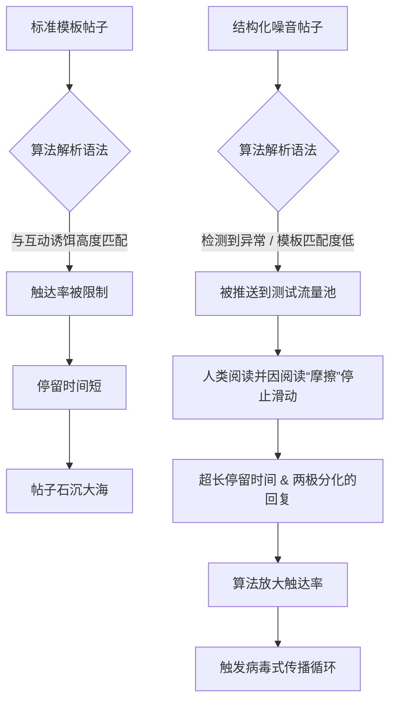

我们生活在一个数字同质化的时代。现在去看看你的 X（Twitter）或 LinkedIn 信息流。那里是一片由格式模板、“爆款线程”钩子和排列整齐的要点列表组成的荒原，所有的内容读起来都如出一辙。算法会喜欢某一种格式，直到它不再喜欢为止。一旦某种特定的内容结构达到了饱和的顶峰，平台的算法就会开始主动对其进行打压，从而导致一种被称为“算法疲劳”的现象。

解决这个问题的解药并不是完全抛弃结构。真正的解药是**算法的偶然性 (Algorithmic Serendipity)**，而它是通过一个我们称之为**结构化噪音 (Structured Noise)** 的概念来设计的。

如果你想在今天这个过度饱和的注意力经济中建立一个病毒式的传播循环，你就必须打破人类大脑和解析你文本的机器学习模型的模式识别机制。本指南将引导你准确地了解如何做到这一点，用数据驱动的异常现象取代那些陈词滥调的通用废话。

## “完美”帖子的消亡

多年来，社交媒体增长黑客的传统智慧是：找到完美的模板，然后无情地反复使用。

*   “这里有 10 个好用到感觉违法的工具……”
*   “我在 6 个月内从 0 赚到了 1000 万美元。这是我的完整剧本：”

这些曾经有效。过去时了。如今，社交媒体算法的权重严重向停留时间、细微的互动（长篇大论的回复，而不仅仅是“好文！”）和可分享性倾斜。当算法检测到一个高度标准化的模板时，它会将其归类为低质量的“互动诱饵 (engagement bait)”。然后，触达率就会被限制。

现在真正能触发病毒式传播的是*异常 (anomaly)*。算法想要的是那些因为不可预测、两极分化或极度引人入胜而能让用户留在平台上的东西。但是，你不能只是发布绝对的混乱；因为纯粹的混乱无法带来转化。

你需要的是**结构化噪音**。

## 什么是结构化噪音？

在声学和数据科学中，“结构化噪音”指的是仍然具有潜在统计模式的随机信号（如粉红噪音或布朗噪音）。在社交媒体营销的背景下，结构化噪音意味着在一个被证明有效的内容架构中引入蓄意的、经过计算的变化和“摩擦”。

它的核心在于让你的内容看起来原生、杂乱且充满人情味，同时在底层维持一个隐蔽的、高度优化的转化引擎。

### 结构化噪音注入框架 (SNIF)

为了将其投入实际操作，我们开发了**结构化噪音注入框架 (Structured Noise Injection Framework, 简称 SNIF)**。这个框架包含一个四层架构，用于起草那些算法无法轻易归类的文案。

1.  **锚点 (The Anchor - 结构)：** 核心心理触发点（例如：地位、好奇心、错失恐惧症 (FOMO)、范式转变）。
2.  **摩擦力 (The Friction - 噪音)：** 故意破坏排版和格式的预期（例如：打破常规语法、使用奇怪的标点符号、插入极其具体但不合逻辑的数据点）。
3.  **两极化向量 (The Polarization Vector)：** 采取一种能迫使评论区产生两极分化回应的立场（从而推高互动指标）。
4.  **隐形行动号召 (The Invisible CTA)：** 一种感觉像是你长篇大论或深刻见解的自然延伸，而不是生硬推销的行动号召。

让我们通过图表来看看结构化噪音是如何打破标准模板所面临的算法疲劳循环的。

## 如何设计“噪音”

以下是向你在 X 和 LinkedIn 上的帖子中注入噪音的具体操作指南。

### 1. 排版格式的异常化

停止使用完美对称的段落。停止在每个项目符号的开头使用表情符号。人类的眼睛对这些早就免疫了。相反，你应该使用不对称性。

*   将一个巨大的、块状的段落与一个单字或单句结合起来。
*   为了强调而使用不一致的字母大小写（少用，但要突然出现）。
*   放弃标准列表。不要用 1、2、3，而是使用由换行符分隔的非结构化思想块。

**排版噪音示例：**
不要写：“SEO 正在发生改变的 3 个原因：1. AI 搜索。2. 零点击结果。3. 内容饱和。”
改成：“SEO 死了。又死了一次。所有人都在为零点击结果哭泣，但他们没有看到数据中那个巨大且刺眼的漏洞：根本没有人在为基于代理 (agentic) 的搜索进行优化。全是些被反复咀嚼的 AI 垃圾。别再为 Google 写作了。开始为那些抓取你数据的爬虫写吧。”

### 2. 极度具体的怪异细节

泛泛的数字会被忽略。“我把流量提高了 50%。”
太无聊了。

注入极其具体、甚至让人觉得有些不舒服的细节。这是一种能够验证真实性的噪音。
“我们的抓取预算被鞋类目录下的 43,021 个动态过滤 URL 给屠杀了。我们砍掉了它们。流量在 9 天内飙升了 14.8%。”

### 3. “反文案”技巧

传统的文案写作教你清晰、简洁和有说服力。反文案 (Anti-copywriting) 则是故意引入阅读摩擦。它听起来就像一个压力山大的创始人在凌晨两点的大脑倾泻。它使用行业术语而不做解释。它假设读者足够聪明，能够跟上你的思路。

这在 LinkedIn 上效果奇佳，因为那里每个人都在拼命试图让自己听起来专业而圆滑。通过让自己听起来未经修饰和原生，你成为了他们信息流中最有趣的东西。

## 标准内容 vs. 结构化噪音 对比

| 特征 | 标准的“大师”模板 | 结构化噪音方法 |
| :--- | :--- | :--- |
| **钩子 (Hook)** | “我如何在 30 天内赚到 1 万美元：” | “上周我们在广告上烧了 14,000 美元，投资回报率是零。这是这次失败的精确拆解：” |
| **排版** | 对称、要点列表、大量表情符号。 | 不对称、密集的文本块混合着锐利的单行短句。极少表情符号。 |
| **语气** | 权威、干瘪、过度乐观。 | 原生态、略带愤世嫉俗、高度分析性、未經過濾。 |
| **数据使用** | 整数 (100%, 10x)。 | 细化、杂乱的数字 (14.2%, 87 天, 1,402 次点击)。 |
| **算法反应** | 被归类为互动诱饵；遭到限流。 | 被归类为新颖的讨论；根据停留时间被放大推荐。 |

## 设计病毒式传播循环

获得高触达率只是成功了一半。真正的病毒式传播循环要求这种触达率能够转化为驱动进一步触达的行动。

在 X 上，这意味着将有争议的回复构建到你的主要论点中。说出一些真实但不受欢迎的话，然后在回复中无情地捍卫它。算法非常看重创作者的回复。

在 LinkedIn 上，这意味着利用评论的“网络效应”。结构化噪音的方法通常会导致人们产生分歧或要求澄清。当他们评论时，你的帖子就会被推送到他们的网络中。

### 工具在制造噪音中的作用

你无法在规模化的情况下手动完成这一切。不断发明新的排版异常和追踪两极化向量的认知负荷太高了。你需要一个了解基础模板的系统，这样它才能故意偏离这些模板。

这就是 NavoKit 的 **AI Social Booster** 成为你不公平优势的地方。

不像那些只会吐出完全相同的枯燥模板（这些模板正是导致算法疲劳的罪魁祸首）的通用 AI 写作工具，AI Social Booster 就是为生成“异常”而设计的。你输入你的核心见解（锚点），工具会故意注入摩擦，改变语法，移除陈词滥调的过渡，并为了最大化停留时间进行优化。

它不是在替你写作；它是在将你干净的想法打碎成打破算法、具有高留存率的格式。它本质上是一个自动化的 SNIF 引擎，让你能够测试数百种结构化噪音的变体，直到你找到在你所处利基市场触发病毒传播循环的精确频率。

## 结论：停止试图完美

互联网正淹没在完美之中。完美的钩子，完美的线程，完美的公司更新。这一切都是白噪音。

要脱颖而出，你必须设计偶然性。你必须成为系统矩阵中的一个故障 (glitch)。使用结构化噪音注入框架，打造出看起来像是一场意外，但转化能力却如同机器般精准的帖子。停止用模板对抗算法，开始用精心计算的异常来打破它。
