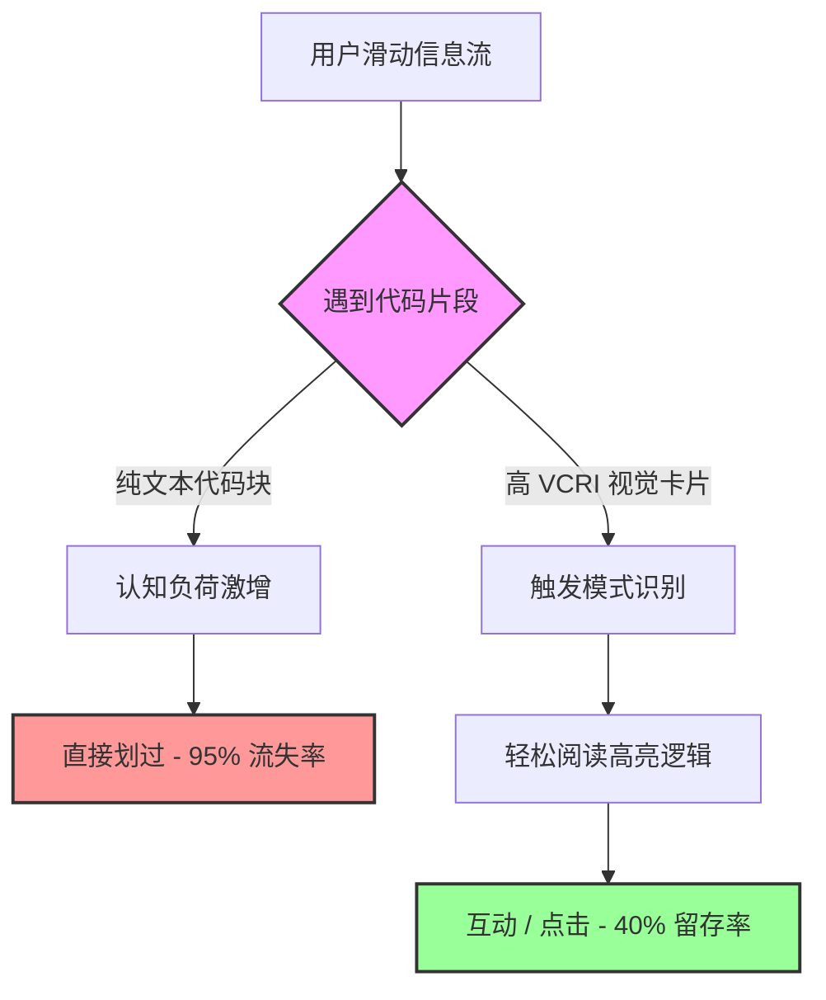

我们都有过这样的经历。当你在 X（以前的 Twitter）上滑动屏幕，或者浏览 Dev.to 上的文章时，你撞上了一堵由等宽灰色文字组成的“墙”。那可能是一个没有排版的 `console.log()` 报错输出，或者更糟——一段直接复制粘贴、缩进全无的 Python 脚本。

你会怎么做？你肯定会继续向下滑动，直接跳过。

在开发者营销 (Developer Marketing)、开发者关系 (DevRel) 和技术内容创作这个竞争极其激烈的领域，**注意力是你最稀缺的资源**。如果你还在社交媒体或技术文档中分享原始的纯文本片段，或是排版糟糕的代码块，那你无疑是在主动扼杀你的转化率。

欢迎来到**优美代码的复兴 (Renaissance of Beautiful Code)** 时代。如今的开发者不仅仅想要解决方案；他们更希望以一种清晰易读、美观且能瞬间理解的方式来消化这些内容。

在这篇深度剖析中，我们将彻底拆解为什么纯文本代码片段注定失败，引入一个衡量开发者参与度的新框架，并向你展示如何利用视觉化代码资产让你的内容投资回报率 (ROI) 提升 10 倍。

## 纯文本的认知负荷灾难

开发者每天都在阅读代码。当他们将注意力切换到社交媒体、技术简报或博客文章时，他们的大脑正在寻找高信号、低阻力的信息。

像 LinkedIn 或 X 这样的平台上的纯文本代码块需要大脑进行高强度的“解析”。读者必须在脑海中自行添加语法高亮，费力找出核心逻辑到底在哪一行，还要自动过滤掉那些无关紧要的样板代码 (boilerplate)。这会产生巨大的认知负荷激增。

当认知负荷意外飙升时，跳出率也会随之飙升。你不仅仅是在和其他技术帖子争夺注意力；你还在与表情包、突发新闻和各种应用通知竞争。

### 视觉代码保留指数 (VCRI)

为了量化这种现象，我们需要一个框架。这就是我们提出的 **视觉代码保留指数 (Visual Code Retention Index, 简称 VCRI)**。

VCRI 衡量的是一个开发者停止滑动屏幕、解析代码并采取你期望的行动（点赞、收藏、点击链接或注册）的可能性。它的计算基于四大核心支柱：

1.  **即时可读性 (Immediate Legibility, IL)：** 能否在 3 秒内理解核心功能？
2.  **上下文高亮 (Contextual Highlighting, CH)：** 关键代码行是否在视觉上与样板代码有明显区分？
3.  **平台美学 (Platform Aesthetics, PA)：** 该代码片段在特定平台上看起来是否原生且高级（例如：合适的宽高比、是否兼容暗黑模式）？
4.  **品牌关联 (Brand Association, BA)：** 代码片段是否能在不引起反感的情况下，潜移默化地强化你的品牌形象？

一个纯文本代码片段在 VCRI 评分表上几乎得零分。它的可读性极差，没有任何高亮，美感糟糕，更谈不上品牌关联。

让我们通过图表直观地对比一下，当用户遇到纯文本代码片段和高 VCRI 富媒体卡片时，留存率是如何断崖式下跌的。

数据一目了然。当你强迫开发者在一个原本并非为此设计的环境中解析原始文本时，他们会毫不犹豫地放弃你的内容。

## 美学代码的经济学

为什么这很重要？因为在开发者营销中，**参与度就等于采用率**。

如果你是一位正在推广新 API 的 DevRel，或者是一个试图让大家看到你的 SaaS 产品的独立开发者，你的代码片段**就是**你的产品演示。如果演示看起来很廉价，产品给人的感觉就会很廉价。

让我们通过一个具体的对比表，来看看不同格式是如何影响关键指标的。

| 评估指标 | 纯文本代码片段 | 平台原生 Markdown | 优美的代码图片 (高 VCRI) |
| :--- | :--- | :--- | :--- |
| **阻断滑动能力 (Scroll-Stopping)** | 极低 | 中等 | **极高** |
| **理解所需时间** | > 10 秒 | 5-7 秒 | **< 3 秒** |
| **社交分享潜力** | 几乎为零 | 低 (容易格式错乱) | **具备病毒式传播潜力** |
| **跨平台一致性** | 高 | 低 (依赖各平台的解析器) | **完美一致** |
| **品牌辨识度** | 无 | 无 | **高 (可自定义背景/水印)** |

*表格：不同代码分享方式的性能特征对比。*

如你所见，将你的代码转化为一张精美、静态的视觉图片，是确保在 Discord、Slack、LinkedIn 和 Reddit 等所有平台上获得完美一致性、最大化分享率和超高 VCRI 分数的唯一途径。

## 如何落地高 VCRI 资产

你已经明白了“为什么”。现在让我们来谈谈“怎么做”。过去，制作精美的代码资产意味着要打开 Figma，粘贴代码，手动调整文本样式，绘制背景渐变，然后再导出。

那种工作流已经死了。对于现代内容创作的速度来说，它太慢了。

为了真正利用好优美代码的复兴浪潮，你需要的是能够以“思维的速度”运行的工具。你需要一个系统，只要输入 Markdown 或原始代码，就能瞬间生成针对各平台优化的、高 VCRI 的图片。

### 引入 NavoKit 的 Markdown 转图片工具

这正是我们在 NavoKit 中开发 **Markdown 转图片 (Markdown to Image)** 工具的初衷。我们受够了仅仅为了在 Twitter 上分享一个 5 行的 React Hook，就要在设计软件里耗费 15 分钟。

NavoKit 的这款工具专为开发者和技术营销人员打造，旨在帮助他们无需成为平面设计师，也能将 VCRI 最大化。

它将彻底改变你的工作流：

1.  **零阻力输入：** 只需粘贴你的 Markdown 或代码即可，无需调整繁琐的文本框。
2.  **即时语法高亮：** 自动识别编程语言，并应用美观、符合无障碍标准的主题。
3.  **智能上下文聚焦：** 轻松模糊样板代码或高亮特定代码行，让你的受众确切知道该看哪里。
4.  **品牌级美学呈现：** 几秒钟内应用令人惊艳的背景渐变、自定义窗口框架（macOS、Windows 或极简风格）以及不显眼的品牌水印。

现在，你不再需要写完教程后贴上一块干巴巴的文本；你可以将该代码块拖入 NavoKit，生成一张极具视觉冲击力的图片资产，并将其嵌入到你的博客或社交媒体帖子中。

### “窗口”的心理学触发机制

像 NavoKit 这样的工具之所以如此有效，其背后有着深层的心理学原因。当你在一个模拟的 macOS 或 Windows 终端/编辑器窗口中展示代码时，你触发了开发者大脑深处的模式识别 (pattern recognition)。

它让人感觉像“回到了主场”。它传达了一个信号：这不仅仅是文本，而是**可执行的现实**。它在抽象概念和具体工具之间架起了一座桥梁。纯文本块只是一段引语；而装裱精美的代码片段，则是一个产品。

## 停止流量泄漏

你每次发布一段未排版、丑陋的代码块，都在泄漏潜在的流量、GitHub 上的 Star 数，以及产品的注册用户。你正在向你的受众传达一个信息：你不够尊重他们的时间，甚至不愿意帮他们减少认知负荷。

优美代码的复兴无关乎虚荣。它关乎对读者的同理心，以及对转化漏斗的冷酷优化。

通过采用视觉代码保留指数 (VCRI) 框架，并利用 NavoKit 的 Markdown 转图片生成器等专业工具，你可以将你的技术内容从极易被无视的文本，转变为能够让人停止滑动屏幕、实现高转化的视觉资产。

开始尊重你的代码吧。开始尊重你受众的注意力。让你的代码片段变得优美，然后看着你的各项指标节节攀升。
