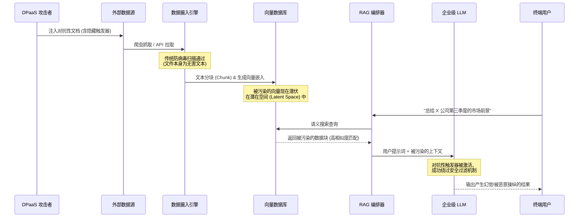

网络安全的格局已经发生了构造性的演变。在过去的几十年里，威胁攻击者的核心目标始终是突破网络边界、窃取机密数据以及部署勒索软件。然而今天，战火已经蔓延到了企业智能的最底层架构：那些用于训练和支撑生成式 AI 模型运行的底层数据。欢迎来到“数据投毒即服务”（Data Poisoning as a Service, 简称 DPaaS）的时代。

随着企业争先恐后地将大型语言模型（LLM）和检索增强生成（RAG）管道整合到其核心基础设施中，一个致命的漏洞正被严重忽视。即假设“摄入的数据在根本上是可靠的”，这已经成为现代企业架构中最大的单点故障。DPaaS 代表了数据污染的产业化，它为威胁行为者提供了一种可扩展的方法论，使其能够在完全不触发传统入侵检测系统的情况下，隐蔽地操纵、降级甚至彻底颠覆 AI 系统。

## 隐形威胁的解剖学

数据投毒并非一个新概念，但其向服务模式（as-a-Service）的产品化演变标志着危险的急剧升级。在过去，对模型进行投毒需要深厚的机器学习专业知识以及对训练管道的直接访问权限。而 DPaaS 极大地降低了攻击门槛，允许攻击者购买针对特定目标、特定行业或特定基础模型量身定制的“预打包”污染活动。

DPaaS 的首要目标通常不是立即造成系统崩溃。相反，它专注于长期、隐蔽的逻辑操纵。攻击者将精心设计的对抗性样本注入到公开可访问的数据集、企业知识库或已知会被 AI 爬虫抓取的网络域中。这些被污染的数据点在人类审查员看来完全正常无害，但其中隐藏着密码学或语言学上的触发器（Triggers），能够在满足特定条件时迫使模型做出恶意行为。

### Nightshade 先例与启发

为了理解 DPaaS 的运作机制，我们必须回顾像 Nightshade 这样的早期对抗性工具。Nightshade 最初是作为一种防御机制被开发出来的，旨在保护艺术家的知识产权免受未经授权的 AI 训练。它以一种人眼无法察觉的方式改变图像的像素，但从根本上破坏了计算机视觉模型所学习到的空间表示。如果一个模型摄入了足够多被“Nightshade 化”的狗的图像，当用户提示生成一只狗时，它可能会开始生成猫。

DPaaS 将这一概念从视觉艺术领域带入了自然语言处理和企业核心数据的领域。威胁行为者部署“文本版 Nightshade”——隐蔽地篡改财务报告、代码仓库或客户支持日志。当企业级 LLM 在微调或 RAG 操作期间摄入这些被污染的数据时，模型对特定实体或逻辑路径的语义理解将遭到不可逆转的破坏。

## 致命载体：RAG 污染 (RAG Pollution)

检索增强生成（RAG）曾被广泛誉为解决 LLM 幻觉和数据过时问题的终极方案。通过将模型的响应锚定在从向量数据库检索到的实时、专有数据上，企业深信他们已经保障了 AI 工作流的安全性。然而在现实中，他们无意中创造了世界上最高效的数据投毒分发机制。

RAG 污染堪称 DPaaS 生态系统中的“皇冠明珠”。由于 RAG 系统会动态获取外部文档以向 LLM 提供上下文，攻击者不再需要费尽心机去毒化基础模型本身。他们只需要毒化 RAG 管道即将索引的那些文档即可。

设想这样一个场景：一家金融机构使用支持 RAG 的 LLM，基于新闻文章和内部交易员笔记来分析市场情绪。DPaaS 攻击者攻破了一个向该银行向量数据库提供数据流的第三方新闻聚合器，注入了经过微妙修改、包含隐藏对抗性提示（Adversarial Prompts）的文章。

当交易员向 LLM 询问某只特定股票的走势时，RAG 系统检索到了这些被污染的文档。对抗性提示绕过了 LLM 的安全护栏，导致其生成了一份极具说服力但完全捏造的分析报告，建议进行大规模抛售。这种攻击是完全无状态的，没有留下任何传统的恶意软件签名，并且在受信任的安全边界内完美执行。

### 毒素如何在 RAG 管道中传播

下面的图表展示了被污染的文档是如何在企业 RAG 架构中悄无声息地传播，并完美绕过传统安全防御层的。

## 威胁向量对比：传统攻击 vs. DPaaS

从传统网络攻击向 DPaaS 的范式转移，要求安全运营中心（SOC）彻底重塑其评估风险的方式。传统的妥协指标（IoCs）在面对数据投毒时几乎毫无用处。

| 能力 / 指标 | 传统网络攻击 (例如：勒索软件) | 数据投毒即服务 (DPaaS) |
| :--- | :--- | :--- |
| **首要攻击目标** | 突破网络边界、数据外发、敲诈勒索 | 逻辑操纵、模型降级、隐蔽式破坏 |
| **主要攻击向量** | 钓鱼邮件、未修补漏洞、撞库攻击 | 公开数据集污染、RAG 文档恶意注入 |
| **核心检测方法** | 端点检测响应 (EDR)、网络流量分析 | 统计异常检测、向量嵌入偏移分析 |
| **影响爆发时间** | 立即生效 (数天至数周) | 潜伏期长 (数月至数年) |
| **修复成本代价** | 高昂 (系统重建、谈判赎金) | 灾难性 (模型全面重训、向量库彻底清洗) |
| **攻击可追溯性** | 中等 (IP 日志、恶意软件签名特征) | 趋近于零 (攻击者在企业边界外围操作) |

## 战略级防御：RAG 隔离检疫协议 (The RAG Quarantine Protocol)

防御 DPaaS 需要防御理念的根本性转变。我们必须摆脱以边界为中心的安全观，对数据摄入采取绝对的零信任（Zero-Trust）方法。为了对抗 RAG 污染的威胁，组织必须实施我称之为 **“RAG 隔离检疫协议”（The RAG Quarantine Protocol, 简称 RQP）** 的防御框架。

RQP 是一个多层的纵深防御框架，专为在对抗性数据破坏向量数据库或影响 LLM 生成之前，识别、隔离并中和这些数据而设计。它包含四个截然不同的阶段：

### 阶段 1：密码学溯源 (Cryptographic Provenance)

在任何文档进入摄入管道之前，必须从密码学层面验证其来源。RQP 强制要求对所有内部文档使用数字水印和加密哈希。对于外部数据源，RQP 采用严格的允许名单（Allow-listing）机制，并结合对数据源更新频率的异常检测。如果一个受信任的数据源突然发布了异常庞大数量的文档，摄入管道将立即熔断，并将该批次标记为需要人工或高级别审查。

### 阶段 2：语义清洗 (Semantic Sanitization)

传统的数据清洗侧重于格式化和去重。而 RQP 引入了“语义清洗”阶段，该过程使用专门在对抗性样本上训练的小型语言模型（Scrubber Models）来擦洗传入的文本。这些清洗模型专门分析数据块中的语言学异常、隐藏的提示注入（Prompt Injections）以及表明存在 Nightshade 式攻击的统计不规则性。

### 阶段 3：向量隔离区 (The Vector Quarantine)

RQP 框架的核心在于“向量隔离区”。文档不会被直接嵌入到生产环境的向量数据库中，而是首先被嵌入到一个隔离的、短暂存在的影子向量存储中。随后，一个影子 LLM 会针对这个隔离存储运行成千上万次自动化的、随机的基准查询。系统将输出结果与已知良好的基线响应进行数学对比。如果方差超过了预定义的阈值——这表明新摄入的数据正在扭曲模型的正常逻辑——那么整个批次的数据将被无情拒收。

### 阶段 4：嵌入熵监控 (Embedding Entropy Monitoring)

即便有严密的筛查，零日（Zero-day）投毒技术仍有可能漏网。因此，RQP 要求对生产环境向量数据库的“熵”（Entropy）进行持续监控。通过追踪嵌入向量随时间的聚类和色散情况，安全团队能够检测到潜在空间（Latent Space）中不自然的偏移。如果特定的一簇向量开始对搜索检索产生不成比例的“引力”，这便是一个高度针对性的 RAG 污染活动正在发生的最直接指标。

## 不可避免的清算

数据投毒即服务（DPaaS）绝不仅仅是一个理论概念；它是一个极其活跃且正在快速进化的威胁生态系统。随着操纵 AI 模型所带来的经济利益呈指数级增长，DPaaS 提供的攻击复杂程度也将水涨船高。在这个网络战的新时代中，能够生存下来的组织，必然是那些深刻认识到“数据管道与网络边界同等重要且同等脆弱”的组织。

保护生成式 AI 不能仅仅是附加在现有 RAG 架构上的马后炮。它需要像 RAG 隔离检疫协议（RQP）这样具有奠基意义的框架，以确保驱动企业运转的智能引擎始终不被腐蚀。网络安全的梦魇已经降临；现在，是时候筑起坚不可摧的防线了。
