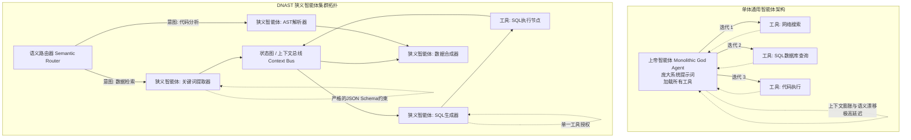

在过去两年里，AI工程生态系统一直痴迷于“上帝智能体（God Agent）”的概念——这是一个单体的、无所不知的系统，配备了无尽的工具库、数千行的系统提示词（System Prompts）以及多步推理循环，理论上它能够解决你抛给它的任何问题。这种愿景极其诱人：为一个前沿大模型设定一个目标，赋予它访问你API生态的权限，然后观察它如何自主地在复杂的业务逻辑中穿梭。

然而，在实际的生产环境中，这些单体通用智能体（Monolithic Generalist Agents）无一例外地撞上了南墙。它们遭受着灾难性的上下文稀释（Context Dilution）。随着推理循环（ReAct Loops）的每一次迭代，它们的幻觉（Hallucination）概率呈指数级复合增长。它们白白消耗着海量的Token，耗尽了KV缓存，并且以不可预测的方式静默崩溃。

通用智能体的时代正在终结。未来属于在确定性路由集群中运行的高度专业化的“狭义智能体（Narrow Agents）”。这种从单体智能体向微智能体（Micro-Agent）架构的范式转变，不仅仅是一种技术趋势，更是构建可靠的、生产级AI系统的数学和经济学必然。

## 单体智能体在数学上的不可能性

要理解为什么通用智能体会失败，我们必须审视基于Transformer架构的底层机制，以及它们如何与ReAct（推理与行动）循环相互作用。

当你将20个工具、复杂的JSON Schema以及管理每一个边缘场景的庞大系统提示词打包到一个智能体中时，你不可避免地稀释了它的注意力机制（Attention Mechanism）。即使拥有超大的上下文窗口（如128k、1M或2M tokens），模型可靠地提取和加权针对特定子任务的正确指令的能力也会退化。这通常被称为“迷失在中间（Lost in the Middle）”现象，但在智能体系统中，它表现为更危险的后果：工具滥用、推理漂移（Reasoning Drift）和无限死循环。

假设 $P(E)$ 是智能体正确执行单个步骤（选择正确的工具、正确格式化参数并在不产生幻觉的情况下解释结果）的概率。在一个包含 $N$ 个步骤的单体ReAct循环中，最终成功完成任务的概率是 $P(E)^N$。

如果一个上下文极其臃肿的智能体在每一步的成功率是90%（$P(E) = 0.9$），那么一个5步任务的成功率只有59%。在10步任务中，成功率暴跌至34%。

当你将架构碎片化，拆分为专业化的狭义智能体时，你可以将每个特定节点的 $P(E)$ 优化到接近0.99甚至更高。通过用狭义智能体构成的确定性有向无环图（DAGs）取代开放式的ReAct循环，系统故障的复合概率将被大幅降低。

## 引入：狭义智能体定向集群拓扑（DNAST）

解决单体架构脆弱性的方案，并不是单纯等待一个拥有更大上下文窗口的、更强的前沿大模型；而是软件架构的底层范式转移。我们提出了**狭义智能体定向集群拓扑（Directed Narrow-Agent Swarm Topology，简称 DNAST）**。

DNAST放弃了“单一自治实体”的概念，转而采用一种类似于微服务（Microservices）的LLM架构。在这个框架中，“智能体”被简化为一个纯粹的功能节点，并带有极端的约束条件：单一的目标，极小的上下文，以及只能访问零个或一个工具的权限。

### 架构对比：单体 vs. 集群



### DNAST 框架的核心组件

1. **语义路由器 (The Semantic Router, L0)**: 路由器本身不是一个生成式智能体，而是一个分类层。它评估入站的用户状态，并确定性地将负载路由到相应的执行图。路由器依赖于语义相似度（Embeddings）、传统分类器或极其严格的基于规则的逻辑。它能有效防止系统触发不必要的长链推理。
2. **狭义智能体 (The Narrow Agents, L1)**: 它们是专注的“打工人”。一个狭义智能体的系统提示词只有几十个Token，而不是几千个。它只做一件事。例如，一个 `SQLValidationAgent`（SQL验证智能体）只负责根据特定的数据库方言检查SQL字符串的语法是否有效。它完全不知道上层应用程序在做什么。它的KV缓存占用极小，允许进行大规模的并发处理。
3. **临时上下文总线 (The Ephemeral Context Bus)**: 状态不再像单体架构那样通过一个庞大的消息线程（无差别地追加上下文）来传递，而是通过严格类型化的上下文总线在智能体之间传递。智能体输出经过JSON Schema验证的负载（Payloads），并将其传递给图中的下一个节点。上下文总线能有效防止提示词注入和状态损坏在系统中蔓延。
4. **归约器/合成器 (The Reducer / Synthesizer, L2)**: 一旦狭义智能体完成了它们的并行或串行执行，一个终端智能体会将这些离散的输出合成为用户或下游应用程序所需的最终格式。

## 性能指标：单体 vs. 集群

在部署于高吞吐量的企业级环境中时，DNAST框架在每一个关键维度上都系统性地超越了通用ReAct智能体。

| 架构指标 | 单体通用智能体 | DNAST 集群拓扑 | 核心原因分析 |
| :--- | :--- | :--- | :--- |
| **Token利用效率** | 极差 | 极佳 | 单体架构在每次循环迭代时都要重新处理庞大的系统提示词和工具描述。狭义智能体使用极其精简的静态提示词。 |
| **延迟 / 首字时间 (TTFT)** | 极高 (串行ReAct推理) | 极低 (高度可并行) | 狭义智能体可以跨分布式集群并发执行独立的子任务。 |
| **幻觉率** | 非线性复合增长 | 被隔离并受限 | 单体架构会将产生幻觉的对话上下文带入下一步。狭义智能体受限于严格的Schema约束。 |
| **系统可调试性**| 噩梦级 | 轻而易举 | 在集群中，开发人员可以根据各个节点类型化的输入/输出边界，精准定位故障节点。 |
| **KV缓存利用率**| 巨大的浪费 | 高度优化 | 由于跨请求使用完全相同且不可变的系统提示词，狭义智能体能极其高效地共享前缀缓存 (Prefix Cache)。 |
| **安全性与作用域** | 攻击面极其宽广 | 遵循最小权限原则 | 单体需要所有工具的访问权限。狭义智能体被沙盒化，只能访问单一特定功能。 |

## 狭义智能体与前缀缓存的经济学

除了在可靠性方面的压倒性优势，行业向狭义智能体架构的转变更是受到纯粹的经济学和基础设施限制的驱动。在规模化提供大语言模型服务时，根本的瓶颈在于显存带宽。当一个通用智能体运行时，它消耗了大量的KV（键-值）缓存显存，仅仅是为了维持当前步骤根本用不到的工具和规则的上下文。

通过采用DNAST，工程团队可以实现激进的异构模型路由（Heterogeneous Model Routing）。较简单的任务（如JSON格式化、实体提取或SQL语法验证）可以路由到部署在廉价推理硬件上的高量化、小参数开源模型（例如 Llama-3-8B 或 Mistral-7B）。而前沿大模型（如 GPT-4o, Claude 3.5 Sonnet, 或 Gemini 1.5 Pro）则被专门保留给高层路由、复杂推理或最终的合成节点。

此外，狭义智能体是**提示词前缀缓存（Prompt Prefix Caching）**机制的最大受益者。因为一个狭义智能体拥有高度静态、简明的系统提示词，且永远不会改变，该提示词的注意力键值（Attention KVs）可以被永久缓存在GPU显存中。当数以千计的请求涌向 `EntityExtractionAgent` 时，推理引擎只需要为新传入的用户负载计算注意力，这将推理成本降低了几个数量级，并大幅缩短了首字时间（TTFT）。

## 狭义智能体的严苛提示词工程

构建狭义智能体的艺术在于“约束注入（Constraint Injection）”。你不再是为一位“乐于助人的助手”编写指令；你是在对一个功能性的软件节点进行编程。

传统的通用提示词往往是这样的：
*“你是一个乐于助人的AI助手。你可以访问工具 X、Y 和 Z。首先，一步步思考用户的问题。然后，决定使用哪个工具。如果发生错误，请重试。”*

相比之下，狭义智能体的提示词是这样的：
```text
SYSTEM: You are the `SQL_Table_Extractor_Node`. (你是SQL表名提取节点)
INPUT: Natural language text. (输入: 自然语言文本)
OUTPUT: Extract PostgreSQL table names mentioned. Output a strict JSON array of strings. (输出: 提取提到的PostgreSQL表名。输出严格的字符串JSON数组)
CONSTRAINT 1: If no tables are found, output []. (约束1: 如果没有找到表，输出[])
CONSTRAINT 2: Do not explain your reasoning. Do not generate SQL queries. Do not acknowledge the user. (约束2: 不要解释推理过程。不要生成SQL查询。不要用敬语回应用户)
```

这种粗暴的极简主义保证了确定性的行为。智能体不可能偏离轨道进入存在主义式的死循环，因为它根本没有能够进行语义发散的“跑道”。它是这台高度优化机器中一个可靠的齿轮。

## 安全性、沙盒与最小权限原则

单体智能体最致命但却被讨论得最少的缺陷之一就是安全性。在传统的软件架构中，我们严格遵守最小权限原则（PoLP）。负责生成用户头像的微服务绝不可能拥有金融交易数据库的写入权限。

然而，在上帝智能体（God Agent）时代，开发人员经常在一个LLM上下文中同时赋予读取用户数据、执行任意代码、查询生产级数据库和发送电子邮件的权限。这为提示词注入（Prompt Injection）和越狱（Jailbreaking）创造了天文学级别的巨大攻击面。如果攻击者设法通过看似无害的输入（例如，智能体正在总结的网页上隐藏的恶意负载）向单体智能体注入了恶意提示词，该智能体就拥有使用其武器库中任何工具来执行攻击的权限。

在DNAST集群拓扑中，安全性是结构性的。因为每个狭义智能体都是一个独立的微服务，它在一个严格的沙盒内运行。`WebScrapingAgent` 拥有网络访问权限，但无法写入数据库。`SQLGenerationAgent` 拥有Schema访问权限，但无法执行查询。即使爬虫节点通过提示词注入被攻破，爆炸半径也被严格限制在爬虫节点内部。攻击者无法横向移动，因为该节点根本没有可用的横向移动工具。

## 智能体状态管理的演进

通用智能体通常依赖于一条庞大的单体聊天记录来维持状态（State）。思维轨迹、工具调用和观察结果都被全部追加到一个不断增长的消息数组中。对于长时间运行的进程来说，这种做法是灾难性的。随着上下文窗口逐渐填满，模型的注意力机制越来越难以区分过去相关的观察结果和已经过时的死胡同，从而导致认知能力退化（Cognitive Degradation）。

DNAST 通过显式的状态管理机制解决了这个问题，通常通过基于图的框架（如 LangGraph）、状态机或自定义的事件驱动架构（EDA）来实现。在一个集群中，状态是一个通过上下文总线传递的外部的、可变的JSON对象。

狭义智能体不需要阅读过去所有对话的庞大文字记录，它只接收执行其特定功能所需的精确状态切片。如果 `DataSynthesizerAgent` 需要某个查询的结果，它不需要阅读生成该查询的原始提示词，也不需要阅读执行过程中遇到的所有报错。它只接收最终的、经过清洗的数据负载。这种将“记忆”与“执行”解耦的机制，使得集群可以无限扩展，而不会遭受上下文坍缩（Context Collapse）的折磨。

## 结语

对通用人工智能（AGI）的狂热追求，导致软件工程师过早地将通用化、对话式的范式强加于生产级后端系统之上。但工程学的本质，始终是构建健壮的、可预测的、可扩展的架构。

单体ReAct智能体只是一个实验原型——它是通向自主系统的一瞥，但在规模化应用面前根本不堪一击。生产级AI和自主系统的真正未来，必定属于集群：通信于严格类型化总线之上、高度受限、极致专业化且无状态的节点网络。

“上帝智能体”已死，狭义智能体集群万岁。
