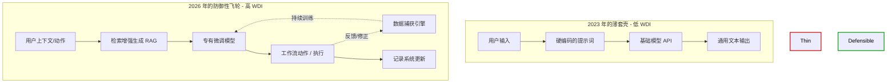

生成式 AI 的蜜月期已经彻底宣告结束。还记得 2023 年吗？你只需要用胶水代码把一个系统提示词（System Prompt）粘在一个 OpenAI 的接口上，套上一个订阅付费的壳，就可以自诩为 SaaS 创始人了。快进到 2026 年，满大街都是“ChatGPT-for-X”创业公司的坟墓。

如果你的核心产品架构，说到底只是把用户的输入扔给一个基础大模型，然后在一个干净的 UI 里渲染出结果，那你根本就没有在做一门生意。你拥有的只是一个脆弱的 UI 组件，它掩盖了你毫无价值捕获能力的残酷事实。

市场已经变得精明了。基础模型已经沦为大宗商品，推理成本也已经跌入谷底，而创始人们自以为正在构建的护城河，结果证明不过是一个随时会干涸的水坑。让我们来彻底解剖一下，为什么通用 API 套壳应用正在面临大规模灭绝，以及当前 AI 周期的幸存者偏差教会了我们关于真正防御性的哪些硬核道理。

## 利润压缩的死亡螺旋

“薄套壳”应用（Thin Wrapper）的致命缺陷在于利润压缩。当你唯一的差异化优势只是一个花哨的界面和一段隐藏的提示词时，你的进入壁垒实际上为零。

套壳创业公司运行在一个极其残酷的经济现实中：你被夹在了控制智能层并拿走大部分利润的基础模型提供商，以及毫无切换成本的终端用户之间。一旦有一个能匹配你能力的开源模型发布，或者基础模型提供商把你的功能作为原生特性发布，你的用户流失率就会瞬间飙升到 100%。

你不是在修筑护城河；你只是在租来的土地上搭了个违建。

## 引入：工作流防御性指数 (WDI)

为了量化 AI 创业公司的存活率，我们需要超越“AI 原生”这种虚无缥缈的热词。我们开发了一个名为 **工作流防御性指数（The Workflow Defensibility Index, 简称 WDI）** 的分析框架。WDI 通过三个维度来衡量一个应用抵御基础模型更新冲击的韧性：

1. **数据飞轮速度 (Data Flywheel Velocity)**：用户交互产生能够改进系统的专有数据的速度有多快？
2. **工作流整合深度 (Workflow Integration Depth)**：该工具在用户的日常操作中嵌入得有多深（例如，是否对 CRM、代码库或内部 API 具有直接的读/写访问权限）？
3. **模型独立性 (Model Independence)**：产品对自定义微调（Fine-tuning）或专业模型路由的依赖程度，而不是仅仅依赖一个单一的通用 API 节点。

WDI 得分低的创业公司就是薄套壳。它们只提供了功能级别的便利。高 WDI 得分则表明系统极其健壮，在这里，AI 是复杂工作流的赋能者，而不是产品本身。

## 脆弱性可视化：套壳 vs. 飞轮

让我们来看看死路一条的套壳和具有防御性的产品在架构上的巨大分歧。

注意薄套壳架构中缺失的关键一环：没有反馈循环。基础模型对特定用户的上下文一无所知，创业公司也没有捕获任何专有数据来建立优势。这是一种无状态的交易。然而，防御性系统利用模型来执行工作流，捕获执行过程中的遥测数据，并利用这些数据来训练更小、更快、特定于任务的模型。

## 范式转移的解剖：套壳 vs. 真正的产品

你怎么知道你是在做一个功能还是在做一家公司？这里是硬核拆解：

| 衡量指标 | API 套壳应用 | 具有防御性的 AI 产品 |
| :--- | :--- | :--- |
| **核心价值主张** | 相比 ChatGPT 更好的 UI 体验 | 自动化复杂的、多步骤的工作流 |
| **数据战略** | 零。无状态的提示词。 | 专有的遥测数据和反馈循环 |
| **模型战略** | 单一依赖（例如，只用 GPT-4o） | 模型路由，本地 SLM（小语言模型），定制化微调 |
| **切换成本** | 几乎为零。用户极易流失。 | 极高。深度嵌入到内部工具中 |
| **护城河 / 防御性** | 依赖用户对提示词工程的无知 | 通过专有数据建立的结构性优势 |
| **WDI 评分** | 0.1 - 0.3 | 0.7 - 1.0 |

## 向专有数据和微调（Fine-Tuning）的转向

在 2024-2025 年的大清洗中幸存下来的创业公司都意识到，仅仅依赖通用的零样本提示（Zero-shot Prompting）无异于宣判死刑。范式已经转向了专业的、特定领域的智能。

现在的问题不再是你是否使用 AI；而是你的 AI 是否拥有基础模型无法从公共网络上抓取到的上下文。

这要求工程实践发生根本性的转变。顶尖的工程团队不再把时间花在微调系统提示词以避免幻觉上，而是开始构建复杂的数据摄取管道。他们正在整理高质量的评估数据集。他们正在微调更小的、开源权重的模型（如 Llama 4 或专用的 SLM），以便在非常具体、狭窄的任务上击败 GPT-5。

在一个专有内部数据上运行的微调模型，将永远碾压依赖零样本推理的通用模型。更重要的是，它将单位经济效益（Unit Economics）拉到了你这边。

## 是工作流，而不仅仅是提示词

对抗基础模型大宗商品化的终极防御手段，是拥有工作流（Workflow Ownership）。套壳创业公司错误地以为生成文本就是最终目标。并不是。生成的文本只是一种过渡状态。最终目标是任务的执行。

如果你的产品只生成一封营销邮件，那它就是一个套壳。如果你的产品生成了邮件，并根据历史转化数据自动与之前的活动进行 A/B 测试，根据情绪分析路由回复，并自动更新 CRM 系统……那就是一个工作流产品。

当你拥有工作流时，基础模型就变成了一个可互换的后端组件。如果 OpenAI 涨价或者 Anthropic 发布了更好的模型，你只需相应地路由推理流量即可。用户根本不在乎，因为他们付费购买的价值是工作流的执行，而不是原始的智能。

## 2026 年的现实检验

我们正在见证 AI 创业生态系统中一次残酷但必要的修正。AI 套壳的零利率狂欢已经撞上了残酷的市场现实。

如果你是这个领域的创始人或工程师，请审视一下你的架构。如果你的竞争优势能被一个聪明的 16 岁高中生拿着 Cursor IDE、花一个周末看一遍 API 文档就复制出来，那你已经死了。

去建立反馈循环。深入整合到工作流中。停止依赖租来的智能，开始构建你自己的数据飞轮。薄套壳的时代已经结束。深度工作流的时代已经到来。
