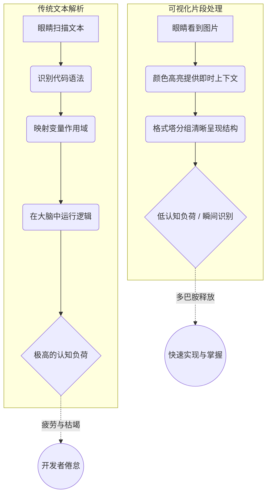

我们都曾经历过这种令人抓狂的时刻：凌晨两点，构建失败，你绝望地在 GitHub 上搜索一个配置项。你打开一个仓库，希望能快速找到实现细节。然而，迎接你的却是一个长达一万字的 `README.md`，读起来不像是一份快速入门指南，倒更像是一篇晦涩难懂的学术论文。你无休止地往下滚动，穿过设计哲学的长篇大论、历史遗留的决策说明，以及密密麻麻的等宽字体字符墙，双眼逐渐失去焦距。

这就是传统文档的现状。它确实非常全面，但却完全忽略了读者的认知负荷。

但在开发者社区中，一场变革正在悄然发生。在过去的几年里，我们在 Twitter/X、LinkedIn 和 GitHub 等平台上见证了一次大规模的转变。冗长文本块的时代正在终结。取而代之的是一种全新的沟通标准：**可视化代码片段**。

在这篇深度解析中，我们将探讨这种转变背后的心理学动因，引入一个用于高效技术沟通的框架，并审视工具链将如何演进以满足这种全新的审美标准。

## “直接看文档 (RTFM)” 的认知成本

经典的工程师口头禅“去读那该死的文档 (RTFM)”包含了一个潜在的假设：文档实际上是可读的。但人类的大脑天生并不擅长高效解析大段的纯文本，尤其是当这些文本中夹杂着语法符号、终端命令和抽象逻辑时。

当我们阅读文本时，我们是按顺序解码符号的。而当我们看一张图片时，我们的大脑是在并行处理信息。这不仅仅是用户体验理论，这是基础的神经学。麻省理工学院 (MIT) 的研究人员发现，人类大脑处理眼睛看到的整张图片只需短短的 13 毫秒。

让我们将这种处理方式的差异可视化：

当你将代码包裹在一个设计精良、视觉结构清晰的图像中时，你实际上是在利用语法高亮、间距、排版和对比度作为认知捷径。你不仅仅是在展示代码；你是在引导读者的视线，精准地落在需要关注的地方。

## 引入：瞬时掌握代码可视化循环 (IGCVL)

要理解为什么有些文档能够像病毒一样传播，而另一些却无人问津，我们需要深入探究知识传递的机制。我将这个过程称为**瞬时掌握代码可视化循环 (Instant-Grasp Code Visualization Loop, 简称 IGCVL)**。

IGCVL 的运作包含四个截然不同的阶段：
1. **吸引 (视觉对比度)：** 在信息流或 README 的纯色背景中，可视化代码片段脱颖而出。它通过高级的排版和精心设计的布局传递出“高价值”的信号。
2. **锚定 (语法熟悉度)：** 大脑通过语法高亮瞬间识别出编程语言。开发者潜意识里会想：“啊，这是 Rust，我懂这个。”
3. **核心 (逻辑隔离)：** 多余的细节被剥离，没有任何样板代码。代码片段完全聚焦于“顿悟”时刻——即正在演示的特定逻辑、修复方案或架构。
4. **转化 (知识获取)：** 开发者在不必耗费心力解析庞大文件的情况下，内化了该概念。这个循环以一种满足感而非疲惫感闭环。

可视化代码片段并不能完全取代深度的参考文档（我们仍然需要 API 规范），但它们作为关键的切入点发挥着作用。它们是漏斗的顶端，用来捕获开发者的注意力。

## 文本 vs. 视觉：全方位对比

让我们来看看这两种范式在试图引导新开发者入门或分享架构模式时的具体对比。

| 功能 / 维度 | 传统纯文本块 (`markdown`) | 可视化代码片段 (富图像) |
| :--- | :--- | :--- |
| **初始处理速度** | 缓慢，需要线性顺序阅读 | 几乎瞬时，利用并行视觉处理 |
| **情感反馈** | 通常令人不知所措、枯燥乏味 | 吸引人、有成就感，充满“高级感” |
| **社交媒体传播性** | 极差 (格式错乱，受限于字数) | 极佳 (原生图片支持，算法流量扶持) |
| **上下文隔离度** | 很难与周围的解释文本分离开来 | 强制作者必须提取和隔离核心概念 |
| **品牌识别度** | 几乎为零 (看起来和其他文档没区别) | 极高 (自定义主题、水印、独特背景) |

## 现有技术栈的痛点

所以，开发者确实*想要*分享可视化的代码。但他们是如何做到的呢？从历史来看，这个工作流充满了痛苦。

1. **原生截图方案：** 你打开 VS Code，缩小终端面板，隐藏侧边栏，放大字体，然后按下 `Cmd + Shift + 4`。结果呢？一张像素模糊、裁剪尴尬的图片，带着诡异的阴影，变量名下面可能还有一条拼写错误的波浪下划线。这看起来非常不专业。
2. **基于 Web 的生成器：** 你复制你的代码，粘贴到一个 Web 应用中，反复摆弄内边距的滑块，导出一张 PNG，然后突然发现自己打错了一个字母。你只能从头再来一遍。
3. **README 中的 CSS 黑客手段：** 你试图在 markdown 中编写复杂的 HTML/CSS，想让它在 GitHub 上看起来体面一些，结果却发现平台净化了你的标签，导致布局彻底崩溃。

这些解决方案都无法规模化。它们打破了开发者的心流状态。如果你正在撰写一篇技术博客或构建一个文档网站，你不应该离开你的开发环境去创建美观的视觉资产。

## NavoKit 解决方案：原生的“Markdown 转图片”引擎

这正是我们在 NavoKit 中内置 **Markdown 转图片 (Markdown to Image)** 工具的初衷。我们审视了那些糟糕的工作流，并意识到开发者需要的是一个可通过编程控制、原生集成，且美感毫不妥协的解决方案。

NavoKit 的工具彻底抛弃了笨拙的“截图-裁剪”流程。它允许你直接在工作流中提取原生的 markdown 代码块，并将它们瞬间渲染成令人惊叹的、高保真的图片。

### 为什么 NavoKit 能够颠覆现状：

* **零摩擦力：** 你无需离开你的工作区。你只管写代码，渲染工作交由工具完成。
* **影棚级的视觉美学：** 我们不仅仅做了一个截图工具，我们构建了一个渲染引擎。它能自动应用专业的内边距、完美的投影、macOS 风格的窗口控件（如果你需要的话），以及高级的语法高亮主题。它让你的代码看起来就像是准备在苹果发布会上展示一样。
* **极强的更新韧性：** 打错字了？没问题。因为它是基于 markdown 驱动的，你只需要修改文本，图片就会完美地重新生成。再也不用痛苦地重新对齐截图边缘了。
* **品牌一致性：** 你可以在所有的代码片段中应用统一的主题，确保你的博客、Twitter 信息流和官方文档看起来都高度一致且极其专业。

## 开发者关系的未来是视觉化的

我们正在告别“去读文档 (RTFM)”的时代，全面迈入“看这里 (Look at this)”的时代。

随着代码库变得越来越复杂，而我们的注意力持续缩短，沟通的重担已经完完全全落在了内容创作者的肩上。仅仅写出正确的代码已经不够了，你必须以一种极易消化的方式将其呈现出来。

那些拥抱可视化代码片段的开发者和公司——那些真正理解“瞬时掌握代码可视化循环”的人——将会建立起最强大的社区，打造出最受喜爱的工具。他们才是真正尊重用户时间和认知能量的人。

当一张图就能说明一切时，请停止强迫你的用户去阅读一本厚重的字典。今天就尝试使用 NavoKit 的 Markdown 转图片工具，开始将你的字符墙转化为艺术品吧。你的读者的神经元会感谢你的。
