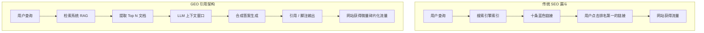

“十条蓝色链接”的黄金时代已经宣告死亡，而尸检报告异常残酷。随着 AI 搜索引擎——Perplexity、SearchGPT 以及 Google 的 AI Overviews——全面接管战场，传统的搜索范式已经彻底崩塌。对于内容创作者、发布商和 SEO 从业者而言，这绝不仅仅是算法的更迭，而是一场生死攸关的生存危机。你花了十年时间建立的流量管道，正被大语言模型 (LLM) 肆意榨取。它们咀嚼你的心血，向用户吐出合成答案，留给你的却只有一个微小、极易被忽视的引用链接。

欢迎来到强化版的“零点击搜索”时代。欢迎来到生成式引擎优化 (Generative Engine Optimization, GEO) 的纪元。

如果你还在痴迷于关键词密度、精准匹配锚文本以及虚荣的外链指标，那么你正在为一座鬼城做优化。游戏规则已经被彻底颠覆。想要在 AI 带来的流量反噬中生存下来，创作者必须停止追求网页排名，转而致力于在生成式输出中“工程化”你的引用率。

## 流量吞噬的底层逻辑

让我们抛开科技巨头们的公关辞令，直击其底层机制。过去的搜索引擎就像是图书管理员：它们指引用户去寻找正确的书籍。而生成式引擎则是合成器：它们把书读完，一把火烧掉，然后递给用户一份要点总结。

当用户向生成式引擎发起查询时，系统会执行一个多阶段的检索与生成流程。它首先提取查询意图，向传统索引发起请求以获取头部文档（即检索增强生成，RAG），然后将这些文档塞进大语言模型的上下文窗口。接着，LLM 会基于这些被检索到的文档，幻化出一个连贯的回答。

如果你的内容被检索到了，但没有被 LLM 引用，你的流量就是零。如果你的内容被引用了，你获得的流量也仅仅是过去占据排名第一时的一小部分。这意味着，搜索流量外溢的总盘子已经发生了断崖式的萎缩。

## 传统 SEO 漏斗的消亡

传统的 SEO 模型是线性的。你匹配用户意图，杀入前三名，然后收割点击。而 GEO 模型则是非线性的、基于概率的。你不再是为了排名而战；你是在争夺“上下文窗口包含率 (Context Window Inclusion)”和“合成引用优先级 (Synthesized Citation Priority)”。

在 GEO 架构中，通过检索阶段（进入 Top 文档行列）只是赢得了半场战役。你还必须在 LLM 的合成过程中存活下来。如果你的内容注水严重、啰嗦冗长或结构模糊，LLM 会毫不犹豫地无视你，转而引用那些密度更高、更具权威性的信息源。

## 核心框架：GEO 引用三角法则 (The GEO Citation Triangle)

为了逆向工程 LLM 在合成时如何选择引用源，我总结出了 **GEO 引用三角法则**。这个框架描绘了三个关键维度，迫使 LLM 不仅要摄取你的内容，还要将其作为不可替代的权威来源优先展示。

### 1. 权威向量 (Authority Vectors) - 事实的重量
RAG 管道中的 LLM 经过了极其严格的微调，它们天然偏好权威信息源，以最小化幻觉和法律风险。在 GEO 时代，权威不再仅仅是域名评级 (DR)；它是一个复杂的实体关联矩阵。
- **第一方数据：** 你是否拥有别人没有的独家统计数据、专利研究或原始数据？LLM 对硬核数据有着极度的饥渴。
- **专业锚点：** 作者实体是否关联了可验证的资质？语义网依赖 schema 标记将内容与已知且受信任的实体绑定。
- **品牌显著性：** 在 LLM 最初训练的庞大语料库中，你的品牌实体是否与该主题有着强烈的绑定关系？

### 2. 实体共振 (Entity Resonance) - 语义的深度
关键词已死，实体即一切。实体共振衡量的是你的内容在多大密度和多高精准度上，映射到了特定主题的知识图谱中。
- **LSI 已经过时，拥抱语义邻近性。** 你必须覆盖那些在数学模型上围绕核心主题聚类的二级和三级实体。
- **定义清晰度：** LLM 解析文本的方式是寻找清晰、毫无歧义的定义。如果你把答案埋在 500 字的废话开篇之下，RAG 解析器会直接将你的文档从上下文窗口中剔除。
- **关系映射：** 充分利用结构化元素（表格、列表、结构化数据）来明确定义实体之间的关系。

### 3. 句法密度 (Syntactic Density) - 单 Token 的信息熵
LLM 的上下文窗口是有限的，它们偏好高信息密度的文本。句法密度是指独特的事实陈述与总 Token 数的比率。
- **剔除所有废话。** 每一句话都必须交付价值。如果一段话删掉后不损失任何事实，那就果断删掉。
- **Markdown 极致优化：** 使用清晰的标题 (H2, H3)、无序列表和加粗文本来传递重要性信号。LLM 能极高效地解析 Markdown；利用它来高亮你的核心论点。
- **直击答案：** 将“太长不看 (TL;DR)”放在最前面。“倒金字塔”的新闻写作风格是 GEO 最完美的格式。

## 范式转移：传统 SEO vs. GEO

在 2023 年行之有效的策略，在 2026 年只会对你造成反噬。以下是这场变革中血淋淋的现实对比。

| 核心指标 / 策略 | 传统 SEO (2024 年前) | 生成式引擎优化 (GEO) |
| :--- | :--- | :--- |
| **首要目标** | 争夺 SERP 排名第一 | 在 AI 输出中获得首位引用 (Primary Citation) |
| **内容结构** | 长篇大论、强叙事性、堆砌关键词 | 高句法密度、模块化、实体丰富 |
| **流量预期** | 高流量、泛意图 | 低流量、超高精准度、极高转化率 |
| **核心指标** | 搜索流量、点击率 (CTR) | 品牌显著性、引用声量份额 (Share of Voice) |
| **内容格式** | 大段文本、冗长的指南 | 表格、JSON-LD、Markdown 列表、硬数据 |
| **外链策略** | 追求高 DR、精准匹配锚文本 | 品牌提及、在可信节点中的实体共现 |

## 战术执行：如何“工程化”你的引用率

如果你想在这场反噬中活下来，必须立刻重构你的编辑策略。以下是你今天就必须落地的硬核战术。

### 1. 部署“信息检索 (IR) 诱饵段落”
在每篇文章的开头，H1 标签之下，放置一段 50 字左右、密度极高的摘要，直接回答核心查询。使用列表或加粗段落。这不是写给人类读者看的；这是抛给 RAG 提取算法的诱饵。让它变得如此简洁、充满事实，以至于 LLM 别无选择，只能一字不差地提取并引用你。

### 2. 超配独家专有数据
停止洗稿互联网上已有的内容。LLM 洗稿的能力比你强一万倍。想要被引用，你必须向生态系统中注入全新的信息。发起一项问卷调查、爬取并分析一份数据集、发布一个行业指数。如果你是某个具体数据的唯一来源，LLM 在被问及该话题时，*必须* 引用你。

### 3. 极度依赖 Markdown 和表格
LLM 解析结构化文本的能力远超非结构化散文。如果你在对比两个概念，不要写 500 字的论述。直接做一个详细的 Markdown 表格。如果是步骤指南，使用有序列表。把内容的结构梳理到极致，让 LLM 能够毫无阻力地提取实体关系。

### 4. 优化“长尾对话式查询”
用户不再搜索“最好的 CRM”。他们的查询变成了：“我在俄亥俄州经营一家 5 人的管道维修公司，我们用 Quickbooks，哪款 CRM 集成最好且月费低于 50 美元？” 你的内容必须能够解答这些极其具体、多变量的复杂查询。构建专注于特定使用场景的内容枢纽，解决那些泛泛而谈的 LLM 总结根本无法触及的深度痛点，迫使它们必须通过引用专家内容来补全答案。

## 转型或灭亡的十字路口

对 AI 搜索引擎的抵制和愤怒是合理的。这感觉就像是掠夺，因为从结构上来说，它就是。但是，抱怨 LLM 的道德问题挽救不了你的业务。

互联网正在分裂成两个截然不同的层：由 AI 控制的“合成层 (Synthesis Layer)”和由创作者控制的“源头层 (Source Layer)”。如果你继续生产平庸、易于合成的内容，你将被合成层无情地抽象和抹除。你的流量将归零。

想要在 GEO 时代生存，你必须成为源头层中不可替代的权威节点。你必须生产出具有极高句法密度、深度实体共振和绝对权威性的内容，让生成式引擎如果离开了你的引用，就根本无法正常运转。

十条蓝色链接已经成为历史。停止哀悼吧。掌握 GEO 引用三角法则，为上下文窗口而优化，在这个全新的生成式边疆中夺回属于你的领地。游戏并没有结束；它只是变成了地狱难度。
