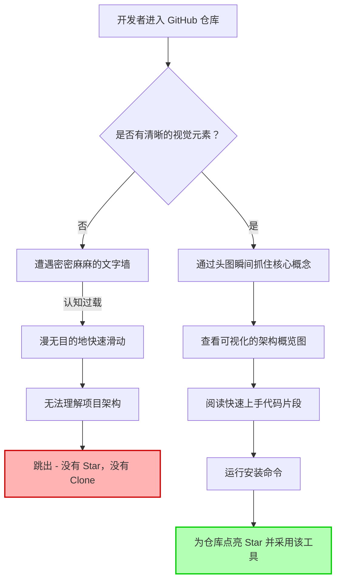

你刚刚花了整整六个月的时间，打造了一个足以改变游戏规则的开源项目。代码库干净整洁，测试覆盖率高达 99%，性能基准测试结果更是令人惊叹。你满怀期待地点击了“发布”，在 Hacker News、X（推特）和 Reddit 上疯狂发帖，然后坐等 Star 数量如潮水般涌来。

然而……现实却是一片死寂。也许只有你的几个同事友情赞助了三颗星，外加一个机器人的自动点赞。

到底哪里出了问题？你查看了仓库的流量统计，发现有数百个独立访客，但克隆（Clone）和 Star 的数量却几乎为零。一个残酷的真相是：你的代码也许是传世之作，但你的 GitHub README 却彻底搞砸了。它读起来就像一份晦涩难懂的法律文件，而在竞争极其激烈的开源世界里，开发者们根本没有耐心去阅读一面“文字墙”。

欢迎来到**仓库跳出率（Repo Bounce Rate）**的残酷现实。

当一个开发者点进你的代码仓库时，你只有不到三秒钟的时间来证明你的工具值得他们投入时间。如果他们不能在瞬间搞懂你的项目是干什么的、架构是怎样的、以及如何快速上手，他们就会毫不犹豫地点击返回按钮。在这篇深度解析中，我们将探讨为什么文本堆砌的 README 正在摧毁你的开源项目采用率，引入一个全新的仓库设计心智模型，并向你展示如何瞬间可视化你的仓库结构，从而大幅提升转化率。

## 开源消费者的心理学

开发者是出了名的持怀疑态度的消费者。在评估一个新的库或工具时，他们往往是在寻找**不使用**它的理由。这个项目还有人维护吗？它是不是过于复杂了？它会让我的打包体积膨胀吗？

但在他们提出这些问题之前，他们已经完全基于美学和结构做出了潜意识的判断。**感知质量等于实际质量。**如果你的 README 看起来像是一个混乱的思维垃圾桶，那么来访的开发者自然会假设你的源代码也是一团糟。

相反，那些拥有精美视觉效果、清晰架构图和优雅代码片段的仓库，能够传递出一种权威感和可靠性。这绝不是肤浅的面子工程，这是应用于开发者工具的 UX 设计（也就是 DX - 开发者体验）。

## 隆重介绍：README 转化漏斗 (The README Conversion Funnel)

要修复一个糟糕的 README，我们需要像对待一个高转化率的落地页（Landing Page）那样去对待它。与其仅仅是把代码“记录”下来，你更需要引导访客穿过**“README 转化漏斗”**。

这个漏斗由四个截然不同的阶段组成：

1. **钩子（The Hook，0-3秒）：** 位于首屏的黄金位置。这包括一个极具吸引力的标题、相关的徽章（构建状态、版本、开源协议），以及至关重要的一点——一张能够瞬间传达核心价值主张的高质量头图（Hero Image）或视觉图。
2. **架构概览（The Architecture Glance，3-10秒）：** 这东西到底是怎么运作的？有哪些核心组件？在这一步，纯文本的解释往往会遭遇惨败，而可视化的结构图则能大放异彩。
3. **“快速上手”试用（The Quick Start Trial，10-30秒）：** 让工具跑起来的阻力最小的路径。一个简单的 `npm install` 加上一段精美的高亮代码片段，展示最核心的 API。
4. **转化（The Conversion）：** 开发者为仓库点亮 Star，Fork 代码，或者将其整合到他们自己的业务代码中。

让我们通过一个图表，来直观地看看当你忽略了这个漏斗，仅仅依赖纯文本时，会发生怎样灾难性的流失。



注意到瓶颈在哪里了吗？如果你在视觉展示阶段失败了，开发者甚至根本不会滑到你的“快速上手”部分。

## 纯文本目录树的谬误

多年来，解释仓库组织结构的“行业标准”，就是在终端里运行 `tree` 命令，然后把 ASCII 字符输出粘贴到代码块里。

```text
.
├── src/
│   ├── components/
│   ├── utils/
│   └── index.ts
├── tests/
└── package.json
```

虽然这种方法确实能用，但在现代开发者营销的语境下，它已经彻底过时了。原因如下：

1. **极高的认知负担：** ASCII 树状图需要逐行阅读。大脑必须去解析那些线条、缩进和字符，才能构建出心理模型。
2. **糟糕的移动端体验：** 你试过在 GitHub 手机 App 上看一个复杂的 ASCII 树状图吗？格式完全错乱，强迫用户进行恶心的横向滚动，看起来就像一堆乱码。
3. **毫无品牌认知：** 它只是未经修饰的原始文本。它对于提升你工具的“高级感”没有任何帮助。

让我们来看看传统方法与现代可视化架构的正面交锋。

| 特性 / 方案 | 传统的纯文本树状图 (`tree` 命令) | 现代的可视化架构图 (NavoKit 渲染) |
| :--- | :--- | :--- |
| **认知阻力** | 高。需要枯燥的逐行阅读和脑内重构。 | 低。人类的模式识别能力能瞬间领悟。 |
| **美学价值** | 看起来像 1995 年的终端日志转储。 | 呈现出高级 SaaS 产品的界面质感。 |
| **移动端适配** | 格式极易崩坏，横向滚动体验极差。 | 完美的缩放体验，响应式的图片渲染。 |
| **品牌一致性** | 零定制空间。永远只有那一种等宽字体。 | 完全掌控主题、色彩和品牌调性。 |
| **对转化率的影响** | 勉强及格（符合最低预期）。 | 极高。在潜意识中传递出“高质量代码”的信号。 |

## 破局之道：使用 NavoKit 瞬间可视化你的仓库

你深知视觉效果的重要性，但是打开 Figma、设计排版、导出切图，还要时刻保持它们与你的代码库同步，这简直是一个巨大的时间黑洞。你是一名工程师，不是一个全职的平面设计师。

这就是为什么 **NavoKit 的“Markdown 转图片 (Markdown to Image)”工具** 将成为你实现开源项目用户增长的秘密武器。

不用再和设计软件死磕了，NavoKit 允许你直接在浏览器中，将你的代码库结构、代码片段和 Markdown 瞬间生成令人惊艳的、支持视网膜屏幕的高清视觉图。它完美地弥合了枯燥的底层代码与高级的开发者营销之间的鸿沟。

### 立即改造你的 README：实战指南

以下是一份标准的操作手册，教你如何使用 NavoKit 将你的仓库从一个“文本垃圾场”升级为高转化率的开发者资产：

#### 1. 彻底干掉 ASCII 树状图
删掉那些纯文本的目录结构。打开 NavoKit，输入你仓库的核心结构，使用 Markdown 转图片工具生成一张精美的、带有主题风格的架构图。你可以自定义背景，添加高级的阴影效果，并应用与你品牌美学相匹配的语法高亮。

#### 2. 让你的代码片段“升维”
不要再把你最关键的示例代码扔进普通的 Markdown 代码块里了。你的“快速上手（Quick Start）”代码是整个仓库中最重要的一段代码。使用 NavoKit 将该片段转换为带有 MacOS 风格窗口的精美视觉图。它能立刻抓住眼球，并大声宣告这是一款“高级货”。

#### 3. 为暗色模式 (Dark Mode) 而设计
GitHub 的暗色模式非常受欢迎。如果你上传的都是带有纯白色背景的 PNG 图片，你简直是在闪瞎一半受众的眼睛。在使用 NavoKit 生成图片时，请利用透明背景或自适应主题的颜色，确保无论用户的系统偏好如何，你的架构图都能完美融入。

#### 4. 优化“首屏滑动”体验
把你刚刚生成的可视化架构图，**紧贴着**放在你的徽章（Badges）和项目简介之后。绝对不要让开发者向下滑动很久才找到你的项目是怎么构建的。要用视觉证据立刻给他们带来冲击。

## 仓库美学的投资回报率 (ROI)

在 GitHub README 的视觉结构上投入时间，绝不是什么虚荣心作祟；这是一种极具战略眼光的分发机制。

当你降低了理解代码库所需的认知阻力时，你本质上也就降低了使用的门槛。一个能瞬间理解你项目架构的开发者，在安装你的 Package 时会充满信心。

通过应用“README 转化漏斗”，并利用 NavoKit 这样强大的工具轻松生成高质量的视觉资产，你可以止住流量的流失，并开始将匆匆过客转化为忠实用户、贡献者和布道师。

不要再让你才华横溢的代码被埋没在一个糟糕的、全是文字的 README 后面了。瞬间可视化你的代码仓库结构，然后看着你的采用率飙升吧。
