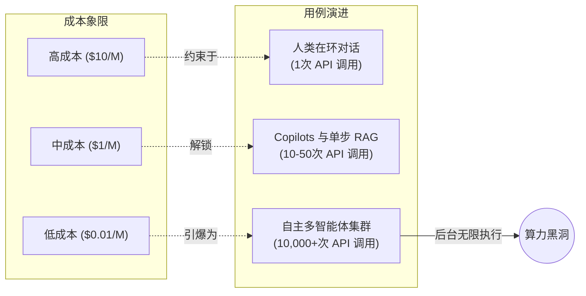

1865年，英国经济学家威廉·斯坦利·杰文斯观察到了一个反直觉的现象：提高煤炭使用效率的技术进步，非但没有减少煤炭消耗，反而让消耗量飙升。因为煤炭动力变得更便宜、更高效，它在更多应用场景中变得具备商业可行性。

把时间快进到这个十年，硅谷在AI算力上正在陷入完全相同的认知陷阱。当下的主流叙事认为：随着模型变得更小、更高效，被量化为4-bit，并被蒸馏成极度优化的混合专家（MoE）架构，全球对GPU的需求将会见顶。“我们在优化推理，”这种论调声称，“因此我们需要更少的硬件。”

这种逻辑从根本上就是本末倒置的。推理的优化恰恰是点燃算力需求火药桶的那根火柴。我们正面临着一场不折不扣的AI杰文斯悖论。

### 延迟-弹性需求曲线 (The Latency-Elasticity Demand Curve)

为了理解为什么算力需求即将猛烈地脱离历史硬件摩尔定律，我们需要引入一个新的心智模型。我们称之为**延迟-弹性需求曲线**。

这个框架的提出基于一个核心假设：LLM推理的需求相对于成本和延迟具有无限的弹性。当推理既昂贵（每百万Token 10美元）又缓慢（首字延迟以秒计）时，AI的使用被严格限制在高价值、同步的、Human-in-the-loop（人类在环）任务中。你问一个问题；模型回答。API调用的比例是1:1。

但是，当你把成本打到每百万Token 0.01美元，把延迟压缩到毫秒级时，工作负载的基础性质就变了。AI从一个*同步工具*转变为一个*异步后台进程*。

在接近零成本的区间，我们不再为API调用效率做优化。相反，我们开始用廉价的算力换取更高的智能水平。当你能轻易生成一个包含500个子Agent的后台集群，让它们激烈辩论一个问题，生成一万个合成测试用例，编译代码、执行、读取堆栈跟踪并在400次迭代中自我修正时，你为什么还要依赖所谓的Zero-shot（零样本）提示词？

### 智能体自主循环：无底的算力黑洞

下一波AI浪潮的决定性特征不再是更强的基础智能，而是Agentic Looping（智能体循环）。当开发者构建自主系统时，他们依赖的是思维树（ToT）、自我反思（Self-reflection）和海量并行采样等架构。

思考一个简单的编程任务。在高成本象限下，开发者写一段提示词，得到一个代码片段，然后手动调试。
在微成本象限下，开发者只需分配一个工单。AI会读取整个代码库，生成一个架构规划Agent，该Agent再派生出三个独立的实施Agent。它们编写代码，编写单元测试，并不断循环运行。每一次报错都会触发一次新的诊断提示词。

过去那种单次500 Token的API调用，现在演变成了一个深度嵌套的、递归的分形API调用树，在后台默默吞噬掉5000万个Token。

| 成本象限 | API 经济学 | 交互模式 | 单任务API调用量 | Token 消耗量 |
|---------|------------|----------|----------------|--------------|
| **高** | $10.00 / 1M | 同步对话 | 1 - 2 | 1万 - 5万 |
| **中** | $1.00 / 1M | 引导式 RAG / Copilot | 10 - 50 | 10万 - 50万 |
| **低** | $0.10 / 1M | 思维链循环 (CoT Looping) | 500 - 1,000 | 500万 - 2000万 |
| **微** | < $0.01 / 1M | 无边界智能体集群 | 100,000+ | 10亿+ |

上面的表格揭示了这场灾难级的扩展向量。API成本下降100倍，绝对不会让你的账单节省99%。它解锁的是那些需求量暴增10,000倍的全新工作负载。这里的需求弹性系数远远大于1。

### 优化的错觉

硬件提供商和模型构建者正陷入一场激烈的价格逐底竞争。FlashAttention、连续批处理 (Continuous batching)、投机解码 (Speculative decoding) 以及 FP8 量化，都在疯狂地压低单个 Token 的服务成本。

但每一盎司的优化，都在直接补贴算法侧的暴力破解 (Brute-forcing)。如果推理成本便宜了10倍，理性的工程决策就是多采样10倍的路径来寻找一个更好的答案。我们正在用纯粹的、未经验证的原始算力来替代算法的优雅。

我们已经看到了早期的震颤。后台Agent在7x24小时分析日志，合成数据生成管道正在吞噬空闲的GPU周期，LLM甚至在实时逐帧生成整个游戏。

杰文斯悖论保证了算力需求绝对没有天花板。我们正在建造的，不是吐出一个数字就关机的计算器，而是合成认知引擎。当认知劳动力的成本变得比人类劳动力更低的那一刻起，对这种劳动力的需求实际上就是无限的。

更便宜的推理并不是解决GPU短缺的方案。它正是那个确保短缺永远不会结束的核心机制。
