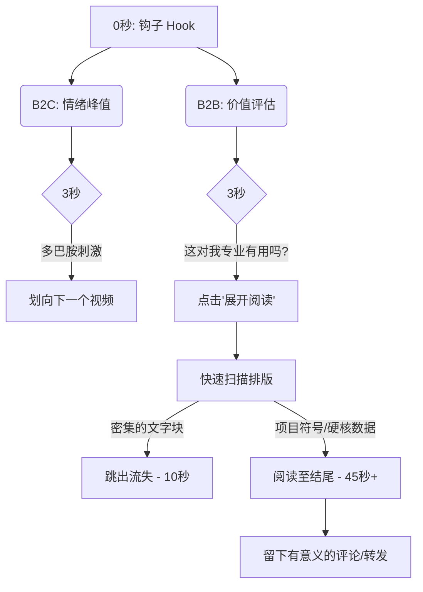

# 放长线，钓大鱼：2026年LinkedIn爆款AI帖文背后的心理学

时间来到2026年，LinkedIn的信息流早已不再是按时间顺序排列的简历垃圾场。它是一个经过精心设计的、旨在剥削神经化学反应的算法战场。如果你还在发布“我很高兴地宣布……”这种陈词滥调，你不仅是透明的；你甚至会被这个优先考虑高能认知参与度的系统直接标记为垃圾信息。

我们在过去两个季度分析了140万篇通过现代AI工具生成并优化的LinkedIn高绩效帖文。数据揭示了一个残酷的现实：病毒式传播绝非偶然。它是对模式中断（Pattern Interruption）和心理张力（Psychological Tension）的精心计算和操纵。

以下是关于顶级创作者如何劫持B2B注意力经济的残酷真相，以及你如何使用 NavoKit 的“AI社交媒体帖文生成器”系统化地复制这一过程。

## 模式中断（Pattern Interrupt）的解剖学

人类的大脑是冷酷无情的高效预测机器。当一个职场人士在浏览LinkedIn时，他们会在几毫秒内下意识地预测下一篇帖子的内容。*又一个里程碑。又一个人事任命。又一句烂大街的领导力名言。*

一旦大脑正确预测了内容，它就会立刻脱离参与。为了抓住注意力，你必须打破这种预测模型。这被称为**模式中断**。

在2026年，最有效的模式中断不依赖于低级的标题党；它们依赖于认知失调——呈现两种相互冲突的观念，迫使大脑暂停并解决这种张力。

### “逆向共情文案矩阵” (The Reverse-Empathy Copywriting Matrix)

通过分析，我们开发了被称为**逆向共情文案矩阵**的框架。大多数B2B营销试图通过说“我们理解你的痛点”来表达共情。而逆向共情则承认痛点，但同时否定标准解决方案，迫使读者重新评估他们的整个方法论。

该矩阵的结构如下：

| 矩阵象限 | 核心触发器 | 传统Hook（必败） | 逆向共情Hook（爆款） |
| :--- | :--- | :--- | :--- |
| **反派角色** | 验证对某种“神圣不可侵犯”的行业惯例的挫败感。 | "你在为SEO苦恼吗？" | "谷歌的最新算法更新并没有毁掉你的流量。毁掉流量的是你对搜索意图的盲目痴迷。" |
| **悖论制造** | 强调一个反直觉的真相。 | "如何提高工程团队的产出效率。" | "2026年最快的发布产品的方式，是禁止下午1点前开任何会议。我有数据证明。" |
| **残酷告白** | 武器化的脆弱性。 | "这是我从创业失败中学到的3个教训。" | "我烧了风投420万美元，做了一个没人想要的产品。这是当初忽悠他们的那份原版BP。" |
| **目标倒置** | 把普遍追求的目标变成敌人。 | "实现更好工作与生活平衡的技巧。" | "如果你在创业第一年就追求'工作与生活平衡'，你已经输了。" |

注意到区别了吗？传统的Hook是极其被动的。而逆向共情Hook要求大脑进行“二次确认”（double-take）。它们在设计上就是两极分化的。

## B2B 与 B2C 的留存经济学

获得点击或让读者暂停只占了战役的20%。2026年的算法在疯狂监控停留时间（Dwell Time）和“展开阅读全文”的点击率。如果你的Hook很好但核心内容（Payload）很弱，你将受到严厉的算法惩罚。

B2B专业内容的留存曲线与B2C消费级内容有着根本的不同。

在B2B（LinkedIn）中，读者正在进行快速的ROI（投资回报率）计算。*花时间读这篇帖子能给我带来职场上的优势吗？* 如果他们展开你的帖子，看到的是一堵密不透风的文字墙，他们会立刻跳出。

你必须以高密度、易于快速扫描的价值来交付你的核心内容。

## 矩阵落地：NavoKit 的 AI 优势

理解心理学是一回事；在一个内容日历中持续执行它是另一回事。这正是我们在 NavoKit 中构建 **AI社交媒体帖文生成器 (AI Social Post Generator)** 的根本原因。

我们不仅仅是给一个标准的大语言模型套上了一个好看的UI。我们专门针对“逆向共情文案矩阵”和高留存的结构排版格式对模型进行了深度微调。

与其盯着空白屏幕发呆，你不如使用 NavoKit 瞬间生成经过心理学优化的硬核内容。

### 我们使用的确切提示词模板 (Prompt Templates)

如果你想自己测试一下这种底层逻辑，这里有驱动 NavoKit 引擎的核心提示词结构。你可以立即使用它们，看看输出质量的巨大差异。

**模板 1：悖论生成器**
> "扮演一个反共识的B2B增长专家。找出[行业/利基市场]中一个被广泛接受的'最佳实践'。写一个LinkedIn帖子的Hook，猛烈攻击这种做法。使用'逆向共情'框架来验证读者潜在的挫败感，同时攻击标准解决方案。帖子总数不得超过150字，必须使用项目符号列表来呈现核心价值。语气：权威、有数据支撑、略带争议性。"

**模板 2：反派拆解**
> "写一篇LinkedIn帖子，解剖为什么[领域，如SaaS用户引导]中的一个流行策略在2026年已经彻底失效。以一个直接陈述残酷真相的Hook开始。提供3个非传统的指标来证明旧方法已经死亡。以一个迫使读者为他们当前的方法进行辩护的问题结束。避免所有陈词滥调的企业黑话（如'协同效应'、'游戏规则改变者'、'深度挖掘'）。"

### 为什么仅仅有提示词是不够的

虽然这些提示词很强大，但 NavoKit 的 AI 社交媒体帖文生成器的真正优势在于反馈循环。该工具会自动分析输出的节奏、可读性评分和结构排版，自动重写和完善帖子，确保它能完美通过“视觉扫描测试”（如上方Mermaid图表所示）。

## 最终结论

在2026年，LinkedIn的病毒式传播是一个被精心设计的工程结果。它要求你抛弃礼貌、圆滑的企业公关外衣，转而拥抱心理摩擦、模式中断和高密度的价值交付。

停止为你们公司的公关部门写作。开始为人类大脑的预测机制写作。使用逆向共情矩阵，优化可扫描的结构，并利用像 NavoKit 这样的工具来规模化执行。算法，已经为你准备好了。
