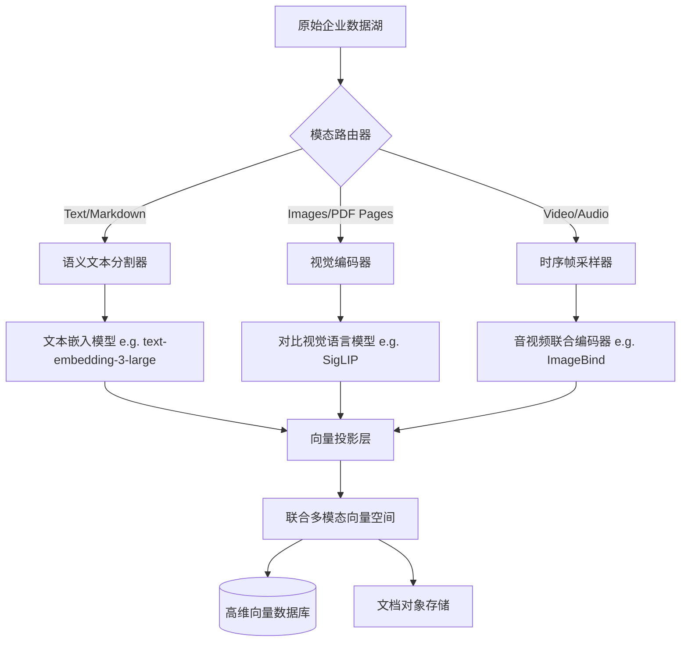

纯文本检索增强生成（RAG）的蜜月期已经正式结束。在过去几年里，工程团队习惯于将LangChain包装器套在文本嵌入模型上，把文档塞进向量数据库，然后宣告大功告成。然而，真实的企业数据绝不仅仅是纯文本，它是一个由架构图、包含密集财务图表的散乱PDF、客户支持音频日志和操作指导视频组成的混沌网络。当纯文本RAG遇到这种现实情况时，往往会彻底败下阵来。它剥离了视觉上下文，丢弃了音频和视频的时间细微差别，最终无法捕捉数据的真实语义内涵。

为了解决这个问题，我们必须突破单模态流水线的局限性，全面拥抱多模态RAG。这不仅仅是把一张图片传给多模态大模型那么简单；它要求我们在底层彻底重构数据摄取、嵌入（Embedding）以及在一个统一向量空间内进行检索的方式。在这篇技术深度长文中，我们将探讨构建生产级多模态搜索系统的工程需求，并引入一个处理多样化数据类型的稳健架构框架。

## 纯文本范式的坍塌

当你使用标准的文本分块（Chunking）策略处理一本密集的系统手册时，OCR（光学字符识别）步骤不可避免地会破坏文档的结构完整性。一张显示随时间变化的收入增长图表会变成一堆杂乱无章的字母和数字，X轴与数据点之间的空间关系永久丢失。

传统的RAG试图通过提取文本并寄希望于LLM能将其拼凑起来来解决这个问题。但是，语义搜索依赖于高维空间中向量的邻近性。如果嵌入模型“看”不到图表，生成的向量在数学上将与任何询问“收入趋势”的查询相距甚远。我们需要一种架构，能够摄取原始像素、音频波形和文本字符串，将它们全部投影到一个共享的语义空间中。在这个空间里，文本查询可以检索到图像，或者图像查询可以检索到视频片段。

## 引入：跨模态融合架构 (Cross-Modal Fusion Architecture)

为了处理多模态摄取和检索的复杂性，我们采用了一种我称之为**跨模态融合架构（CMFA, Cross-Modal Fusion Architecture）**的模式。CMFA的核心理念是“后期融合”（Late-stage fusion）：我们尽可能长时间地保持原始数据的保真度，为每种模态使用专门的编码器，仅在最终的嵌入层将它们投影到一个共享的向量空间中。

这种架构将摄取流水线与嵌入模型解耦，允许你在不影响文本摄取流水线的情况下，无缝替换视觉编码器（如CLIP或SigLIP）。

### CMFA 摄取流水线

以下是数据在摄取阶段如何流经跨模态融合架构：



在CMFA流水线中，**模态路由器（Modality Router）**是一个关键组件。它检查传入的有效载荷（例如S3 Bucket事件）并确定处理路径：
- **文本**经过标准的语义分块处理。
- **图像**（以及光栅化的PDF页面）被传递给视觉编码器。在处理密集的、包含大量文本的图像时，我们更倾向于使用SigLIP等对比模型，而不是早期的CLIP变体，因为前者表现出更优越的性能。
- **视频**需要时序帧采样器（Temporal Frame Sampler）。提取每一帧在计算上是毁灭性的。相反，我们使用场景变化检测算法来提取关键帧，将这些帧连同提取的音轨一起传递到像Meta的ImageBind这样的音视频编码器中。

真正的魔法发生在**向量投影层（Vector Projection Layer）**。因为不同的编码器输出不同维度的向量（例如，OpenAI文本为1536维，SigLIP为768维），我们必须将它们投影到一个统一的空间。这通常是通过使用通过对比损失（Contrastive Loss）训练的轻量级神经网络来实现的，以对齐模态，确保“一只狗在玩抛接球”的文本向量与同一场景的图像向量具有极高的余弦相似度。

## 架构对比：纯文本RAG vs 多模态RAG

为了理解复杂性的转变，让我们直接比较一下所需的子系统。

| 组件 | 纯文本RAG (Text-Only RAG) | 多模态RAG (CMFA架构) |
| :--- | :--- | :--- |
| **数据摄取** | 简单的OCR，正则解析，递归字符分割 | 模态路由，场景检测，PDF光栅化 |
| **嵌入模型** | 单一稠密文本模型 (e.g., BGE-m3, OpenAI) | 多个专用模型 (SigLIP, ImageBind, 文本模型) |
| **向量空间** | 同构 (Text-to-Text对齐) | 异构 (联合跨模态对齐) |
| **检索机制** | 文本向量的k-NN或HNSW | 多向量查询，跨模态倒数秩融合 (RRF) |
| **生成阶段** | 标准大语言模型 (GPT-4, Claude 3 Opus) | 视觉语言大模型 (VLM) (GPT-4o, Claude 3.5 Sonnet) |
| **存储基础设施**| 向量数据库 + 基础元数据 | 向量数据库 + 对象存储 (用于原始图像/视频帧) |
| **延迟特征** | 低 (文本解析和嵌入速度快) | 高 (视觉编码和帧采样计算量大) |

## CMFA的检索机制

跨模态检索要求从简单的k-NN（K近邻）转向多向量查询。当用户发出诸如“向我展示新身份验证服务的架构图并总结其组件”的查询时，系统必须执行多管齐下的检索。

1. **查询编码**：文本查询被嵌入到联合向量空间中。
2. **跨模态搜索**：我们对向量数据库执行HNSW（分层可导航小世界）搜索。由于空间是对齐的，这个单一的文本向量将同时检索出描述认证服务的文本文档和代表架构图的图像向量。
3. **倒数秩融合 (RRF)**：在生产环境中，纯粹依赖联合嵌入是有风险的。我们通常通过对与图像关联的文本元数据运行BM25稀疏搜索来增强这一点，并使用RRF融合结果。这种混合搜索方法稳定了检索指标。

## 克服工程瓶颈

实施跨模态融合架构并非没有挑战。两个最大的难题是维度灾难和延迟。

### 维度灾难 (The Dimensionality Curse)
当将多个模态投影到一个单一空间时，你会面临“维度灾难”的风险。如果联合空间太小，你就会失去区分Q1收入柱状图和Q2收入柱状图所需的语义粒度。如果空间太大，你在向量数据库中的内存成本将飙升，并且查询延迟会恶化。

目前的最佳实践是利用俄罗斯套娃表示学习（MRL, Matryoshka Representation Learning）。通过训练投影层以优化MRL，我们可以截断生成的向量（例如，从2048维降至512维），同时检索准确率的损失最小，从而显着降低生产环境中的内存占用。

### 异步摄取与GPU管理
视觉和视频编码器对GPU的消耗极大。在摄取期间同步运行它们会阻塞你的流水线并产生巨额的云账单。CMFA需要一种异步的、事件驱动的架构。
传入的文件应被转储到对象存储中，触发消息队列（如Kafka或SQS）。由GPU支持的Worker节点从该队列中拉取任务，批量处理，并将向量推送到数据库。当空闲时，你必须积极地将这些Worker节点自动缩容到零，因为为突发性的摄取工作负载维护持久的GPU实例是走向破产的捷径。

## 生成阶段：向VLM喂入数据

一旦检索到相关的块（文本、图像、视频关键帧），就必须对它们进行格式化以进入生成阶段。标准的LLM无法处理图像字节。你必须将Prompt路由到视觉语言模型（VLM）。

这里的Prompt构建非常微妙。你不仅仅是在连接文本；你是在将文本与base64编码的图像或预签名的URL交织在一起。
```python
# VLM的概念性有效载荷
payload = {
    "role": "user",
    "content": [
        {"type": "text", "text": "基于检索到的上下文，总结该系统。"},
        {"type": "image_url", "image_url": {"url": "s3://bucket/retrieved_diagram.png"}},
        {"type": "text", "text": "检索到的文本: 认证系统使用OAuth2..."}
    ]
}
```
VLM会同时关注图表的视觉特征和文本的语义，综合出一个准确反映企业数据多模态现实的响应。

## 未来展望：视觉的后期交互 (Late Interaction)

展望未来，业界正在向视觉的后期交互（Late Interaction）模型迈进，类似于ColBERT在文本领域所取得的成就。后期交互模型不是将整张图像压缩成一个密集的向量，而是为图像的斑块（Patches）生成一个Token级别的嵌入矩阵。这允许查询在检索期间关注图像的特定区域，从而大幅提高细粒度搜索的准确性（例如，在密集的幻灯片组中搜索特定的Logo）。

多模态RAG不仅仅是对纯文本系统的边际改进；这是一次范式转变。通过采用跨模态融合架构等框架，工程团队可以释放困在视觉和音频资产中的潜在价值，构建最终能像我们一样理解世界的AI搜索系统。
