如果你一直密切关注那些不断突破大语言模型边界的算力集群，你可能已经注意到了一个极其刺眼的技术债务。整个行业都在试图用粗暴的算力堆叠来强行突破注意力（Attention）机制 O(N²) 的计算复杂度壁垒。每一次打破上下文窗口长度的记录——无论是 128k、1M 还是 10M Token——靠的都不是优雅的架构性突破，而是纯粹且毫无技术含量的集群烧钱行动。我们正在用海量的 GPU 小时和极其夸张的热功耗，来掩盖 Transformer 架构中最根本的物理限制。

从定义上来看，注意力机制要求在生成下一个 Token 时，必须回顾所有之前的 Token。这意味着在训练阶段，内存消耗和计算需求会随着序列长度的增加呈二次方爆炸；而在推理阶段，内存带宽（Memory Bandwidth）则直接成为了无法逾越的死亡瓶颈。在工程前线，这被称为 KV Cache 危机。纯 Transformer 架构的时代已经触及了天花板。欢迎来到后 Transformer 时代：状态空间模型（State Space Models, SSMs），特别是 Mamba 及其混合变体 Jamba 的统治领域。

## 二次方的高墙：注意力机制为何注定失败

要理解为什么 SSM 是一种不可避免的进化方向，我们必须从最底层的硬件层面解剖注意力机制是如何崩溃的。当一个标准的 Transformer 在自回归推理中生成哪怕只有一个 Token 时，它都必须将所有历史 Token 的键值对（KV Cache）从高带宽内存（HBM）完整加载到容量极小、但速度极快的 SRAM 中。随着上下文长度飙升至百万级别，这个庞大的 KV Cache 会瞬间撑爆 SRAM 的容量上限。

这种操作对硬件效率的破坏是毁灭性的。你的推理集群会彻底陷入“内存带宽受限（Memory-Bandwidth Bound）”的绝境。你可能花了高达 95% 的运行时间，仅仅是在内存总线来回搬运毫无意义的字节，而不是执行真正驱动模型智能的浮点运算（FLOPs）。强大的张量核心（Tensor Cores）处于极度饥饿的空转状态，而内存控制器却在超负荷运转直至崩溃。

```mermaid
graph TD
    subgraph Transformer 推理瓶颈
        A1[输入 Token T] --> B1[从 HBM 加载 O-N 级别的完整 KV Cache 到 SRAM]
        B1 --> C1[计算 O-N^2 注意力矩阵]
        C1 --> D1[将新的 KV 向量写回 HBM]
        D1 --> E1[极高延迟 / 极低吞吐量]
    end
    
    subgraph SSM 线性推理范式
        A2[输入 Token T] --> B2[从 HBM 加载固定大小的 O-1 隐藏状态]
        B2 --> C2[在 SRAM 内更新 O-1 状态向量]
        C2 --> D2[将更新后的状态写回 HBM]
        D2 --> E2[超低延迟 / 极致吞吐量]
    end
    
    style B1 fill:#ff9999,stroke:#cc0000,stroke-width:2px
    style B2 fill:#99ff99,stroke:#00cc00,stroke-width:2px
```

## 状态空间模型（SSM）：夺回线性时间

状态空间模型代表了与注意力范式彻底决裂的另一条道路。SSM 并没有将当前 Token 与过去海量 Token 组成的庞大矩阵进行暴力对比，而是通过一个连续的潜在状态（Latent State），将一维输入序列映射为一维输出序列。在数学本质上，它们是连续时间微分系统，为了在现代数字硬件上运行而进行了严密的离散化处理。

SSM 最核心、也最具破坏力的特征在于它的“双重人格”。在推理阶段，它的运作模式与传统的循环神经网络（RNN）完全一致，仅维护一个固定大小的隐藏状态，并随着每个新 Token 进行常量级更新。这带来了模型部署工程师梦寐以求的圣杯：O(1) 的显存复杂度和绝对线性的生成时间。然而，在训练阶段，如果动态系统是时间不变量的（Time-Invariant），整个序列就可以被完全展开，并利用快速傅里叶变换（FFT）作为卷积神经网络（CNN）进行全局计算。这赋予了它与 Transformer 同样恐怖的、高度并行化的大规模训练能力。

但是，早期的 SSM 迭代版本（例如曾在学术界引起轰动的 S4 架构）隐藏着一个致命的缺陷：它们在数学上是线性和时间不变量的。这意味着应用于隐藏状态的转移矩阵，完全不受输入 Token 内容的影响。无论模型是在处理一个极其关键的专有名词、一个决定句法结构的标记，还是一个毫无意义的停顿词，它都会施加完全相同的连续动态运算。这种僵化的逻辑导致它们在处理离散信息检索、选择性复制和精确路由等任务时表现得一塌糊涂——而这正是密集注意力机制（Dense Attention）无可争议的王座。

## Mamba：选择性扫描的硬件革命

Mamba 通过一种被称为“选择性状态空间（Selective State Spaces）”的机制，彻底解决了这个致命的时间不变量问题。通过让 SSM 的参数在数学上依赖于输入数据，Mamba 赋予了架构根据当前 Token 动态过滤信息的能力。它可以主动选择“记住”一个特定的变量名，并瞬间“遗忘”无用的对话填充词。这种机制完美模拟了注意力机制的动态路由和精确查找能力，却完全不需要承受那可怕的二次方计算成本。

然而，在机器学习工程中，从来没有免费的午餐。让参数变得依赖于输入，意味着模型在训练期间无法再作为快速、并行的全局卷积来计算。它强行将模型拉回了严格的顺序循环模式，而这种模式传统上会在 GPU 等高度并行的硬件上造成毁灭性的性能断崖。

这正是 Mamba 展现其大师级工程水准的地方：它引入了一种深度感知底层硬件架构的算法。Mamba 没有依赖标准的 PyTorch 矩阵乘法（这种方法会因为不断将中间状态写回 HBM 而反复摧毁 SRAM），而是直接在 Kernel 级别融合了选择性扫描操作（Fused Selective Scan）。它将输入和参数一次性加载到 SRAM 中，在超快的 SRAM 物理限制内完成整个顺序扫描，并仅仅将最终的输出结果写回 HBM。通过巧妙绕过内存总线的物理瓶颈，Mamba 实现了足以媲美高度优化版 Transformer 的训练速度，同时死死守住了其 O(1) 的推理性能优势。

### 引入框架：硬件感知线性循环指数 (HALRI)

为了准确量化为什么 Mamba 的硬件感知选择性扫描相比传统架构如此具有毁灭性的效能，我们必须彻底抛弃那种幼稚的纯 FLOPs 计数法。我们在这里提出一个严密的全新评估框架：**硬件感知线性循环指数（Hardware-Aware Linear Recurrence Index, HALRI）**。

HALRI 框架测量的是循环架构中，有用的计算操作（在 SRAM 内执行的有效 FLOPs）与 HBM 读写操作所需总字节数之间的比率，并严格按照序列长度进行归一化。其数学表达定义如下：

`HALRI = (SRAM 中的总有效 FLOPs) / (HBM 传输的字节数 × 序列长度)`

当我们通过 HALRI 的硬核工程视角来审视现代架构时，结果是极其残酷且明朗的：
1. **Transformer** 的 HALRI 随着序列长度的增长呈指数级衰减，并迅速逼近于零。加载 KV Cache 所需的内存带宽以压倒性的速度碾压了实际执行的计算量。
2. **标准 RNN（LSTM/GRU）** 拥有一个平坦但极其低下的 HALRI 值。尽管它们在计算上呈线性缩放，但针对每个 Token 持续发生的 HBM 读写灾难，使得它们在现代以张量核心为主的硬件上显得极其低效。
3. **Mamba（选择性 SSM）** 通过将整个隐藏状态的更新循环牢牢锁定在 SRAM 的封套内，实现了一个持续高水平且极其稳定的 HALRI。

这个指标极其精准地暴露了为什么在当前的工程环境中，纯粹依靠理论 FLOPs 来评估序列模型是一个门外汉的低级错误。内存带宽才是最终的物理约束；在规模化部署中，它是唯一真正有价值的流通货币。

## Jamba：极其务实的混合架构

虽然 Mamba 已经在数学和工程层面决定性地证明了无注意力序列建模的可行性，但要想从当前的技术栈中彻底驱逐 Transformer，依然是一项极其艰巨的任务。尽管 Mamba 拥有恐怖的效率，但它在处理百万 Token 级别的极端上下文时，依然在完美的“大海捞针（Needle-in-a-haystack）”式精准检索任务中显得有些吃力。Transformer 虽然在工程上臃肿不堪，但它在海量上下文中通过零样本上下文学习（Zero-shot In-context Learning）精准提取特定事实的暴力美学能力，至今无可匹敌。

于是，Jamba 诞生了：这是一种由 AI21 设计的混合架构，它极为粗暴且有效地将 Mamba 层与传统的 Transformer 层交织在一起。Jamba 并不追求任何学术上的意识形态纯洁性；它是对当前工业界部署约束极其务实的妥协与利用。

通过利用 Mamba 层来承担连续序列处理的沉重计算负担，并极其稀疏地注入密集的注意力层（例如，每七个 Mamba 层仅配备一个注意力层），Jamba 实现了整体 KV Cache 占用的断崖式下降。在推理阶段，它有效地将内存带宽需求削减了整整 8 倍，同时却不可思议地保留了纯 Transformer 那种锋利如刀的离散信息检索能力。

| 架构核心特性 | 纯 Transformer（密集注意力） | Mamba（纯选择性 SSM） | Jamba（SSM-注意力混合） |
| :--- | :--- | :--- | :--- |
| **训练时间复杂度** | O(N²) - 极端长度下完全崩溃 | O(N) - 完美线性缩放 | O(N) 由 SSM 层主导计算 |
| **推理内存 (KV Cache)** | O(N) - 随上下文长度呈指数爆炸 | O(1) - 永远恒定的隐藏状态 | O(N) 但内存占用锐减 8 倍 |
| **推理吞吐量上限** | 被内存带宽死死卡住 | 纯计算受限（吞吐量极高） | 极高，仅受稀疏注意力层拖累 |
| **上下文精准事实检索** | 近乎完美 | 挣扎于极其精确的离散查找 | 极其稳健且强大 |
| **HALRI 硬件效率得分** | 在海量上下文中极低 | 异常之高 | 中等偏上 |
| **算法执行核心** | 全局密集的庞大矩阵乘法 | Kernel 级融合的顺序扫描 | 混合交替块执行模式 |

## 生产部署侧的工程革命

当我们将视线从学术研究基准转移到实际的生产侧工程时，SSM 的意义变得更加惊人。向数百万并发用户部署大语言模型，本质上是一个资源分配和吞吐量优化的硬核系统问题。在纯粹的 Transformer 架构中，每一个活跃的用户会话都需要为其特定的 KV Cache 独立分配一大块极高成本的高带宽显存。这死死卡住了单一推理节点所能支持的最大并发批处理规模（Batch Size）。

当一个节点因为 KV Cache 膨胀而触及显存上限时，它就无法再接收任何新的请求——即便此时它的张量核心可能只有 20% 的利用率。这迫使工程团队不得不引入一系列极其复杂且脆弱的妥协方案：大规模张量并行、连续批处理算法（Continuous Batching）、Paged Attention 显存分页机制，甚至将状态卸载到速度极慢的 NVMe 存储中。这些全部都是用来掩盖架构层面底层缺陷的软件级创可贴。

Mamba 则直接从物理上抹平了这一整类问题。由于其隐藏状态的大小是完全固定的，无论它处理了多少 Token，每个用户会话的内存占用都微乎其微且永远恒定。一台运行基于 Mamba 架构模型的生产推理服务器，其理论上能支持的并发批处理规模要比同等参数的 Transformer 大出好几个数量级。这直接转化为恐怖的 Token 吞吐量（TPS）、极低的用户延迟，以及呈断崖式下跌的单次查询运营成本。

## 暴力美学时代的终结

整个机器学习工程界正在以可怕的速度逼近悬崖。光刻技术中的光罩尺寸正在触及残酷的物理极限，标准数据中心机架的热耗散能力早已见顶，而 HBM 的带宽扩展也正在撞向绝对的天花板。我们不可能再简单地通过将更多加速器强行拼凑成庞大且畸形的网格，来继续逃避注意力机制的二次方瓶颈。

从 O(N²) 二次方架构向 O(N) 线性架构的过渡，早已不再是学术论文中为了刷榜而争论的哲学偏好；这是由半导体物理学原理和内存总线带宽所下达的、绝对不可违抗的物理强制令。那个仅仅依靠向 Transformer 架构无脑砸入无限算力就能大力出奇迹的粗暴时代，正在迅速拉上帷幕。

以 Mamba 极其底层的 Kernel 创新为引领，以 Jamba 极具部署价值的务实混合方案为代表，状态空间模型（SSM）代表了机器学习工程领域真正的前沿阵地。它们用残酷的现实强迫开发者放弃那些天真的幻想——不要再把序列长度和内存带宽当作无限的资源来挥霍，而是要开始构建真正敬畏现代数据中心底层硬件限制的模型架构。后 Transformer 时代的黎明早已到来，并且正在极其核心的生产环境中疯狂运转。唯一的问题是：行业里的其他人，还愿意为那庞大且愚蠢的 KV Cache 缴纳多久的智商税？
