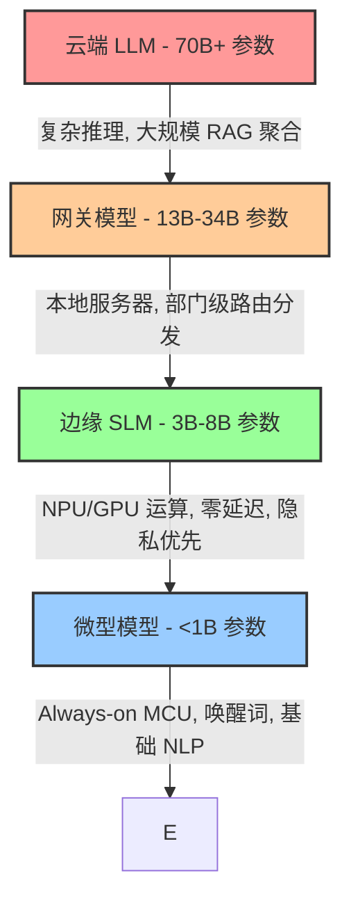

我们一直被强行灌输一种“越大越好”的技术叙事。过去三年里，整个 AI 生态系统都在围绕一个简单粗暴的逻辑运转：疯狂堆叠参数量，囤积 GPU，然后祈祷云端 API 在高峰期不要限流。我们将模型从 7B 膨胀到 70B，然后一路狂飙突破 400B，甚至开始将 100 毫秒以上的延迟底线和天价的推理账单视为常态。

但物理定律是残酷的。

真正的瓶颈从来不是模型的“智力”，而是内存带宽与数据引力 (Data Gravity)。将用户的 Prompt 传输到 3000 英里外的集中式集群，通过一个密集的 70B 参数模型跑一遍，再将 Token 流传回——对于 90% 的现实世界任务来说，这种计算方式是极度低效甚至荒谬的。行业目前正在经历一场剧烈且必要的路线修正。焦点已经猛烈地转向了小语言模型 (SLMs)——特别是高度优化的 1.5B 到 8B 参数量级——并让它们完全在本地硅片上运行。

让我们来彻底解剖一下，为什么 7B 量级已经成为边缘 AI (Edge AI) 无可争议的重磅武器，以及底层的软硬件协同设计是如何让这一切成为可能的。

## 内存带宽的血肉战场

要理解这种转变，你必须直面算力背后的数学。在自回归生成 (Autoregressive Generation) 中，内存带宽严格决定了性能上限。生成单个 Token 需要将整个模型的权重从内存加载到计算单元中。

如果你在 FP16（16 位，即每个参数 2 字节）精度下运行一个 70B 参数的模型，模型权重会消耗大约 140 GB 的显存 (VRAM)。仅仅为了达到每秒生成 1 个 Token 的速度，你就需要 140 GB/s 的内存带宽。像 H100 这样的现代云端 GPU 可以提供大约 3.3 TB/s 的内存带宽。对于数据中心的批量请求来说这很棒，但对于客户端设备而言，这不仅性能过剩，而且在结构上根本无法实现。

现在看看 7B 模型。在 FP16 下，它需要 14 GB 内存。但实际上，现在已经没有人在边缘端跑 FP16 了。

这就轮到 INT4 量化和分组缩放技术 (如 AWQ 或 GGUF 格式) 登场了。通过激进地将权重降低到每个参数 4 bits，这个 7B 模型的内存占用瞬间锐减到约 3.5 GB 至 4 GB。

Apple 的 M4 芯片基础版拥有 120 GB/s 的内存带宽。骁龙 X Elite 可以达到 135 GB/s。一个 4GB 大小的模型运行在 120 GB/s 带宽的芯片上，理论上可以实现每秒生成 30 个 Token (120 / 4 = 30 t/s)——完全本地运行，零网络请求，零 API 成本。

30 t/s 这个阈值至关重要。它恰好匹配人类的平均阅读速度。一旦本地生成的极限达到 30 t/s，用户体验就变得与高速云端 API 毫无二致，且完全没有网络抖动。

## 边缘-云端推理金字塔 (The Edge-Cloud Inference Pyramid)

我们正在摆脱对单一庞大 API 的依赖，转向层级化的架构。我将此称为 **边缘-云端推理金字塔**。

1. **微型模型 (<1B):** 驻留在微控制器 (MCU) 和 DSP 上。功耗在毫瓦级别。
2. **边缘 SLM (3B-8B):** 真正的干活主力。运行在笔记本电脑和智能手机的神经处理单元 (NPU) 或集成 GPU 上。它们负责处理 80% 的日常任务：摘要提取、草稿生成、结构化数据解析 (如 JSON 生成)。
3. **网关模型 (13B-34B):** 运行在本地企业服务器或高端工作站上，作为中继节点。
4. **云端 LLM (70B+):** 严格保留给深度逻辑推理、海量上下文摄取以及复杂的 Agentic 规划任务。

通过这个金字塔进行查询路由，系统可以在处理简单任务时实现近乎即时的首字响应时间 (TTFT)，同时将昂贵的云端算力留给真正的硬核难题。

## 硬件算力觉醒：NPU 纪元

7B 模型的爆发不仅仅是软件工程的胜利；它是芯片架构从“以 CPU 为中心”向“以 NPU 为中心”转移的直接结果。

NPU (神经处理单元) 本质上是一个庞大的 MAC (乘加累积) 单元阵列，专门针对低精度矩阵运算 (INT8, INT4) 进行了极致优化，并配备了专用的 SRAM，以避免昂贵的主存读写往返。

看看 TOPS (Tera Operations Per Second, 每秒万亿次操作) 的军备竞赛吧。2023 年，普通笔记本 NPU 的算力大约在 10-15 TOPS。到了 2026 年，“AI PC”的基准要求已经拉升到了 40-50 TOPS，现代硅片在纯 NPU 上甚至可以轻松突破 60 TOPS。

当你使用 INT4 权重在一个 50 TOPS 的 NPU 上运行 7B 模型时，你的硅片正在以巅峰效率运转。CPU 进入休眠状态。GPU 继续负责屏幕渲染。而 NPU 则以仅 3-5 瓦的微薄功耗疯狂吞吐 Transformer 块。你可以在一台电池供电的设备上连续进行数小时的推理运算，而风扇甚至懒得转一下。

## 残酷的商业经济学

让我们剥去炒作的外衣，审视一下部署的单位经济学 (Unit Economics)。如果你正在构建一个拥有百万日活 (DAU) 的应用程序，仅仅依靠云端 API 是纯粹的财务自杀。

| 核心指标 | 云端 LLM (例如，API 调用的 70B 模型) | 边缘 SLM (本地运行的 7B 模型) |
| :--- | :--- | :--- |
| **单次查询边际成本** | 约 $0.0005 至 $0.002 | $0.00 (算力成本由用户的硬件买单) |
| **首字响应时间 (TTFT)** | 300ms - 800ms (严重依赖网络环境) | < 50ms (零网络开销，极致瞬发) |
| **离线可用性** | 彻底瘫痪 | 100% 满血运行 |
| **隐私与数据安全** | 数据离开设备 (伴随合规风险) | 数据永远在本地内存中流转 (默认符合 HIPAA/GDPR) |
| **长上下文成本** | 随 Token 数量呈线性或二次方暴增 | 只要本地 VRAM 装得下，完全免费 |

这笔账是极其无情的。将 70% 的日常推理任务卸载到本地 7B 模型，不仅仅是削减了你的 AWS/GCP 账单；它从根本上重塑了你商业模式的可行性。因为你不再需要为用户的计算需求自掏腰包。

## 知识蒸馏与合成数据引擎

为什么 7B 模型现在变得如此聪明？它们已经不再直接从粗糙的互联网原始数据中从零开始训练了。真正的核心机密是知识蒸馏 (Knowledge Distillation) 和合成数据流水线 (Synthetic Data Pipelines)。

研究人员不再去抓取低质量的 Reddit 帖子，而是使用庞大的 70B+ 模型生成高度精炼、结构完美的训练集。大模型扮演“教师”的角色，生成包含详细思维链 (Chain of Thought) 的解答过程。而 7B 模型则作为“学生”，直接在这些高信噪比、富含逻辑的数据上进行训练。

在 MMLU 和 HumanEval 等基准测试中，我们看到现在的 7B 模型经常能够稳定击败 18 个月前的 70B 模型。参数量缩小了 10 倍，但数据质量提升了 100 倍。每个参数承载的知识密度正在呈指数级飙升。

## 现实世界的部署技术栈

为本地推理构建应用需要一套截然不同的工程栈。你不再是简单地向一个 REST 接口发送请求。你必须亲自管理模型的生命周期。

1. **极致量化 (Quantization):** 你需要从 HuggingFace 拉取 FP16 权重，然后使用量化算法 (如 llama.cpp 的量化工具) 对其进行处理，精准切入 INT4 的甜点区，同时避免困惑度 (Perplexity) 出现不可接受的退化。
2. **格式封装 (Format Packaging):** 像 GGUF 或 ONNX 这样的格式已经成为标准，它们将模型权重、元数据和分词器 (Tokenizer) 规则全部打包进一个单一的、高度便携的二进制文件中。
3. **执行引擎 (Execution Engine):** 诸如 ONNX Runtime、CoreML 或是原生的 llama.cpp 等运行时极度贴近底层硬件，能够根据特定的 SoC 架构，将矩阵乘法动态调度给 CPU、GPU 或 NPU。

这个技术栈正在迅速成熟，屏蔽了异构芯片带来的开发痛苦。

## 范式的终结与重生

默认向云端巨兽发送请求的时代已经走向终结。延迟太高，物理限制太苛刻，而在大规模应用面前，经济账根本算不平。

7B 参数量级正是帕累托前沿 (Pareto Frontier) 上的那个完美甜点。它与当前硬件的内存带宽极限、NPU 的算力爆发以及 INT4 量化技术产生了完美的交汇。通过将计算能力重新推回边缘，我们捍卫了隐私，粉碎了延迟，并彻底消灭了边际推理成本。

7B 不仅仅是新的 70B。它是唯一能够真正将 AI 塞进地球上每一台设备，并且不会在此过程中让数据中心因为过热而熔毁的终极架构。
