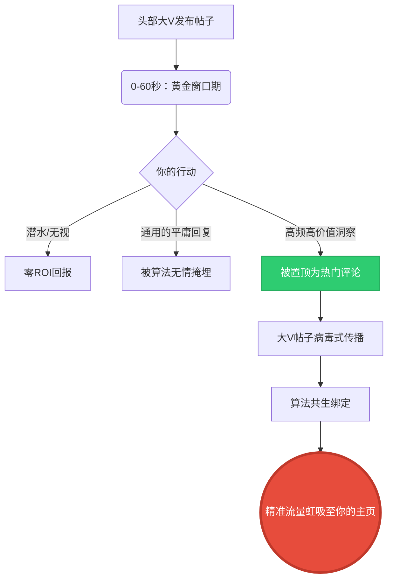

近二十年来，“1%定律”一直是社交网络的金科玉律：1%的人创造内容，9%的人参与互动，90%的人默默潜水。如果你在打造品牌，以前的任务很简单——成为那1%。耗费数小时去起草完美的推文连载、拍摄无瑕疵的视频，或者撰写终极指南。

但是，当我们一头撞进2026年的下半场时，整个流量版图发生了剧烈的震荡。潜水不再仅仅是被动；在算法层面，潜水对你的账号触达率来说就是判了死刑。更令人震惊的是，传统的内容创作正面临严重的ROI（投资回报率）危机。各大平台内容泛滥，信息流被彻底拥堵。如今真正的战场已经不再是主信息流——而是**评论区**。

欢迎来到基于评论的算法黑客时代。在这个时代，高频参与感主导了一切，而AI辅助的评论已经正式成为了全新的“内容创作”。

## 原始1%定律的崩塌

看看过去十二个月X、LinkedIn和Reddit的数据。这些平台已经明确地对他们的推荐引擎进行了重新设计，现在的算法将**对话深度**的优先级排在**广播触达率**之上。一条没有任何回复的孤立帖子，无论你有多少粉丝，都会在14分钟内死亡。但是，在一个头部大V帖子下方引发激烈辩论的评论呢？它可以吸走成千上万的个人资料点击，并持续数天为你引流。

现实情况是，创作原创内容需要庞大的时间成本，而且有机分发算法正在前所未有地挤压创作者，逼迫他们“付费买量”。然而，评论区依然是一片未被完全开垦的西部荒野——这是一个纯粹的实力场，一条见解深刻、观点逆势或者极其幽默的回复，其曝光指数完全可以超越原作者的帖子。

你不需要成为创造帖子的那1%。你需要成为劫持对话的那0.1%。

## 微互动雪球效应 (The Micro-Engagement Snowball Effect)

我们称这种新范式为**微互动雪球效应**。这个框架建立在一个残酷的数学真相之上：一篇帖子生命周期内的前60秒，决定了它90%的总触达率。如果你能在这个黄金窗口期注入一条具有高留存率的评论，算法就会将你的回复与帖子的核心流量动能绑定在一起。随着帖子的爆发，你的评论也会随之裂变。

### 该框架是如何运作的：

1. **速度拦截 (Velocity Interception)**：监控你所在领域的头部高杠杆账号。他们发帖的那一秒，倒计时开始。
2. **语境劫持 (Contextual Hijacking)**：不要留下类似“好文！”这样毫无营养的废话，而是抛出极其具体的、有增量价值的见解，或是结构化的反面论点。
3. **算法共生 (Algorithmic Symbiosis)**：平台的AI会将你的评论标记为“对话驱动源”，并将你的回复固定在顶部。
4. **流量虹吸 (Traffic Siphoning)**：10万个人阅读了这篇帖子，4万人滑动浏览了评论区，1万人看到了你被置顶的回复，1000人点击了你的个人主页。你在零广告支出的情况下，获得了极高意向的精准流量。

## 数据对决：传统创作 vs. 评论黑客

让我们来拆解一下2026年注意力的单位经济学。如果你现在仍然仅仅依赖传统的发帖模式，那你就是在疯狂地流血（时间与资本）。

| 指标 | 传统原创帖子 | 评论黑客（热门回复） |
| :--- | :--- | :--- |
| **制作时间** | 45 - 120 分钟 | 1 - 3 分钟 |
| **初始触达保障** | 极低（被算法限流） | 极高（寄生于大V的流量池） |
| **主页点击转化率** | 2% - 4% | 8% - 15%（利用好奇心缺口） |
| **生命周期** | 4 - 6 小时 | 长达72小时（如果讨论串保持活跃） |
| **石沉大海的风险** | 极高 | 几乎为零 |

数据不会撒谎。评论黑客技术带来了不对称的惊人回报。但这其中有一个致命的弱点：**人类的反应延迟**。

## 人类延迟的致命缺陷

如果“微互动雪球效应”依赖于最初的60秒，那么人类的生物学限制就是你最大的瓶颈。你不可能24小时坐在桌前疯狂刷新信息流。即使你在第15秒抓住了帖子，起草一篇高质量、非通用、结合语境的精彩回复也需要时间。当你按下“发送”键时，已经有40个人挤进了这个空间。你失去了起量的势能。

此外，如果你求助于基础的自动化脚本，平台会立刻屠宰你的账号。我们早就过了粗制滥造机器人的时代。现代的推荐引擎使用情感分析和语义映射来标记那些毫无灵魂的AI回复（比如“哇，太真实了！感谢分享！”）。如果你听起来像个机器人，你就会被影子封禁（Shadowban）。毫无商量余地。

这正是该策略从纯理论转向武器化执行的转折点。

## 将流程武器化：NavoKit AI Social Booster 登场

要在规模化层面上真正执行“微互动雪球效应”，你需要**零延迟**与**超语境智能**的结合。你需要一个系统能够在原帖上线的几秒钟内，阅读帖子、理解行业底层逻辑、匹配你的个人品牌基调，并精准投放一个高价值的洞察。

这就是为什么我们打造了 **NavoKit AI Social Booster**。

我们没有造一个垃圾信息发布机。我们打造的是一个战术级的互动引擎。AI Social Booster 能吸收大V帖子的上下文，并瞬间起草出极具观点性、数据支撑或逆向思维的回复。这些回复在统计学上是被优化过、极易被算法置顶的。

*   **零延迟触发**：成为每一个关键帖子下的第一条高价值评论。
*   **反平庸引擎**：由受过病毒式回复结构训练的定制大语言模型驱动，确保你的评论读起来像是一位顶级行业分析师的真知灼见，而不是某种预测性文本算法生成的废话。
*   **克隆你的声音**：它能深度学习你的专属行业黑话、语气以及排版癖好。

### 潜水时代的终结

互联网不再是一个99%的人默默仰望1%的人的博物馆。它是一场争夺注意力的血腥角斗，而评论区就是那座角斗场。如果你还在潜水，你就在输掉比赛。如果你还在为了零分发量的原创内容死磕，你只是在燃烧自己。

元宇宙的游戏规则已经改变。通过高频评论进行的算法劫持，是当今你在社交网络上能执行的最高杠杆活动。停止在拥挤不堪的主信息流中竞争吧。开始统治评论区。部署 **NavoKit AI Social Booster**，触发微互动雪球效应，让头部大V为你源源不断的流量打黑工。
