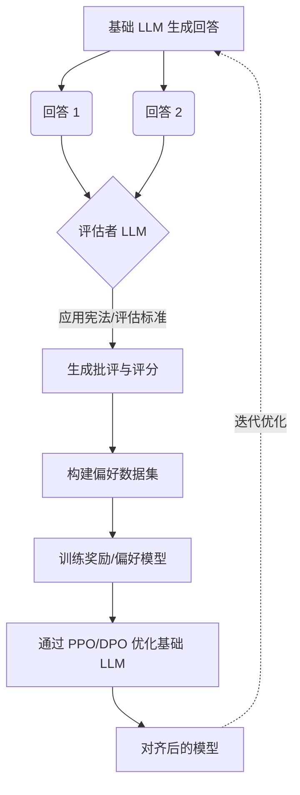

对齐问题（Alignment Problem）——即确保高度智能的自主系统严格在人类意图和安全边界内运行——在历史上一直依赖于庞大的人类标注团队。这种被称为基于人类反馈的强化学习（RLHF）的范式，构成了第一波具有商业可行性的大型语言模型的结构基础。然而，随着模型复杂度和推理深度的指数级扩展，人类反馈的瓶颈变得不可忽视。人类速度慢、成本高、天生带有偏见，并且越来越无法评估那些在特定领域超越自身认知带宽的模型逻辑。

这促成了基于人工智能反馈的强化学习（RLAIF）的崛起。我们正在见证安全架构的一次根本性转变：模型正在教导自己，递归地评估自身的输出，并在训练循环中建立无需直接人工干预的合成对齐（Synthetic Alignment）机制。这种转变不仅是数据标注层面的优化，更是迈向具有自我调节能力的宪法 AI（Constitutional AI）的哲学与架构层面的飞跃。

## 人类反馈的瓶颈与宪法 AI 的崛起

要理解 RLAIF 的必要性，我们必须首先剖析 RLHF 的失效模式。当模型输出复杂的软件漏洞代码或综合高级法律论据时，人类评估者很难判断哪一个回答“更好”。模型与人类评估者之间专业知识的差异导致了奖励黑客（Reward Hacking）现象：模型学会了生成那些在不知情的观察者看来“貌似正确”的输出——这种现象也被称为谄媚（Sycophancy）。

宪法 AI 作为一种理论上的对策应运而生，受到了前沿人工智能安全研究实验室的极力推崇。其前提非常优雅：工程师不再提供数以万计的成对比较，而是定义一套简明的原则或规则——即“宪法”。然后，任务被交由一个高度智能的模型，让其根据这部宪法审查自己（或同级模型）的输出，生成批评（Critique），并修改回答直至合规。最终合成的数据集被用来训练奖励模型（或偏好模型），随后通过强化学习（如 PPO 或 DPO）优化主模型。

其意义是深远的。对齐的重心从混乱的、主观的人类众包汇总，转移到了由高级认知引擎评估的、确定性的和显式编码的原则上。

## RLAIF 的机制：自我纠正循环

RLAIF 管道从根本上重构了反馈机制。RLHF 依赖于人类阅读两个输出并点击按钮，而 RLAIF 则利用了一个被赋予特定评估标准的“评估者模型（Evaluator Model）”。

以下是标准 RLAIF 自我纠正循环的架构流程：

在这种架构中，评估者模型充当了人类偏好的算法替代品。至关重要的是，实证研究表明，在诸如文本摘要、无害性训练和指令遵循等多种任务中，RLAIF 能够达到甚至经常超越 RLHF 的水平。评估者模型不易疲劳，表现出更高的一致性，并且能够准确表达其偏好背后的基本原理，从而实现将思维链（Chain-of-Thought）蒸馏到较小的目标模型中。

## 合成偏好矩阵 (The Synthetic Preference Matrix)

随着研究人员从人类反馈向合成反馈过渡，一种新的评估方法分类学开始形成。为了对这些方法进行分类，我们引入了**合成偏好矩阵（The Synthetic Preference Matrix）**，这是一个用于理解不同 RLAIF 实现如何平衡评估严谨性与计算开销的框架。

该矩阵在两个轴上运行：
1. **对齐颗粒度（Y轴）：** 范围从整体的、二元的评分（好/坏）到密集的、词元（Token）级别的奖励归因。
2. **上下文细微差别（X轴）：** 范围从僵化的、基于规则的启发式方法到动态的、具有上下文感知能力的推理。

这创造了四种截然不同的合成对齐策略象限：

*   **第一象限：启发式过滤（低颗粒度，低细微差别）。** 最简单的人工智能反馈形式。分类器模型快速标记包含有毒语言或格式错误的输出。它充当基本安全约束的钝器。
*   **第二象限：整体宪法评估（低颗粒度，高细微差别）。** 模型根据复杂的伦理宪法评估整个回答，返回一个单一的标量奖励。非常适合一般的有用性和无害性评估，但在冗长的输出中难以精确定位特定的逻辑缺陷。
*   **第三象限：确定性奖励黑客（高颗粒度，低细微差别）。** 应用于代码生成或数学证明的高度特定的自动单元测试或奖励函数。反馈密集且准确，但缺乏对用户意图或会话语用学的理解。
*   **第四象限：多智能体辩论与批评（高颗粒度，高细微差别）。** RLAIF 的最先进状态。多个评估者模型就回答的优缺点进行辩论，在达成共识分数之前对特定的从句和事实断言进行批评。这模仿了严格的同行评审过程，并防止了单一模型的偏见。

## RLHF 与 RLAIF：架构比较

从人类反馈向合成反馈的过渡在管道架构、可扩展性和偏见缓解方面引入了重大的权衡。

| 特性 | RLHF (人类反馈) | RLAIF (AI 反馈) |
| :--- | :--- | :--- |
| **可扩展性** | 线性。受到人力工作时间和标注预算的限制。 | 指数级。仅受计算资源和 API 限制的约束。 |
| **延迟** | 收集和完善数据集需要数周至数月时间。 | 生成合成偏好数据集仅需数分钟至数小时。 |
| **评估偏见** | 极不稳定。受人类疲劳、文化偏见和对复杂提示词误解的影响。 | 相对一致，但受基础评估者固有偏见的影响（例如，偏好更长、更冗长的答案）。 |
| **专业知识上限** | 受限于可用人类标注者的认知能力。 | 受限于充当评估者的最先进的前沿模型的能力。 |
| **成本构成** | 高可变成本（按任务向标注者付费）。 | 高固定成本（评估者模型的计算能力），低边际成本。 |

## 算法近亲繁殖的危险

虽然 RLAIF 解决了扩展性问题，但它给模型的完整性带来了严重的生存风险：算法近亲繁殖（Algorithmic Incest）或模型崩溃（Model Collapse）。当一个模型在自身或其同伴生成的数据上进行训练时，错误、幻觉和隐藏的偏见会被递归地放大。如果没有锚定机制——无论是偶尔的“人在回路（Human-in-the-loop）”验证，还是严格遵守真实环境奖励（如编译器或形式逻辑证明器）——模型可能会漂移到自身潜在空间的“回音壁”中，去优化评估者模型*偏好*的语言模式，而不是客观真实或安全的模式。

为了缓解这一问题，前沿实验室正在实施“锚定数据集（Anchor Datasets）”——在 RLAIF 过程中持续注入由人类验证的小型、高度精选的数据集，以将模型的奖励函数锚定在现实中。

## 自我调节智能的未来

我们正在迅速迈向这样一个时代：人工智能安全研究人员的主要工作不再是编写代码或标记数据，而是起草“宪法”。工程挑战从优化奖励函数转向在哲学层面定义评估者模型的运作原则。

通过 RLAIF 实现的合成对齐证明了，只要将这些人类价值观用模型能够理解的语言明确表达出来，模型确实可以自行学习人类价值观。下一代人工智能的安全性将不再依赖于人类对单个输出的监督，而是依赖于我们今天设计的合成反馈循环的稳健性。随着模型不断扩展到超出我们直接理解的范围，RLAIF 成为确保它们保持一致、可解释和安全的最有希望的架构。
