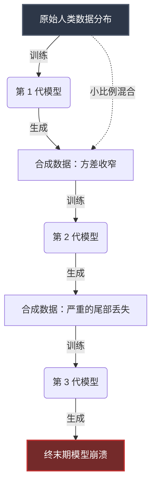

人工智能行业正加速逼近一个严苛的物理上限，业界通常将其称为“数据墙（Data Wall）”。在过去的十年中，架构扩展的主导启发式策略一直保持着顽固的经验主义：增加参数量，并线性扩展预训练语料库。Chinchilla 扩展定律（Scaling Laws）将这种直觉形式化，确立了当数据集规模与参数量同步增长时，模型性能的扩展达到最优。然而，这种对 Token 的贪婪吞噬，不可避免地导致了高质量、人类生成的网络数据的枯竭。我们实际上已经将互联网上语言丰富、结构严谨的文本挖掘殆尽。

面对人类认知产出的有限供给，研究人员自然而然地转向了剩余最丰富的 Token 来源：模型自身的输出。这个命题看似优雅——利用强大的模型生成海量的合成数据，以此来训练下一代架构。然而，这种递归策略却孕育了一种根本性的统计学病理。欢迎来到合成数据悖论（The Synthetic Data Paradox）。

## 模型崩溃的统计力学

模型崩溃（Model Collapse）并非软件 Bug；当一个概率系统在自身近似值的输出上进行递归训练时，这是一种数学上的必然。要理解其力学原理，我们必须审视自回归语言模型的目标函数。这些模型被优化以最小化训练分布的负对数似然（Negative Log-Likelihood）。它们以极高的保真度学习人类语言的集中趋势，但内在地平滑了分布中低概率、高方差的“尾部（Tails）”。

当第 N 代模型输出数据时，它会轻微地过度表示高概率 Token，而未能充分表示赋予人类语言多样性和边缘情况（Edge Cases）的罕见、特殊的 Token。如果将这种合成输出输入到第 N+1 代模型中，新模型学习到的将是原始分布的一个被压缩、被扭曲的版本。

这个过程在连续的世代中不断复合，导致方差的灾难性损失。数据分布不可逆转地向一个同质化、高概率但最终毫无意义的众数（Mode）坍缩。早期的症状表现为文体多样性的丧失以及处理小众边缘情况能力的下降；晚期崩溃则会导致模型输出重复的、毫无逻辑的乱码。

上图展示了数据分布不可逆转的收窄过程。请注意，即使将小比例的原始人类数据混合到合成语料库中，合成 Token 的庞大体量依然能够淹没梯度更新，将模型的权重拉向坍缩的众数。

## 合成数据悖论

悖论恰恰在于此：为了超越当前前沿模型的能力上限，我们需要数量级更多的数据。而唯一具备可扩展性的数据来源就是合成生成。然而，不加区分地在合成数据上进行训练，会主动削弱模型的性能和泛化能力。

我们被困在一个热力学陷阱中。信息熵（Information Entropy）定律决定了一个系统无法凭空创造新的信息；模型生成的合成数据，充其量包含与其训练集相同数量的信息，而在实践中，由于生成过程的损耗性质，它包含的信息严格来说要少得多。那么，我们如何在不陷入模型崩溃黑洞的情况下，利用合成数据来引导（Bootstrap）智能？

## 合成可验证性阈值（SVT）框架

为了将未来的路径形式化，我们引入了**合成可验证性阈值（Synthetic Verifiability Threshold, SVT）**。SVT 是一个理论框架，定义了合成数据停止作为退化影响，并转变为建设性训练信号的边界条件。

SVT 的核心假设是：只有当数据生成过程与数据验证过程解耦，并且验证过程能够访问高效扩展的非对称“基准事实（Ground Truth）”预言机（Oracle）时，合成数据才能改善模型。

在实际应用中，SVT 将任务划分为两个截然不同的领域：
1. **阈值下任务（不可验证）：** 开放式创意写作、主观推理和非结构化对话。在这些领域，验证合成数据的“正确性”需要人类评估员或绝对占优的模型。生成这些任务的合成数据成本低廉，但在规模化验证上，其计算或经济成本是难以承受的。在这些数据上进行训练不可避免地导致模型崩溃。
2. **阈值上任务（可验证）：** 数学推导、代码生成、形式逻辑和强化学习环境。在这些领域，提议的解决方案（合成生成）可以由外部编译器、数学求解器或确定性引擎进行严格验证。生成过程是概率性的，但验证过程是确定性的。

SVT 决定了 AI 行业必须将其扩展策略完全转向阈值上任务。我们不能简单地生成数十亿个合成对话 Token 并祈祷奇迹发生。相反，我们必须构建庞大的、程序化的验证流水线。

例如，在代码生成中，模型可以生成数千个候选脚本。自动化沙盒环境（预言机）对其进行编译，运行单元测试，并过滤掉失败的用例。幸存的子集不仅是合成数据；它是*经过验证的*合成数据，包含了真实的结构性真理，从而绕过了生成过程的热力学约束。

## 结构性缓解策略

除了严格在 SVT 之上运行，研究人员正在开发复杂的结构性技术，以延迟混合数据机制中模型崩溃的发作。

### 1. 数据来源图谱（Data Provenance Graph）
随着网络日益被 AI 生成的内容污染，网络抓取已不再是一项安全的操作。前沿实验室正在大力投资数据来源图谱——旨在追踪文本序列来源的密码学或统计学水印技术。通过为预训练语料库中的每个文档分配一个“合成概率分数”，数据工程师可以激进地降低递归数据的权重或将其过滤，从而保护人类生成基线的纯洁性。

### 2. 通过拒绝采样进行分布匹配
高级训练流水线不再仅仅最小化合成语料库的负对数似然，而是采用拒绝采样（Rejection Sampling）强制合成数据分布匹配原始人类数据的经验分布。通过选择性地丢弃过于靠近众数的合成样本，并有意保留罕见、低概率的生成结果，研究人员可以人为地膨胀合成语料库的方差，防止分布尾部的灾难性丢失。

### 3. 宪法蒸馏（Constitutional Distillation）
合成数据越来越多地不再用于教导模型*说什么*，而是用于教导模型*如何思考*。通过生成合成推理轨迹（思维链，Chain-of-Thought）并应用严格的宪法 AI 过滤，较小的学生模型可以学习到较大教师模型的潜在结构逻辑，而不会继承其特定的概率偏差。

## 训练语料库对比分析

了解数据源之间的精确差异对于跨越数据墙至关重要。下表根据 SVT 框架描述了各种训练语料库的特征。

| 指标 | 纯净人类数据 | 未过滤合成数据 | SVT 验证合成数据 |
| :--- | :--- | :--- | :--- |
| **信息熵** | 高（最大方差） | 低（众数坍缩） | 中到高 |
| **尾部分布** | 丰富、特殊的边缘情况 | 截断、被平滑 | 通过确定性过滤保留 |
| **扩展成本** | 极高（受限于人力） | 接近零（受限于算力） | 高（受限于验证） |
| **模型崩溃风险** | 零 | 极端 / 必然发生 | 极低 |
| **主要用例** | 基础预训练 | 快速原型（危险） | 后训练 (RLHF/RLAIF)、代码/数学 |
| **信噪比** | 不定（需要大量清洗） | 退化 | 极高 |

## 前路：超越自回归范式

数据墙以及随之而来的合成数据悖论，代表了当前深度学习扩展轨迹所面临的最重大的生存威胁。如果我们继续将合成数据仅仅视为人类数据的廉价替代品，我们将在模型能力上触及一条坚硬的渐近线，随之而来的将是快速的退化。

解决方案需要根本性的架构转变。行业必须摆脱对 Token 的暴力积累，转向构建严谨、可扩展的验证环境。未来的模型将不再是在静态抓取的网络语料库上进行训练；它们将在动态的程序化沙盒中进行训练，在那里，每一个生成的 Token 都要承受确定性预言机的压力测试。

通过理解并遵循合成可验证性阈值（SVT），我们可以将合成数据从递归的毒药转化为人工智能下一次飞跃所需的燃料。数据墙并非扩展的终点；它仅仅是“简单扩展”时代的终点。下一个时代，属于那些能够掌握合成思想严谨验证技术的人。
