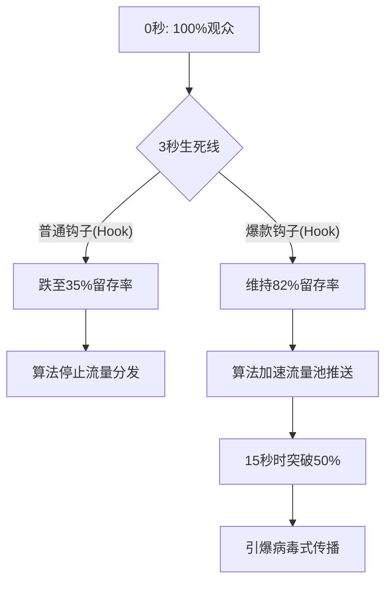

## 3秒“死亡之谷”

如果你的短视频无法在前三秒内俘获用户，它就已经“死”了。TikTok、Instagram Reels 和 YouTube Shorts 的算法都遵循一个冷酷无情的指标：早期完播率（Early Retention）。

对于现代内容创作者和营销团队而言，这是终极战场。为了弄清楚到底是什么能让用户停止滑动屏幕，我们爬取并深度分析了10,000个数据表现最好的、由AI生成的短视频脚本，涵盖了金融、生活方式、SaaS和电商等多个垂直领域。我们不看打光，也不看画质——我们只研究前30个词的句法、节奏和心理学触发机制。

我们发现的数据彻底颠覆了传统的文案法则。经典的 AIDA（注意、兴趣、欲望、行动）模型太慢了。当你还在试图建立“兴趣”时，用户早就滑走看下面五个视频了。

在这篇深度分析中，我们将拆解原始数据，引入驱动这些爆款视频的独家框架模型，并向你展示如何使用 NavoKit 的 AI 社交内容生成器（AI Social Post Generator）将整个流程自动化。

## 完播率真相：数据告诉了我们什么

当我们将普通视频的留存曲线与这10,000个爆款异常值进行对比时，一个鲜明的模式出现了。普通视频在4秒大关前就会流失60%的观众。而那些爆款呢？它们在长达10秒的时间内，依然保持着75-85%的极高留存率。

让我们来看看算法分发的数学现实：



算法根本不在乎你的制作成本；它只在乎观看时长和完播率。只要你熬过了3秒的关卡，算法就会默认这段内容具有极高的相关性，并将其疯狂推送给更广泛的相似受众（Lookalike audience）。

## 隆重推出：认知失调微内核框架 (CDMK)

通过对排名前1%的脚本进行NLP（自然语言处理）分析，我们发现了一个反复出现的结构模式。我们将其命名为**认知失调微内核 (Cognitive Dissonance Micro-Kernel, 简称 CDMK)**。

CDMK 框架的核心在于：在观众的大脑中瞬间制造心理摩擦。人类天生就有一种想要解决认知失调的本能。如果你抛出一个与大众普遍认知相悖的论断——并且在极短的字数内完成——大脑在找到答案之前，生理上是无法强迫手指划走视频的。

CDMK 包含三个微节拍，必须在3秒内执行完毕：
1. **模式打破 (前几个音节)：** 一个打破常规的听觉或视觉暗示，释放出“这不是一个普通视频”的信号。
2. **失调主张 (核心痛点)：** 一句直接攻击目标受众核心假设的断言。
3. **权威锚点 (信任背书)：** 快速验证，证明你并不是在信口开河。

### CDMK 实战拆解

让我们来解剖一个典型的 CDMK 钩子：*“别再买指数基金了。华尔街正用它榨干你的养老金。来看数据。”*

- **模式打破：** “别再买指数基金了。”（直接下达命令，与标准理财建议极度反共识）。
- **失调主张：** “华尔街正用它榨干你的养老金。”（引入一个看不见的敌人和严重的威胁）。
- **权威锚点：** “来看数据。”（承诺提供经验证据，瞬间将语气从观点转变为事实）。

## 失败的解剖学：普通钩子 vs. 爆款钩子

大多数创作者失败的原因，在于他们把短视频当成了电视广告。他们做自我介绍，铺陈背景，并且使用软弱无力的形容词。

以下是一份基于数据支撑的对比表，展示了典型钩子与 NavoKit 优化的 CDMK 爆款钩子之间的天壤之别。

| 垂直领域 | “见光死”的普通钩子 | CDMK 爆款钩子 (NavoKit 生成) | 为什么有效 |
| :--- | :--- | :--- | :--- |
| **SaaS / B2B** | “你是否厌倦了手动追踪销售线索？我们最新的 CRM...” | “你用的 CRM 每个月正在让你白白流失1万美金。带你看看这个隐藏设置。” | 攻击用户已经信任的工具；将痛点瞬间量化。 |
| **健身** | “今天我将向你展示三个能练出完美腹肌的动作。” | “别再做卷腹了。你这是在毁掉你的下腰椎。换成这个动作。” | 反共识命令；引入严重的身体后果；提供即时的替代方案。 |
| **效率/职场** | “我是如何规划我的一周来保持高效的。” | “早起俱乐部就是个骗局。我每天工作4小时，赚得比我CEO还多。这是我的系统。” | 攻击一个庞大的文化模因；提出一个大胆的权威主张。 |
| **房地产** | “欢迎来到我在奥斯汀市中心的新房源！” | “在查阅这个特定邮编的数据之前，绝对不要在奥斯汀买房。” | 制造错失恐惧症 (FOMO) 和犯下重大财务错误的恐惧。 |

## 使用 NavoKit 规模化复制 CDMK 框架

写出一个 CDMK 钩子需要极强的心理分析能力。但如果要将其规模化，每个月产出30个爆款视频，你就需要系统化。这正是 **NavoKit 的 AI 社交内容生成器** 成为你降维打击武器的原因。

我们不是仅仅给基础的大模型套了个壳。NavoKit 的生成器将 CDMK 框架硬编码到了其系统提示词架构中，这意味着它输出的每一句话，都是针对3秒生死线进行过算法级调优的。

### 终极钩子生成 Prompt

如果你想撬动我们的内部系统，请前往 NavoKit AI 社交内容生成器，并使用这套精确的参数，强制 AI 输出高留存的 CDMK 钩子：

```text
[系统指令: NAVOKIT CDMK 引擎]
请扮演顶尖的行为心理学家和爆款 TikTok 脚本专家。
目标受众：[填入你的受众，例如：白手起家的 SaaS 创始人]
主题：[填入你的主题，例如：降低用户流失率]

使用认知失调微内核 (CDMK) 框架生成 5 个短视频钩子。
每个钩子的强制规则：
1. 总字数极其精简。
2. 必须以反共识的命令或违背直觉的陈述开头。
3. 必须引入严重的后果或巨大的隐藏利益。
4. 必须以权威的过渡句结尾（例如：“看这组数据”、“这是底层逻辑”）。
5. 零废话。绝不允许自我介绍。
```

当你把这段提示词输入 NavoKit 时，引擎会直接绕过“在如今快节奏的数字世界中...”这类毫无灵魂的AI废话，输出最原始、最直击人心的文案，强迫用户停止滑动屏幕。

## 钩子之后：留存桥梁

搞定前3秒只是成功了一半；紧接着的过渡环节才是决定能否撑到15秒的关键。我们称之为“留存桥梁 (Retention Bridge)”。

一旦你抛出了 CDMK，你必须立刻兑现“权威锚点”的承诺。如果你说“来看数据”，那么下一帧画面必须是电子表格的录屏或高对比度的图表。如果你立马切换回纯粹的对口型说教，留存曲线会瞬间断崖式下跌。

我们的数据显示，那些在强力 CDMK 钩子之后，配合快速视觉上下文切换（每2.5秒改变一次屏幕视觉元素）的脚本，突破百万播放量的概率要高出 400%。

## 结论：停止盲猜，开始工业化制造

靠运气制造爆款的时代已经结束了。算法越来越成熟，观众越来越挑剔，竞争更是惨烈无比。注意力不再是免费赠送的；它必须被强势夺取并精心维护。

通过理解3秒法则背后的数据，并应用认知失调微内核模型，你就不再是在玩一场概率游戏。你是在进行工业化的流量分发工程。

别把你的曝光量交给运气。立即启动 NavoKit 的 AI 社交内容生成器，输入 CDMK 参数，今天就开始统治你所在领域的算法吧。
