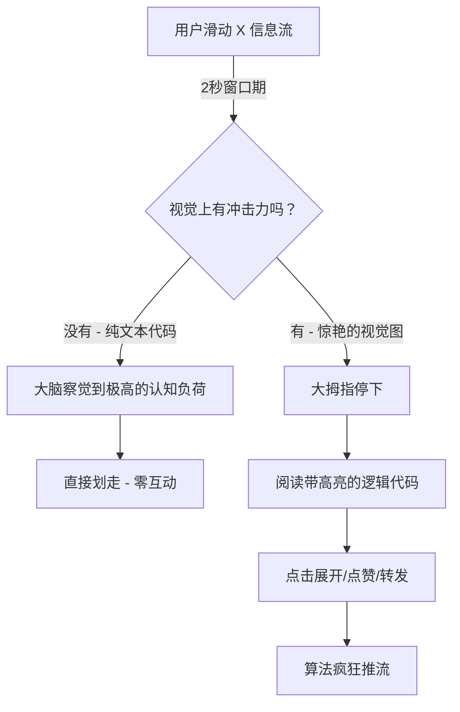

如果你现在还在往 Twitter/X 的信息流里直接复制粘贴原生代码块，那我得和你说句大实话：你正在给自己限流。

这种场景太常见了：一个硬核开发者花了四个小时，为一个 React 组件写出了完美的性能优化方案。他满怀激情地冲到 X 上，甩下一个乱糟糟的 ` ```javascript ` 代码块，点击发送，然后坐等爆款。

结果呢？无人问津。

为什么？因为如果你的代码看起来就像一面灰蒙蒙的静态文字墙，X 的推荐算法才不管你的时间复杂度是不是 O(1)。现在用户的平均注意力时长不到两秒。如果你的代码不能在用户滑屏的瞬间牢牢抓住他们的眼球，它就等于不存在。2026 年科技圈社交媒体的残酷真相是：**包装与干货同等重要**。

在这篇深度解析中，我们将彻底拆解为什么纯文本代码分享已经走到尽头，我还会向你介绍**“四维视觉锚点”策略（4-Visual-Anchor Strategy）**——这是顶尖前 1% 技术大V 用来疯狂收割曝光量、建立庞大粉丝群的增长框架。最后，我们还会探讨为什么直接用系统截图 IDE 是菜鸟行为，以及如何自动化打造完美的视觉美学。

## 无效帖子的解剖学

让我们来看看在社交信息流中阅读纯文本代码时的“认知摩擦”。当用户滑过一段纯文本代码时，他们的大脑必须完成从“休闲消费”到“深度分析”的语境切换。没有语法高亮，没有正确的缩进（X 经常把缩进搞得一团糟），也没有结构层次，这会导致认知负荷瞬间飙升。此时，用户的大脑会选择阻力最小的一条路：*直接划走*。

让我们把这个残酷的现实可视化：



算法的核心指标是“停留时间”（用户在你的帖子上停留了多久）以及即时互动。纯文本代码是在抹杀停留时间，而优秀的视觉设计则是在黑客式地窃取停留时间。

## 隆重推出：“四维视觉锚点”策略

想要让用户停下滑动的手指，你的代码就必须被当成高转化率的视觉创意素材来对待，而不是干巴巴的日志文件。在分析了数以千计的爆款技术帖后，规律已经显而易见。那些成功的代码帖子都巧妙利用了**“四维视觉锚点”策略**：

### 1. 上下文头部（钩子）
不要只是光秃秃地展示代码，给它加个画框。视觉图需要一个标题栏或清爽的头部，在读者开始解析哪怕一个变量之前，用大白话解释清楚这段代码是干什么的。想想 macOS 的窗口控件，或者是极简的终端标签页。

### 2. 高对比度的语法诱惑
语法高亮不仅仅是给开发者看的，它是一种视觉层级工具。深色背景（或极其清爽的浅色模式）上跳跃的鲜艳色彩能够引导视线。关键字突出，字符串分明。这能呈指数级降低认知负荷。

### 3. 隔离式背景
直接截取一张包含侧边栏文件树、终端输出甚至 Spotify 播放器的 VS Code 截图？这全是视觉噪音。代码必须存在于一个纯净的空间中。代码块周围一圈细腻的渐变色或高对比度的纯色留白，能将逻辑隔离出来，散发出一种“高级内容”的质感。

### 4. 权威水印
爆款内容很容易被盗转。一定要给你的代码片段打上个人烙印。在底部加上低调的水印或社交账号 Handle，这样当你的代码被搬运到那些烂俗的编程梗图号时，流量最终还是能回流到你身上。

## 原生截图的致命缺陷

“好吧，”你可能会想，“那我直接用 `Cmd+Shift+4` 截一下我的 IDE 屏幕不就行了？”

快住手。

使用系统原生截图，就等同于给打印出来的纸质文件拍张照。它毫无优化可言，分辨率在不同设备上缩放时惨不忍睹，没有合理的留白，而且还会暴露你 IDE 里杂乱的界面。更要命的是，如果你发现了一个拼写错误，你得从头再截一次图。

让我们来对比一下这几种方式：

| 特性 | X 上的纯文本 | IDE 原生截图 | 四维视觉策略生成图 |
| :--- | :--- | :--- | :--- |
| **停留时间** | 极差 | 一般 | 极高 |
| **移动端阅读体验** | 糟糕 (糟糕的换行) | 碰运气 (缩放问题) | 完美 (自定义比例) |
| **视觉美感** | 零 | 杂乱 / 不专业 | 高级 / 极客感 |
| **品牌资产沉淀** | 无 | 低 | 高 (自定义水印/主题) |
| **算法青睐度** | 低 | 中等 | 极具爆款潜力 |

## 终极增长黑客武器：NavoKit 的“Markdown 转图片”工具

如果你想完美执行“四维视觉锚点”策略，又不想每次发帖都在 Figma 里折腾 20 分钟，你就需要专业的生产力工具。这正是我们在 NavoKit 中打造 **Markdown 转图片（Markdown to Image）** 工具的初衷。

NavoKit 不是简单地给你的代码拍张照；它能将你的 Markdown *渲染*成高保真、专为社交媒体传播优化的视觉资产。

以下是它成为技术创作者秘密武器的原因：
*   **零摩擦的留白与背景：** 一键应用绚丽的渐变色或纯色背景，完美装裱你的代码，彻底告别手动裁剪。
*   **Mac 风格窗口边框：** 轻轻一点，加上专业、极简的窗口控件，让你的代码瞬间拥有备受追捧的“App 级”质感。
*   **完美的语法高亮：** 丢进你的 markdown，指定语言，NavoKit 会自动应用高对比度的绝美主题，让划过的用户瞬间停下。
*   **自动化品牌植入：** 将你的账号 Handle 和头像直接烙印在导出的图片中，让你的才华永远有迹可循。
*   **宽高比精准控制：** 针对 X 平台最佳图片尺寸进行导出，确保在信息流中不会出现尴尬的自动裁剪。

你不需要成为专业设计师也能拥有顶级的视觉美学。你需要的，只是找对杠杆。

## 结语

游戏规则已经变了。往社交媒体倾倒纯文本代码的时代已经彻底结束。如果你正在进行“公开构建 (Build in Public)”，分享技术教程，或是试图通过社交证明来获得下一份心仪的工作，你参与的就是一场视觉争夺战。

别再让你精妙的代码逻辑死在沉寂的信息流里了。采用“四维视觉锚点”策略，用 NavoKit 渲染你的代码片段，然后尽情看着你的互动数据彻底爆发吧。
